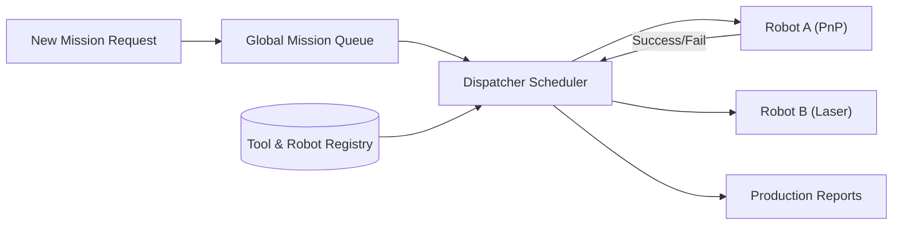

<p align="center">
  
</p>

# 📋 HYDRA-UMC-JOB-DISPATCHER

<p align="center">🇺🇸 <b>English</b> | <a href="README_spa.md">🇪🇸 Español</a> | <a href="README_fra.md">🇫🇷 Français</a> | <a href="README_ita.md">🇮🇹 Italiano</a> | <a href="README_deu.md">🇩🇪 Deutsch</a> | <a href="README_zho.md">🇨🇳 简体中文</a> | <a href="README_jpn.md">🇯🇵 日本語</a></p>

### ⚙️ Priority-Based Mission Queue for Heterogeneous Robot Fleets

<p align="left">
  
  
  
</p>

---

## 1. 🛠️ TECHNICAL OVERVIEW

**HYDRA-UMC-JOB-DISPATCHER** is the task allocation engine of the Orchestrator. it manages a global mission queue, distributing jobs to individual robots based on their current availability, location, and attached tool (URTC).

It ensures that high-priority tasks (e.g., "Emergency Defect Fix") bypass the normal production flow, and coordinates multi-step assembly sequences that require different robots to work in tandem.

### Key Features:
* 📋 **Dynamic Queueing:** Intelligent mission prioritization and scheduling.
* ⚖️ **Tool-Aware Routing:** Automatically routes jobs to the robot with the correct URTC head.
* 🔄 **Multi-Stage Missions:** Manages dependencies between tasks (e.g., "Pick" must happen before "Place").
* 📡 **Persistence:** Fault-tolerant mission state using local Redis/Database storage.
* 🔁 **Idempotent Submission (v0):** Real, opt-in `DedupKey`-based deduplication via `POST /jobs/submit` - a retried submission of an in-flight or already-done job is returned unchanged, and a retry after a real failure reuses the same job ID instead of running the work twice. Priority ordering is deterministic across repeated runs, covered by an explicit regression test.

---

## 2. 🔄 DISPATCHER FLOW



---

## 3. 🧱 ARCHITECTURE & DESIGN DECISIONS

* **Why the real logic lives under `src/`, not at the repo root.** `src/dispatcher` (the scheduling engine) and `src/api` (the HTTP handlers) hold the actual implementation; `main.go`/`version.go` stay at the repo root as the entry point that wires them together.
* **Why job assignment checks tool availability via URTC.** A job that needs a specific tool head is only dispatchable to a robot whose URTC-controlled tool head is actually present and idle - checking this before dispatch (not after a failed pick) avoids a robot arriving at a station it can't actually use. `src/dispatcher.Engine.DispatchOnce` enforces this today by exact `RequiredTool`/`Robot.Tool` match; it doesn't yet talk to a real URTC over CAN to confirm the tool head is physically attached (this engine only knows what a robot registration claims - see `src/api`'s `POST /robots`).
* **Why the scheduler is real today but persistence is not.** `src/dispatcher` implements the actual algorithm the README's "DISPATCHER FLOW" diagram describes: a priority-ordered global queue, tool-aware routing, and multi-stage dependencies (a job stays `blocked` until every job it `DependsOn` reaches `done`). It keeps all of that in memory only - `Engine`'s state lives behind exported methods precisely so a Redis/DB-backed store can replace what's behind them later without changing every caller. Proving the scheduling algorithm itself correct came first.
* **Why the HTTP API is plain JSON/HTTP, not gRPC.** This is a human/ops-facing control surface (submit a job, register a robot, ask what happened) - `hydra.common.v1` (the ecosystem's shared gRPC contract, see `HYDRA-UMC-ORCHESTRATOR/proto/`) stays reserved for node-to-node traffic, per that proto's own documented scope.
* **How this fits the rest of the ecosystem.** A sibling service under HYDRA-UMC-ORCHESTRATOR - turns mission-level decisions into concrete per-robot job assignments, checked against URTC tool availability and HYDRA-UMC-PATH-PLANNER-3D's own routes.
* **Why `POST /jobs/submit` is a new route instead of changing `POST /jobs`.** `AddJob()`/`POST /jobs` always insert and error on an ID collision - that low-level contract is untouched. `SubmitJob()`/`POST /jobs/submit` layers real, opt-in deduplication on top via `Job.DedupKey`: same pattern used across the ecosystem (a safety-gated entry point added alongside an unchanged low-level primitive, not a behavior change bolted onto it).
* **Why a retry-after-failure reuses the same job ID instead of creating a new job.** The alternative - minting a fresh job on every retry - would scatter one logical unit of work's history across several IDs and give a caller no way to tell "this failed once and is being retried" from "this is unrelated new work". Resetting the original job back to `Pending` keeps its whole lifecycle (including the failed attempt) under one ID.

---

## 📂 DIRECTORY STRUCTURE

```text
HYDRA-UMC-JOB-DISPATCHER/
├── src/
│   ├── dispatcher/    # The real scheduling engine: queue, tool-aware
│   │                  # routing, multi-stage dependencies
│   └── api/           # Plain JSON/HTTP handlers wrapping the engine
├── docs/
│   └── API.md         # Real HTTP endpoint reference (requests, responses, status codes)
├── images/            # Media and diagrams
├── systemd/
│   └── hydra-umc-job-dispatcher.service # Local CM5 priority mission queue systemd unit
├── tools/
│   ├── build_test.py  # Build/compile check without bumping version
│   └── ci_validate.py # Manifest/CHANGELOG/docs validation used by CI
├── build/             # Compiled binaries (build.sh/build.bat output)
├── go.mod / go.sum    # Go module definition
├── version.go         # const Version = "X.Y.Z" (go.mod has no app version field)
├── main.go            # Entry point: wires the engine to the HTTP API and listens
├── bump_version.py    # Odometer-style version bump, run by build.sh/.bat
├── bump_manifest_version.py # Syncs hydra-umc.project.json's version to the native one (--sync)
├── build.sh/.bat      # Bumps version, then `go build`
├── run.sh/.bat        # Runs the compiled binary
└── README.md
```

Pruned from the original template: `hardware/`, `firmware/` and `os/` —
this is a pure software service (Go binary) with no dedicated hardware or
firmware of its own and no operating system image to maintain. See
[`docs/API.md`](docs/API.md) for the full HTTP endpoint reference.

---

## 🔧 BUILD & RUN GUIDE

A real priority mission queue with an HTTP API, not just a skeleton that compiles.

```bash
# Windows
build.bat
run.bat -addr :8090

# Linux / macOS
./build.sh
./run.sh -addr :8090
```

`build.sh`/`build.bat` bump the version in `version.go` (ecosystem-wide
odometer rule, see `bump_version.py` - `go.mod` has no native version field
for application binaries) and then run `go build`. `run.sh`/`run.bat`
execute the resulting binary directly.

```bash
# Register a robot, submit a job, dispatch it, then mark it done
curl -X POST localhost:8090/robots -d '{"id":"robot-a","tool":"PnP","available":true}'
curl -X POST localhost:8090/jobs   -d '{"id":"job-1","priority":5,"requiredTool":"PnP"}'
curl -X POST localhost:8090/dispatch -d '{}'
curl -X POST localhost:8090/jobs/complete -d '{"id":"job-1","success":true}'
curl localhost:8090/jobs
curl localhost:8090/robots
```

```bash
# Idempotent submission: a retried request with the same dedupKey never
# runs the same job twice, even if the client used a different job id.
curl -X POST localhost:8090/jobs/submit -d '{"id":"job-2","priority":5,"requiredTool":"PnP","dedupKey":"req-abc"}'
# -> {"ID":"job-2", ..., "result":"created"}
curl -X POST localhost:8090/jobs/submit -d '{"id":"job-2-retry","priority":5,"requiredTool":"PnP","dedupKey":"req-abc"}'
# -> {"ID":"job-2", ..., "result":"duplicate"} - same job, untouched

# After a real failure, a retry with the same dedupKey reuses job-2's ID:
curl -X POST localhost:8090/jobs/complete -d '{"id":"job-2","success":false}'
curl -X POST localhost:8090/jobs/submit -d '{"id":"job-2-retry-2","priority":5,"requiredTool":"PnP","dedupKey":"req-abc"}'
# -> {"ID":"job-2", "Status":"pending", ..., "result":"retried"}
```

```bash
go test ./...   # src/dispatcher (scheduling algorithm) +
                 # src/api (real HTTP round-trips via httptest)
```

---

## 🚀 ROADMAP
* **Phase 1:** Deterministic swarm synchronization over TSN and sub-ms jitter reduction.
* **Phase 2:** 3D Path planning with dynamic obstacle avoidance in multi-robot cells.
* **Phase 3:** Multi-robot job dispatching optimization using real-time resource availability.
* **Phase 4:** AI-driven job duration estimation for better scheduling and heterogeneous robot fleet coordination.

---

## 🔗 Related Projects

This project is part of the HYDRA-UMC robotics ecosystem by the same author (JuanenRac / Electro Hobby 3D). Worth knowing about, since a request might actually be about one of these rather than this repository.

**Parent Project**
- **[HYDRA-UMC-ORCHESTRATOR](https://github.com/JuanenRac/HYDRA-UMC-ORCHESTRATOR)** — integration hub with a real gRPC/Protobuf health-report contract and mission state machine; the parent this repo is one specific orchestration service of, within its own swarm-coordination layer.

**Sibling Projects** — the other orchestration services of HYDRA-UMC-ORCHESTRATOR's own swarm-coordination layer
- **[HYDRA-UMC-SWARM-SYNC](https://github.com/JuanenRac/HYDRA-UMC-SWARM-SYNC)** — real CRDT LWW-Element-Map state sync, property-tested for multi-cell convergence.
- **[HYDRA-UMC-PATH-PLANNER-3D](https://github.com/JuanenRac/HYDRA-UMC-PATH-PLANNER-3D)** — real RRT-based 3D path planner with real obstacle/workspace collision validation.
- **[HYDRA-UMC-NODE-HEALING](https://github.com/JuanenRac/HYDRA-UMC-NODE-HEALING)** — real gRPC-based fleet health watchdog with retry/backoff and identity-mismatch detection.

**Directly Related**
- **[URTC](https://github.com/JuanenRac/URTC)** — firmware for the physical Universal Robot Tool Controller PCB, 25+ tool profiles over CAN bus — assigns jobs based on which of URTC's own tool heads is actually available.
- **[HYDRA-UMC-PRODUCTION-REPORTS](https://github.com/JuanenRac/HYDRA-UMC-PRODUCTION-REPORTS)** — real OEE/availability calculation over DATALAKE history, with reproducible CSV export — the diagrammed target for mission-completion logs; this dispatcher is the intended real source of its own OEE `production_event` data once completions are wired to write it (not implemented yet, tracked on that project's own side).

**Also Part of the Ecosystem**

*Core Hardware & Platform*
- **[HYDRA-UMC](https://github.com/JuanenRac/HYDRA-UMC)** — the physical robot-arm motherboard: CM5 host + dual-core STM32H745, orchestrating up to 8 tool arms over CAN-OTA/SPI-OTA.
- **[HYDRA-UMC-OS](https://github.com/JuanenRac/HYDRA-UMC-OS)** — reproducible Raspberry Pi OS product layer for the CM5: read-only agent, validated config/profiles, WiFi first-contact provisioning.
- **[HYDRA-UMC-SDK](https://github.com/JuanenRac/HYDRA-UMC-SDK)** — the shared JSON-Schema contract and safety-gate boundary every bridge validates its commands against.

*Core Backend & Clients*
- **[HYDRA-UMC-SERVER](https://github.com/JuanenRac/HYDRA-UMC-SERVER)** — the real headless backend (REST/WebSocket) every control client actually talks to.
- **[HYDRA-UMC-STUDIO](https://github.com/JuanenRac/HYDRA-UMC-STUDIO)** — web control dashboard with real-time multi-robot 3D visualization.
- **[HYDRA-UMC-SUITE](https://github.com/JuanenRac/HYDRA-UMC-SUITE)** — desktop (PySide6) swarm command center for multiple servers at once, packaged as a standalone executable.
- **[HYDRA-UMC-ANDROID-CONTROL](https://github.com/JuanenRac/HYDRA-UMC-ANDROID-CONTROL)** — native Android control app with biometric login and a paired Wear OS companion.
- **[HYDRA-UMC-IOS-CONTROL](https://github.com/JuanenRac/HYDRA-UMC-IOS-CONTROL)** — iOS/iPadOS control app (Flutter) with real-time WebSocket sync.
- **[HYDRA-UMC-DSI](https://github.com/JuanenRac/HYDRA-UMC-DSI)** — native touch UI for the onboard 7" DSI touchscreen, embedded on the CM5 itself.
- **[HYDRA-UMC-EDITOR-URDF](https://github.com/JuanenRac/HYDRA-UMC-EDITOR-URDF)** — desktop graphical URDF creator/editor that pushes finished models into STUDIO's own catalog.
- **[HYDRA-UMC-BRIDGE-AMR](https://github.com/JuanenRac/HYDRA-UMC-BRIDGE-AMR)** — coordination boundary for AGV/AMR fleets via a real VDA 5050 MQTT publisher.
- **[HYDRA-UMC-BRIDGE-CNC](https://github.com/JuanenRac/HYDRA-UMC-BRIDGE-CNC)** — high-level CNC-cell coordinator with real GRBL status/control-byte access.
- **[HYDRA-UMC-BRIDGE-DROIDS](https://github.com/JuanenRac/HYDRA-UMC-BRIDGE-DROIDS)** — coordination boundary for legged/humanoid droids, with a real Boston Dynamics Spot command sender.
- **[HYDRA-UMC-BRIDGE-LASER](https://github.com/JuanenRac/HYDRA-UMC-BRIDGE-LASER)** — laser-cell safety coordinator reading 3 real key/enclosure/interlock GPIO safeguards.
- **[HYDRA-UMC-BRIDGE-OPENPNP](https://github.com/JuanenRac/HYDRA-UMC-BRIDGE-OPENPNP)** — safe high-level board-flow coordinator for OpenPnP pick-and-place.
- **[HYDRA-UMC-BRIDGE-PRINTER3D](https://github.com/JuanenRac/HYDRA-UMC-BRIDGE-PRINTER3D)** — safe coordination boundary for Moonraker/Klipper 3D printers, with real gated job commands.
- **[HYDRA-UMC-BRIDGE-ROS2](https://github.com/JuanenRac/HYDRA-UMC-BRIDGE-ROS2)** — safety coordinator with a real, lazily-imported rclpy ROS 2 transport.
- **[HYDRA-UMC-BRIDGE-UAV](https://github.com/JuanenRac/HYDRA-UMC-BRIDGE-UAV)** — coordination boundary for camera-equipped UAVs, with a real MAVLink command sender.

*URTC Tool Platform*
- **[URTC-FLASHER](https://github.com/JuanenRac/URTC-FLASHER)** — desktop GUI flashing tool for URTC boards, CAN-OTA plus full-chip SWD/JTAG.
- **[URTC-TESTER](https://github.com/JuanenRac/URTC-TESTER)** — desktop live CAN-bus diagnostic tool for URTC boards, one panel per tool profile.
- **[URTC-WEB-STUDIO](https://github.com/JuanenRac/URTC-WEB-STUDIO)** — browser-based alternative to URTC-TESTER via the Web Serial API, no local install needed.

*Vision AI Node (Hailo-8)*
- **[HYDRA-UMC-VISION-NODE](https://github.com/JuanenRac/HYDRA-UMC-VISION-NODE)** — integration hub for the Hailo-8 vision pipeline, with a real per-stage hardware-readiness check.
- **[HYDRA-UMC-DETECTION-HEF](https://github.com/JuanenRac/HYDRA-UMC-DETECTION-HEF)** — real compiled-model registry with Hailo-architecture/checksum safe-load verification.
- **[HYDRA-UMC-VISION-STREAMER](https://github.com/JuanenRac/HYDRA-UMC-VISION-STREAMER)** — real GStreamer pipeline + MediaMTX config generator with a real HailoRT integration boundary.
- **[HYDRA-UMC-VISUAL-SERVOING-API](https://github.com/JuanenRac/HYDRA-UMC-VISUAL-SERVOING-API)** — real Position-Based Visual Servoing correction law, safety-gated on upstream zone state.
- **[HYDRA-UMC-SAFETY-ZONES](https://github.com/JuanenRac/HYDRA-UMC-SAFETY-ZONES)** — real zone-breach checking and E-STOP requesting, with calibration-freshness enforcement.

*Cognitive AI Node (Hailo-10)*
- **[HYDRA-UMC-COGNITIVE-NODE](https://github.com/JuanenRac/HYDRA-UMC-COGNITIVE-NODE)** — integration hub for the Hailo-10 cognitive pipeline (LLM/VLA/voice orchestration).
- **[HYDRA-UMC-VLA-ENGINE](https://github.com/JuanenRac/HYDRA-UMC-VLA-ENGINE)** — real action-token encoding/decoding and trajectory generation for a Vision-Language-Action model.
- **[HYDRA-UMC-VOICE-UI](https://github.com/JuanenRac/HYDRA-UMC-VOICE-UI)** — real voice front-end (VAD + intent parser) with a bounded, confirmation-gated Watch relay.
- **[HYDRA-UMC-SEMANTIC-PLANNER](https://github.com/JuanenRac/HYDRA-UMC-SEMANTIC-PLANNER)** — real rule-based task decomposition and semantic error recovery over MCU error codes.
- **[HYDRA-UMC-DOCS-QA](https://github.com/JuanenRac/HYDRA-UMC-DOCS-QA)** — real stdlib-only TF-IDF document search over this ecosystem's own Markdown docs.

*Digital Twin & Simulation*
- **[HYDRA-UMC-TWIN](https://github.com/JuanenRac/HYDRA-UMC-TWIN)** — integration hub for the digital-twin engine, with a real version-compatibility sync contract.
- **[HYDRA-UMC-HIL-BRIDGE](https://github.com/JuanenRac/HYDRA-UMC-HIL-BRIDGE)** — real hardware-in-the-loop safety interlock routing commands between simulation and real hardware.
- **[HYDRA-UMC-PHYSICS-REPLICA](https://github.com/JuanenRac/HYDRA-UMC-PHYSICS-REPLICA)** — real forward kinematics and joint-limit validation over a real URDF subset.
- **[HYDRA-UMC-SYNTHETIC-DATA-GEN](https://github.com/JuanenRac/HYDRA-UMC-SYNTHETIC-DATA-GEN)** — real procedural 2D scene generator with YOLO/COCO annotation export.

*Data & Analytics*
- **[HYDRA-UMC-DATALAKE](https://github.com/JuanenRac/HYDRA-UMC-DATALAKE)** — real sqlite3-backed time-series store with a real ingest/query HTTP API.
- **[HYDRA-UMC-ANOMALY-DETECTOR](https://github.com/JuanenRac/HYDRA-UMC-ANOMALY-DETECTOR)** — real FFT + statistical baseline anomaly detector with drift monitoring.
- **[HYDRA-UMC-TELEMETRY-COLLECTOR](https://github.com/JuanenRac/HYDRA-UMC-TELEMETRY-COLLECTOR)** — real CAN/WebSocket ingestion pipeline into DATALAKE, with sequence deduplication.

*Industrial Gateway*
- **[HYDRA-UMC-GATEWAY-INDUSTRIAL](https://github.com/JuanenRac/HYDRA-UMC-GATEWAY-INDUSTRIAL)** — integration hub relaying to industrial protocols, with a real command allowlist/backpressure layer.
- **[HYDRA-UMC-OPCUA-SERVER](https://github.com/JuanenRac/HYDRA-UMC-OPCUA-SERVER)** — real OPC-UA address space, verified with a real binary-protocol client session.
- **[HYDRA-UMC-MQTT-BROKER](https://github.com/JuanenRac/HYDRA-UMC-MQTT-BROKER)** — real MQTT broker with optional per-client authentication and topic ACLs.
- **[HYDRA-UMC-MTCONNECT-ADAPTER](https://github.com/JuanenRac/HYDRA-UMC-MTCONNECT-ADAPTER)** — real MTConnect `/probe` and `/current` XML endpoints with degraded-mode output.

*Complementary Tools & Ecosystem Operations*
- **[HYDRA-UMC-DASHBOARD-AI](https://github.com/JuanenRac/HYDRA-UMC-DASHBOARD-AI)** — Smart Summaries and Anomaly Highlighting panels over DATALAKE/ANOMALY-DETECTOR, with an honest statistical fallback.
- **[HYDRA-UMC-TOOL-CLI](https://github.com/JuanenRac/HYDRA-UMC-TOOL-CLI)** — fleet CLI with a real, stable exit-code contract, a genuine live client of HYDRA-UMC-SERVER's own API.
- **[HYDRA-UMC-WATCH](https://github.com/JuanenRac/HYDRA-UMC-WATCH)** — WearOS companion app with real haptic alerts and a paired-phone voice relay.
- **[URTC-SMART-RACK](https://github.com/JuanenRac/URTC-SMART-RACK)** — firmware for a board-mounting rack with real tool-ID decoding and Smart Idle pre-heating logic.
- **[URTC-VISION-TOOL](https://github.com/JuanenRac/URTC-VISION-TOOL)** — firmware plus a real Python vision companion for a thermal/RGB inspection tool head.
- **[HYDRA-UMC-UPDATER](https://github.com/JuanenRac/HYDRA-UMC-UPDATER)** — administrative desktop tool that discovers, clones and updates every repo in this ecosystem.


## 👤 AUTHOR
**JuanenRac** (Electro Hobby 3D)
📧 electrohobby3d@gmail.com
📺 [youtube.com/@electrohobby3d](https://youtube.com/@electrohobby3d)

## 📜 LICENSE
GPL-3.0 - See LICENSE for details.
