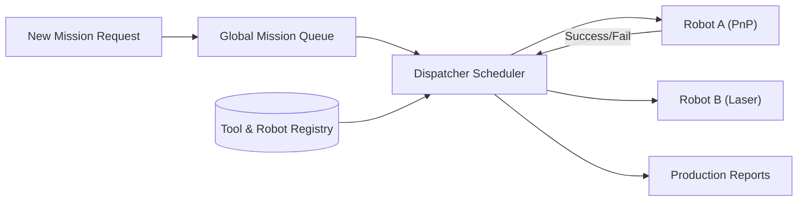

<p align="center">
  
</p>

# 📋 HYDRA-UMC-JOB-DISPATCHER

<p align="center">🇺🇸 <b>English</b> | <a href="README_spa.md">🇪🇸 Español</a> | <a href="README_fra.md">🇫🇷 Français</a> | <a href="README_ita.md">🇮🇹 Italiano</a> | <a href="README_deu.md">🇩🇪 Deutsch</a> | <a href="README_zho.md">🇨🇳 简体中文</a> | <a href="README_jpn.md">🇯🇵 日本語</a></p>

### ⚙️ Priority-Based Mission Queue for Heterogeneous Robot Fleets

<p align="left">
  
  
  
</p>

---

## 1. 🛠️ TECHNICAL OVERVIEW

**HYDRA-UMC-JOB-DISPATCHER** is the task allocation engine of the Orchestrator. it manages a global mission queue, distributing jobs to individual robots based on their current availability, location, and attached tool (URTC).

It ensures that high-priority tasks (e.g., "Emergency Defect Fix") bypass the normal production flow, and coordinates multi-step assembly sequences that require different robots to work in tandem.

### Key Features:
* 📋 **Dynamic Queueing:** Intelligent mission prioritization and scheduling.
* ⚖️ **Tool-Aware Routing:** Automatically routes jobs to the robot with the correct URTC head.
* 🔄 **Multi-Stage Missions:** Manages dependencies between tasks (e.g., "Pick" must happen before "Place").
* 📡 **Persistence:** Fault-tolerant mission state using local Redis/Database storage.

---

## 2. 🔄 DISPATCHER FLOW



---

## 3. 🧱 ARCHITECTURE & DESIGN DECISIONS

* **Why the real logic lives under `src/`, not at the repo root.** `src/dispatcher` (the scheduling engine) and `src/api` (the HTTP handlers) hold the actual implementation; `main.go`/`version.go` stay at the repo root as the entry point that wires them together.
* **Why job assignment checks tool availability via URTC.** A job that needs a specific tool head is only dispatchable to a robot whose URTC-controlled tool head is actually present and idle - checking this before dispatch (not after a failed pick) avoids a robot arriving at a station it can't actually use. `src/dispatcher.Engine.DispatchOnce` enforces this today by exact `RequiredTool`/`Robot.Tool` match; it doesn't yet talk to a real URTC over CAN to confirm the tool head is physically attached (this engine only knows what a robot registration claims - see `src/api`'s `POST /robots`).
* **Why the scheduler is real today but persistence is not.** `src/dispatcher` implements the actual algorithm the README's "DISPATCHER FLOW" diagram describes: a priority-ordered global queue, tool-aware routing, and multi-stage dependencies (a job stays `blocked` until every job it `DependsOn` reaches `done`). It keeps all of that in memory only - `Engine`'s state lives behind exported methods precisely so a Redis/DB-backed store can replace what's behind them later without changing every caller. Proving the scheduling algorithm itself correct came first.
* **Why the HTTP API is plain JSON/HTTP, not gRPC.** This is a human/ops-facing control surface (submit a job, register a robot, ask what happened) - `hydra.common.v1` (the ecosystem's shared gRPC contract, see `HYDRA-UMC-ORCHESTRATOR/proto/`) stays reserved for node-to-node traffic, per that proto's own documented scope.
* **How this fits the rest of the ecosystem.** A sibling service under HYDRA-UMC-ORCHESTRATOR - turns mission-level decisions into concrete per-robot job assignments, checked against URTC tool availability and HYDRA-UMC-PATH-PLANNER-3D's own routes.

---

## 📂 DIRECTORY STRUCTURE

```text
HYDRA-UMC-JOB-DISPATCHER/
├── src/
│   ├── dispatcher/    # The real scheduling engine: queue, tool-aware
│   │                  # routing, multi-stage dependencies
│   └── api/           # Plain JSON/HTTP handlers wrapping the engine
├── docs/
│   └── API.md         # Real HTTP endpoint reference (requests, responses, status codes)
├── build/             # Compiled binaries (build.sh/build.bat output)
├── go.mod / go.sum    # Go module definition
├── version.go         # const Version = "X.Y.Z" (go.mod has no app version field)
├── main.go            # Entry point: wires the engine to the HTTP API and listens
├── bump_version.py    # Odometer-style version bump, run by build.sh/.bat
├── build.sh/.bat      # Bumps version, then `go build`
├── run.sh/.bat        # Runs the compiled binary
└── README.md
```

Pruned from the original template: `hardware/`, `firmware/`, `os/`,
`images/` and `scripts/` — this is a pure software service (Go binary)
with no dedicated hardware or firmware of its own, no operating system image
to maintain, and no media/utility-script content substantial enough yet to
warrant their own folders. See [`docs/API.md`](docs/API.md) for the full
HTTP endpoint reference.

---

## 🔧 BUILD & RUN

A real priority mission queue with an HTTP API, not just a skeleton that compiles.

```bash
# Windows
build.bat
run.bat -addr :8090

# Linux / macOS
./build.sh
./run.sh -addr :8090
```

`build.sh`/`build.bat` bump the version in `version.go` (ecosystem-wide
odometer rule, see `bump_version.py` - `go.mod` has no native version field
for application binaries) and then run `go build`. `run.sh`/`run.bat`
execute the resulting binary directly.

```bash
# Register a robot, submit a job, dispatch it, then mark it done
curl -X POST localhost:8090/robots -d '{"id":"robot-a","tool":"PnP","available":true}'
curl -X POST localhost:8090/jobs   -d '{"id":"job-1","priority":5,"requiredTool":"PnP"}'
curl -X POST localhost:8090/dispatch -d '{}'
curl -X POST localhost:8090/jobs/complete -d '{"id":"job-1","success":true}'
curl localhost:8090/jobs
curl localhost:8090/robots
```

```bash
go test ./...   # src/dispatcher (scheduling algorithm) +
                 # src/api (real HTTP round-trips via httptest)
```

---

## 🚀 ROADMAP
* **Phase 1:** Deterministic swarm synchronization over TSN and sub-ms jitter reduction.
* **Phase 2:** 3D Path planning with dynamic obstacle avoidance in multi-robot cells.
* **Phase 3:** Multi-robot job dispatching optimization using real-time resource availability.
* **Phase 4:** AI-driven job duration estimation for better scheduling and heterogeneous robot fleet coordination.

---

## 🔗 Related Projects

This project is part of a larger robotics ecosystem by the same author (JuanenRac / Electro Hobby 3D), spanning firmware, control software, AI nodes, and fleet tooling. Worth knowing about, since a request might actually be about one of these rather than this repository.

### Family

**Parent:** **[HYDRA-UMC-ORCHESTRATOR](https://github.com/JuanenRac/HYDRA-UMC-ORCHESTRATOR)** — the integration parent this dispatcher serves.

**Siblings:**
- **[HYDRA-UMC-SWARM-SYNC](https://github.com/JuanenRac/HYDRA-UMC-SWARM-SYNC)** — sibling orchestration service, same parent.
- **[HYDRA-UMC-PATH-PLANNER-3D](https://github.com/JuanenRac/HYDRA-UMC-PATH-PLANNER-3D)** — sibling orchestration service, same parent.
- **[HYDRA-UMC-NODE-HEALING](https://github.com/JuanenRac/HYDRA-UMC-NODE-HEALING)** — sibling orchestration service, same parent.

### Directly Related (outside the family)

- **[URTC](https://github.com/JuanenRac/URTC)** — assigns jobs based on which tool head is actually available.

### Rest of the Ecosystem

**HYDRA-UMC platform** — the multi-robot micro-factory cell
- **[HYDRA-UMC](https://github.com/JuanenRac/HYDRA-UMC)** — the CM5 + STM32H745 motherboard orchestrating up to 8 robot arms.
- **[HYDRA-UMC-SERVER](https://github.com/JuanenRac/HYDRA-UMC-SERVER)** — the Express/WebSocket backend every control client talks to.
- **[HYDRA-UMC-STUDIO](https://github.com/JuanenRac/HYDRA-UMC-STUDIO)** — web-based control dashboard, multi-robot 3D visualization.
- **[HYDRA-UMC-ANDROID-CONTROL](https://github.com/JuanenRac/HYDRA-UMC-ANDROID-CONTROL)** — Android control app over Wi-Fi/Bluetooth.
- **[HYDRA-UMC-IOS-CONTROL](https://github.com/JuanenRac/HYDRA-UMC-IOS-CONTROL)** — iOS/iPadOS control app built in Flutter.
- **[HYDRA-UMC-SUITE](https://github.com/JuanenRac/HYDRA-UMC-SUITE)** — desktop swarm command center (Python/PySide6).
- **[HYDRA-UMC-EDITOR-URDF](https://github.com/JuanenRac/HYDRA-UMC-EDITOR-URDF)** — desktop URDF model editor for the robot catalog.
- **[HYDRA-UMC-DSI](https://github.com/JuanenRac/HYDRA-UMC-DSI)** — native touch UI for the onboard DSI touchscreen.

**URTC platform** — the tool head controller every HYDRA-UMC robot arm carries
- **[URTC](https://github.com/JuanenRac/URTC)** — CAN bus tool head controller, 25 tool profiles.
- **[URTC-FLASHER](https://github.com/JuanenRac/URTC-FLASHER)** — desktop CAN-OTA + SWD/JTAG flashing tool.
- **[URTC-TESTER](https://github.com/JuanenRac/URTC-TESTER)** — desktop live CAN-bus diagnostic tool.
- **[URTC-WEB-STUDIO](https://github.com/JuanenRac/URTC-WEB-STUDIO)** — browser-based alternative via Web Serial API.

**🎥 Vision AI Node (Hailo-8)**
- [HYDRA-UMC-VISION-NODE](https://github.com/JuanenRac/HYDRA-UMC-VISION-NODE)
- [HYDRA-UMC-VISION-STREAMER](https://github.com/JuanenRac/HYDRA-UMC-VISION-STREAMER)
- [HYDRA-UMC-DETECTION-HEF](https://github.com/JuanenRac/HYDRA-UMC-DETECTION-HEF)
- [HYDRA-UMC-SAFETY-ZONES](https://github.com/JuanenRac/HYDRA-UMC-SAFETY-ZONES)
- [HYDRA-UMC-VISUAL-SERVOING-API](https://github.com/JuanenRac/HYDRA-UMC-VISUAL-SERVOING-API)

**🧠 Cognitive AI Node (Hailo-10)**
- [HYDRA-UMC-COGNITIVE-NODE](https://github.com/JuanenRac/HYDRA-UMC-COGNITIVE-NODE)
- [HYDRA-UMC-VLA-ENGINE](https://github.com/JuanenRac/HYDRA-UMC-VLA-ENGINE)
- [HYDRA-UMC-VOICE-UI](https://github.com/JuanenRac/HYDRA-UMC-VOICE-UI)
- [HYDRA-UMC-SEMANTIC-PLANNER](https://github.com/JuanenRac/HYDRA-UMC-SEMANTIC-PLANNER)
- [HYDRA-UMC-DOCS-QA](https://github.com/JuanenRac/HYDRA-UMC-DOCS-QA)

**🎮 Digital Twin & Simulation**
- [HYDRA-UMC-TWIN](https://github.com/JuanenRac/HYDRA-UMC-TWIN)
- [HYDRA-UMC-PHYSICS-REPLICA](https://github.com/JuanenRac/HYDRA-UMC-PHYSICS-REPLICA)
- [HYDRA-UMC-HIL-BRIDGE](https://github.com/JuanenRac/HYDRA-UMC-HIL-BRIDGE)
- [HYDRA-UMC-SYNTHETIC-DATA-GEN](https://github.com/JuanenRac/HYDRA-UMC-SYNTHETIC-DATA-GEN)

**📊 Data & Analytics**
- [HYDRA-UMC-DATALAKE](https://github.com/JuanenRac/HYDRA-UMC-DATALAKE)
- [HYDRA-UMC-TELEMETRY-COLLECTOR](https://github.com/JuanenRac/HYDRA-UMC-TELEMETRY-COLLECTOR)
- [HYDRA-UMC-ANOMALY-DETECTOR](https://github.com/JuanenRac/HYDRA-UMC-ANOMALY-DETECTOR)
- [HYDRA-UMC-PRODUCTION-REPORTS](https://github.com/JuanenRac/HYDRA-UMC-PRODUCTION-REPORTS)

**🏭 Industrial Gateway**
- [HYDRA-UMC-GATEWAY-INDUSTRIAL](https://github.com/JuanenRac/HYDRA-UMC-GATEWAY-INDUSTRIAL)
- [HYDRA-UMC-OPCUA-SERVER](https://github.com/JuanenRac/HYDRA-UMC-OPCUA-SERVER)
- [HYDRA-UMC-MQTT-BROKER](https://github.com/JuanenRac/HYDRA-UMC-MQTT-BROKER)
- [HYDRA-UMC-MTCONNECT-ADAPTER](https://github.com/JuanenRac/HYDRA-UMC-MTCONNECT-ADAPTER)

**🛠️ Complementary Tools**
- [URTC-SMART-RACK](https://github.com/JuanenRac/URTC-SMART-RACK)
- [URTC-VISION-TOOL](https://github.com/JuanenRac/URTC-VISION-TOOL)
- [HYDRA-UMC-WATCH](https://github.com/JuanenRac/HYDRA-UMC-WATCH)
- [HYDRA-UMC-TOOL-CLI](https://github.com/JuanenRac/HYDRA-UMC-TOOL-CLI)
- [HYDRA-UMC-DASHBOARD-AI](https://github.com/JuanenRac/HYDRA-UMC-DASHBOARD-AI)


## 👤 AUTHOR
**JuanenRac** (Electro Hobby 3D)
📧 electrohobby3d@gmail.com

## 📜 LICENSE
GPL-3.0 - See LICENSE for details.

## 🛠️ BUILD & RUN

Use the non-versioning build check before a release build:

| Action | Windows | Linux / macOS |
|---|---|---|
| Build check (no version or CHANGELOG change) | `build-test.bat` | `./build-test.sh` |
| Run / development (when provided) | `run*.bat` or `dev*.bat` | `./run*.sh` or `./dev*.sh` |

`build-test.bat` and `build-test.sh` compile or validate the project stack without incrementing `hydra-umc.project.json` or modifying `CHANGELOG.md`. They may create normal compiler output only. Existing `build*.bat`, `build*.sh`, `run*` and `dev*` scripts retain their project-specific, versioned or runtime behavior; use them when that behavior is required.