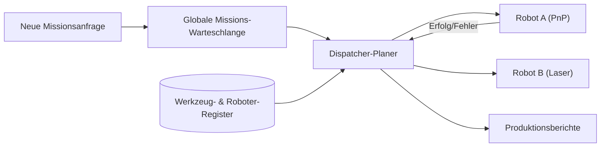

<p align="center">
  
</p>

# 📋 HYDRA-UMC-JOB-DISPATCHER

<p align="center"><a href="README.md">🇺🇸 English</a> | <a href="README_spa.md">🇪🇸 Español</a> | <a href="README_fra.md">🇫🇷 Français</a> | <a href="README_ita.md">🇮🇹 Italiano</a> | 🇩🇪 <b>Deutsch</b> | <a href="README_zho.md">🇨🇳 简体中文</a> | <a href="README_jpn.md">🇯🇵 日本語</a></p>

### ⚙️ Prioritätsbasierte Missions-Warteschlange für heterogene Roboterflotten

<p align="left">
  
  
  
</p>

---

## 1. 🛠️ TECHNISCHER ÜBERBLICK

**HYDRA-UMC-JOB-DISPATCHER** ist die Engine zur Aufgabenverteilung des Orchestrators. Sie verwaltet eine globale Missions-Warteschlange und verteilt Aufgaben an einzelne Roboter basierend auf deren aktueller Verfügbarkeit, Standort und angebautem Werkzeug (URTC).

Er stellt sicher, dass hochpriore Aufgaben (z. B. "Notfall-Defektbehebung") den normalen Produktionsfluss umgehen, und koordiniert mehrstufige Montage-Sequenzen, die die Zusammenarbeit verschiedener Roboter erfordern.

### Hauptmerkmale:
* 📋 **Dynamisches Queueing:** Intelligente Missionspriorisierung und -planung.
* ⚖️ **Werkzeugbewusstes Routing:** Leitet Aufgaben automatisch an den Roboter mit dem richtigen URTC-Kopf weiter.
* 🔄 **Mehrstufige Missionen:** Verwaltet Abhängigkeiten zwischen Aufgaben (z. B. muss "Pick" vor "Place" erfolgen).
* 📡 **Persistenz:** Fehlertoleranter Missionsstatus durch lokale Redis-/Datenbank-Speicherung.
* 🔁 **Idempotente Einreichung (v0):** Echte, optionale `DedupKey`-basierte Deduplizierung über `POST /jobs/submit` - eine erneute Einreichung eines laufenden oder bereits abgeschlossenen Jobs wird unverändert zurückgegeben, und ein Wiederholungsversuch nach einem echten Fehler nutzt dieselbe Job-ID weiter, statt die Arbeit zweimal auszuführen. Die Prioritätsreihenfolge ist über wiederholte Läufe hinweg deterministisch, abgedeckt durch einen expliziten Regressionstest.

---

## 2. 🔄 DISPATCHER-ABLAUF



---

## 3. 🧱 ARCHITEKTUR & DESIGNENTSCHEIDUNGEN

* **Warum die echte Logik unter `src/` liegt, nicht im Repo-Root.** `src/dispatcher` (die Planungs-Engine) und `src/api` (die HTTP-Handler) enthalten die eigentliche Implementierung; `main.go`/`version.go` bleiben im Repo-Root als der Einstiegspunkt, der sie verbindet.
* **Warum die Auftragszuweisung die Werkzeugverfügbarkeit über URTC prüft.** Ein Auftrag, der einen bestimmten Werkzeugkopf benötigt, ist nur einem Roboter zuweisbar, dessen URTC-gesteuerter Werkzeugkopf tatsächlich vorhanden und untätig ist - dies vor der Zuweisung zu prüfen (nicht nach einem gescheiterten Griff) verhindert, dass ein Roboter an einer Station ankommt, die er tatsächlich nicht nutzen kann. `src/dispatcher.Engine.DispatchOnce` setzt das heute bereits per exaktem Abgleich von `RequiredTool` und `Robot.Tool` durch; es spricht noch nicht mit einem echten URTC über CAN, um zu bestätigen, dass der Werkzeugkopf physisch angebracht ist (die Engine kennt nur, was die Roboter-Registrierung über `POST /robots` behauptet).
* **Warum der Scheduler heute schon echt ist, die Persistenz aber nicht.** `src/dispatcher` implementiert den echten Algorithmus, den das "DISPATCHER FLOW"-Diagramm des READMEs beschreibt: eine global nach Priorität sortierte Warteschlange, werkzeugbewusstes Routing und mehrstufige Abhängigkeiten (ein Auftrag bleibt `blocked`, bis jeder Auftrag in seinem `DependsOn` `done` erreicht). All das lebt nur im Speicher - der Zustand von `Engine` bleibt hinter exportierten Methoden, genau damit ein Redis-/DB-gestützter Speicher später das ersetzen kann, was hinter diesen Methoden steckt, ohne jeden Aufrufer zu ändern. Zu beweisen, dass der Scheduling-Algorithmus selbst korrekt ist, kam zuerst.
* **Warum die HTTP-API einfaches JSON/HTTP ist, kein gRPC.** Dies ist eine mensch-/betriebsorientierte Kontrollfläche (einen Auftrag einreichen, einen Roboter registrieren, nachfragen was passiert ist) - `hydra.common.v1` (der geteilte gRPC-Vertrag des Ökosystems, siehe `HYDRA-UMC-ORCHESTRATOR/proto/`) bleibt für Knoten-zu-Knoten-Verkehr reserviert, gemäß dem bereits dokumentierten Geltungsbereich dieses Protos.
* **Wie sich das ins restliche Ökosystem einfügt.** Ein Geschwisterdienst unter HYDRA-UMC-ORCHESTRATOR - verwandelt Entscheidungen auf Missionsebene in konkrete Auftragszuweisungen pro Roboter, geprüft gegen die Werkzeugverfügbarkeit von URTC und die eigenen Routen von HYDRA-UMC-PATH-PLANNER-3D.
* **Warum `POST /jobs/submit` eine neue Route ist, statt `POST /jobs` zu ändern.** `AddJob()`/`POST /jobs` fügen immer ein und schlagen bei einer ID-Kollision fehl - dieser Low-Level-Vertrag bleibt unangetastet. `SubmitJob()`/`POST /jobs/submit` legt darüber echte, optionale Deduplizierung via `Job.DedupKey` - dasselbe Muster, das im gesamten Ökosystem verwendet wird (ein abgesicherter Einstiegspunkt neben einer unveränderten Low-Level-Primitive, keine Verhaltensänderung, die ihr aufgepfropft wird).
* **Warum ein Wiederholungsversuch nach einem Fehler dieselbe Job-ID wiederverwendet, statt eine neue anzulegen.** Die Alternative - bei jedem Versuch einen neuen Job anzulegen - würde die Historie einer einzigen logischen Arbeitseinheit über mehrere IDs verstreuen und einem Aufrufer keine Möglichkeit geben, "das ist einmal fehlgeschlagen und wird wiederholt" von "das ist neue, unabhängige Arbeit" zu unterscheiden. Den ursprünglichen Job auf `Pending` zurückzusetzen hält seinen gesamten Lebenszyklus (einschließlich des fehlgeschlagenen Versuchs) unter einer einzigen ID.

---

## 📂 VERZEICHNISSTRUKTUR

```text
HYDRA-UMC-JOB-DISPATCHER/
├── src/
│   ├── dispatcher/    # Die echte Planungs-Engine: Warteschlange,
│   │                  # werkzeugbewusstes Routing, mehrstufige Abhängigkeiten
│   └── api/           # Einfache JSON/HTTP-Handler, die die Engine umschließen
├── docs/
│   └── API.md         # Echte HTTP-Endpunktreferenz (Requests, Responses, Statuscodes)
├── build/             # Kompilierte Binärdateien (Ausgabe von build.sh/.bat)
├── go.mod / go.sum    # Go-Modul-Definition
├── version.go         # const Version = "X.Y.Z" (go.mod hat kein solches Feld)
├── main.go            # Einstiegspunkt: verbindet die Engine mit der HTTP-API und lauscht
├── bump_version.py    # Versions-Bump nach Kilometerzähler-Prinzip
├── build.sh/.bat      # Erhöht die Version, dann `go build`
├── run.sh/.bat        # Führt die kompilierte Binärdatei aus
└── README.md
```

Aus der ursprünglichen Vorlage entfernt: `hardware/`, `firmware/`, `os/`,
`images/` und `scripts/` — dies ist ein reiner Softwaredienst
(Go-Binärdatei) ohne eigene Hardware oder Firmware, ohne zu pflegendes
Betriebssystem-Image, und ohne Medien-/Utility-Skript-Inhalt, der eigene
Ordner bislang rechtfertigen würde. Siehe [`docs/API.md`](docs/API.md)
für die vollständige HTTP-Endpunktreferenz.

---

## 🔧 BUILD UND AUSFÜHRUNG

Eine echte priorisierte Auftragswarteschlange mit HTTP-API, nicht nur ein
kompilierbares Skelett.

```bash
# Windows
build.bat
run.bat -addr :8090

# Linux / macOS
./build.sh
./run.sh -addr :8090
```

`build.sh`/`build.bat` erhöhen die Version in `version.go` (ökosystemweite
Kilometerzähler-Regel, siehe `bump_version.py` - `go.mod` hat kein
natives Versionsfeld für Anwendungsbinärdateien) und führen anschließend
`go build` aus. `run.sh`/`run.bat` führen die resultierende Binärdatei
direkt aus.

```bash
# Roboter registrieren, Auftrag einreichen, verteilen, dann als erledigt markieren
curl -X POST localhost:8090/robots -d '{"id":"robot-a","tool":"PnP","available":true}'
curl -X POST localhost:8090/jobs   -d '{"id":"job-1","priority":5,"requiredTool":"PnP"}'
curl -X POST localhost:8090/dispatch -d '{}'
curl -X POST localhost:8090/jobs/complete -d '{"id":"job-1","success":true}'
curl localhost:8090/jobs
curl localhost:8090/robots
```

```bash
# Idempotente Einreichung: eine wiederholte Anfrage mit demselben dedupKey
# führt denselben Job nie zweimal aus, selbst wenn der Client eine andere id verwendet.
curl -X POST localhost:8090/jobs/submit -d '{"id":"job-2","priority":5,"requiredTool":"PnP","dedupKey":"req-abc"}'
# -> {"ID":"job-2", ..., "result":"created"}
curl -X POST localhost:8090/jobs/submit -d '{"id":"job-2-retry","priority":5,"requiredTool":"PnP","dedupKey":"req-abc"}'
# -> {"ID":"job-2", ..., "result":"duplicate"} - derselbe Job, unverändert

# Nach einem echten Fehlschlag nutzt ein Wiederholungsversuch mit demselben dedupKey die ID von job-2 weiter:
curl -X POST localhost:8090/jobs/complete -d '{"id":"job-2","success":false}'
curl -X POST localhost:8090/jobs/submit -d '{"id":"job-2-retry-2","priority":5,"requiredTool":"PnP","dedupKey":"req-abc"}'
# -> {"ID":"job-2", "Status":"pending", ..., "result":"retried"}
```

```bash
go test ./...   # src/dispatcher (Scheduling-Algorithmus) +
                 # src/api (echte HTTP-Roundtrips via httptest)
```

---

## 🚀 FAHRPLAN
* **Phase 1:** Deterministische Schwarm-Synchronisation über TSN und Sub-ms-Jitter-Reduzierung.
* **Phase 2:** 3D-Pfadplanung mit dynamischer Hindernisvermeidung in Multi-Roboter-Zellen.
* **Phase 3:** Multi-Roboter-Job-Dispatching-Optimierung unter Berücksichtigung der Ressourcenverfügbarkeit in Echtzeit.
* **Phase 4:** KI-gestützte Schätzung der Jobdauer für eine bessere Planung und Koordination heterogener Roboterflotten.

---

## 🔗 Verwandte Projekte

Dieses Projekt ist Teil eines größeren Robotik-Ökosystems desselben Autors (JuanenRac / Electro Hobby 3D), das Firmware, Steuerungssoftware, KI-Knoten und Flotten-Tools umfasst. Gut zu wissen, denn eine Anfrage könnte tatsächlich eines dieser Projekte betreffen statt dieses Repository.

### Familie

**Elternteil:** **[HYDRA-UMC-ORCHESTRATOR](https://github.com/JuanenRac/HYDRA-UMC-ORCHESTRATOR)** — der Integrations-Elternteil, dem dieser Dispatcher dient.

**Geschwister:**
- **[HYDRA-UMC-SWARM-SYNC](https://github.com/JuanenRac/HYDRA-UMC-SWARM-SYNC)** — Geschwister-Orchestrierungsdienst, gleicher Elternteil.
- **[HYDRA-UMC-PATH-PLANNER-3D](https://github.com/JuanenRac/HYDRA-UMC-PATH-PLANNER-3D)** — Geschwister-Orchestrierungsdienst, gleicher Elternteil.
- **[HYDRA-UMC-NODE-HEALING](https://github.com/JuanenRac/HYDRA-UMC-NODE-HEALING)** — Geschwister-Orchestrierungsdienst, gleicher Elternteil.

### Direkte Beziehung (außerhalb der Familie)

- **[URTC](https://github.com/JuanenRac/URTC)** — weist Aufträge basierend darauf zu, welcher Werkzeugkopf tatsächlich verfügbar ist.

### Restliches Ökosystem

**HYDRA-UMC-Plattform** — die Multi-Roboter-Mikrofabrikzelle
- **[HYDRA-UMC](https://github.com/JuanenRac/HYDRA-UMC)** — das CM5 + STM32H745-Motherboard, das bis zu 8 Roboterarme orchestriert.
- **[HYDRA-UMC-SERVER](https://github.com/JuanenRac/HYDRA-UMC-SERVER)** — das Express/WebSocket-Backend, mit dem jeder Steuerungsclient spricht.
- **[HYDRA-UMC-STUDIO](https://github.com/JuanenRac/HYDRA-UMC-STUDIO)** — webbasiertes Steuerungs-Dashboard, Multi-Roboter-3D-Visualisierung.
- **[HYDRA-UMC-ANDROID-CONTROL](https://github.com/JuanenRac/HYDRA-UMC-ANDROID-CONTROL)** — Android-Steuerungs-App über Wi-Fi/Bluetooth.
- **[HYDRA-UMC-IOS-CONTROL](https://github.com/JuanenRac/HYDRA-UMC-IOS-CONTROL)** — iOS/iPadOS-Steuerungs-App, gebaut in Flutter.
- **[HYDRA-UMC-SUITE](https://github.com/JuanenRac/HYDRA-UMC-SUITE)** — Desktop-Schwarm-Kommandozentrale (Python/PySide6).
- **[HYDRA-UMC-EDITOR-URDF](https://github.com/JuanenRac/HYDRA-UMC-EDITOR-URDF)** — Desktop-URDF-Modelleditor für den Roboterkatalog.
- **[HYDRA-UMC-DSI](https://github.com/JuanenRac/HYDRA-UMC-DSI)** — native Touch-UI für den eingebauten DSI-Touchscreen.

**URTC-Plattform** — der Werkzeugkopf-Controller, den jeder HYDRA-UMC-Roboterarm trägt
- **[URTC](https://github.com/JuanenRac/URTC)** — CAN-Bus-Werkzeugkopf-Controller, 25 Werkzeugprofile.
- **[URTC-FLASHER](https://github.com/JuanenRac/URTC-FLASHER)** — Desktop-Tool für CAN-OTA + SWD/JTAG-Flashing.
- **[URTC-TESTER](https://github.com/JuanenRac/URTC-TESTER)** — Desktop-Tool für Live-CAN-Bus-Diagnose.
- **[URTC-WEB-STUDIO](https://github.com/JuanenRac/URTC-WEB-STUDIO)** — browserbasierte Alternative über die Web-Serial-API.

**🎥 Vision-KI-Knoten (Hailo-8)**
- [HYDRA-UMC-VISION-NODE](https://github.com/JuanenRac/HYDRA-UMC-VISION-NODE)
- [HYDRA-UMC-VISION-STREAMER](https://github.com/JuanenRac/HYDRA-UMC-VISION-STREAMER)
- [HYDRA-UMC-DETECTION-HEF](https://github.com/JuanenRac/HYDRA-UMC-DETECTION-HEF)
- [HYDRA-UMC-SAFETY-ZONES](https://github.com/JuanenRac/HYDRA-UMC-SAFETY-ZONES)
- [HYDRA-UMC-VISUAL-SERVOING-API](https://github.com/JuanenRac/HYDRA-UMC-VISUAL-SERVOING-API)

**🧠 Kognitiver KI-Knoten (Hailo-10)**
- [HYDRA-UMC-COGNITIVE-NODE](https://github.com/JuanenRac/HYDRA-UMC-COGNITIVE-NODE)
- [HYDRA-UMC-VLA-ENGINE](https://github.com/JuanenRac/HYDRA-UMC-VLA-ENGINE)
- [HYDRA-UMC-VOICE-UI](https://github.com/JuanenRac/HYDRA-UMC-VOICE-UI)
- [HYDRA-UMC-SEMANTIC-PLANNER](https://github.com/JuanenRac/HYDRA-UMC-SEMANTIC-PLANNER)
- [HYDRA-UMC-DOCS-QA](https://github.com/JuanenRac/HYDRA-UMC-DOCS-QA)

**🎮 Digitaler Zwilling & Simulation**
- [HYDRA-UMC-TWIN](https://github.com/JuanenRac/HYDRA-UMC-TWIN)
- [HYDRA-UMC-PHYSICS-REPLICA](https://github.com/JuanenRac/HYDRA-UMC-PHYSICS-REPLICA)
- [HYDRA-UMC-HIL-BRIDGE](https://github.com/JuanenRac/HYDRA-UMC-HIL-BRIDGE)
- [HYDRA-UMC-SYNTHETIC-DATA-GEN](https://github.com/JuanenRac/HYDRA-UMC-SYNTHETIC-DATA-GEN)

**📊 Daten & Analytik**
- [HYDRA-UMC-DATALAKE](https://github.com/JuanenRac/HYDRA-UMC-DATALAKE)
- [HYDRA-UMC-TELEMETRY-COLLECTOR](https://github.com/JuanenRac/HYDRA-UMC-TELEMETRY-COLLECTOR)
- [HYDRA-UMC-ANOMALY-DETECTOR](https://github.com/JuanenRac/HYDRA-UMC-ANOMALY-DETECTOR)
- [HYDRA-UMC-PRODUCTION-REPORTS](https://github.com/JuanenRac/HYDRA-UMC-PRODUCTION-REPORTS)

**🏭 Industrielles Gateway**
- [HYDRA-UMC-GATEWAY-INDUSTRIAL](https://github.com/JuanenRac/HYDRA-UMC-GATEWAY-INDUSTRIAL)
- [HYDRA-UMC-OPCUA-SERVER](https://github.com/JuanenRac/HYDRA-UMC-OPCUA-SERVER)
- [HYDRA-UMC-MQTT-BROKER](https://github.com/JuanenRac/HYDRA-UMC-MQTT-BROKER)
- [HYDRA-UMC-MTCONNECT-ADAPTER](https://github.com/JuanenRac/HYDRA-UMC-MTCONNECT-ADAPTER)

**🛠️ Ergänzende Werkzeuge**
- [URTC-SMART-RACK](https://github.com/JuanenRac/URTC-SMART-RACK)
- [URTC-VISION-TOOL](https://github.com/JuanenRac/URTC-VISION-TOOL)
- [HYDRA-UMC-WATCH](https://github.com/JuanenRac/HYDRA-UMC-WATCH)
- [HYDRA-UMC-TOOL-CLI](https://github.com/JuanenRac/HYDRA-UMC-TOOL-CLI)
- [HYDRA-UMC-DASHBOARD-AI](https://github.com/JuanenRac/HYDRA-UMC-DASHBOARD-AI)


## 👤 AUTOR
**JuanenRac** (Electro Hobby 3D)
📧 electrohobby3d@gmail.com
📺 [youtube.com/@electrohobby3d](https://youtube.com/@electrohobby3d)

## 📜 LIZENZ
GPL-3.0 - Siehe LICENSE für Details.
