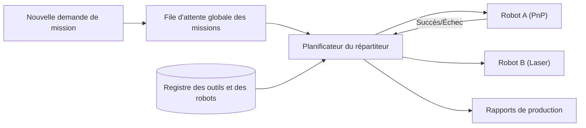

<p align="center">
  
</p>

# 📋 HYDRA-UMC-JOB-DISPATCHER

<p align="center"><a href="README.md">🇺🇸 English</a> | <a href="README_spa.md">🇪🇸 Español</a> | 🇫🇷 <b>Français</b> | <a href="README_ita.md">🇮🇹 Italiano</a> | <a href="README_deu.md">🇩🇪 Deutsch</a> | <a href="README_zho.md">🇨🇳 简体中文</a> | <a href="README_jpn.md">🇯🇵 日本語</a></p>

### ⚙️ File d'attente de missions basée sur les priorités pour les flottes de robots hétérogènes

<p align="left">
  
  
  
</p>

---

## 1. 🛠️ APERÇU TECHNIQUE

**HYDRA-UMC-JOB-DISPATCHER** est le moteur d'allocation de tâches de l'orchestrateur. Il gère une file d'attente globale de missions, distribuant les travaux aux robots individuels en fonction de leur disponibilité actuelle, de leur emplacement et de l'outil attaché (URTC).

Il garantit que les tâches hautement prioritaires (ex : « Réparation de défaut d'urgence ») contournent le flux de production normal et coordonne les séquences d'assemblage en plusieurs étapes qui nécessitent que différents robots travaillent en tandem.

### Caractéristiques principales :
* 📋 **Mise en file d'attente dynamique :** Priorisation et planification intelligentes des missions.
* ⚖️ **Routage sensible aux outils :** Achemine automatiquement les travaux vers le robot disposant de la tête URTC correcte.
* 🔄 **Missions en plusieurs étapes :** Gère les dépendances entre les tâches (ex : « Pick » doit avoir lieu avant « Place »).
* 📡 **Persistance :** État de mission tolérant aux pannes à l'aide d'un stockage Redis/Base de données local.
* 🔁 **Soumission idempotente (v0) :** Déduplication réelle et facultative basée sur `DedupKey` via `POST /jobs/submit` - une resoumission d'un job en cours ou déjà terminé est renvoyée inchangée, et une nouvelle tentative après un vrai échec réutilise le même ID de job au lieu d'exécuter le travail deux fois. L'ordre de priorité est déterministe à travers des exécutions répétées, couvert par un test de régression explicite.

---

## 2. 🔄 FLUX DU DISPATCHER



---

## 3. 🧱 ARCHITECTURE & DÉCISIONS DE CONCEPTION

* **Pourquoi la logique réelle vit sous `src/`, pas à la racine du dépôt.** `src/dispatcher` (le moteur de planification) et `src/api` (les handlers HTTP) contiennent l'implémentation réelle ; `main.go`/`version.go` restent à la racine comme point d'entrée qui les relie.
* **Pourquoi l'attribution des tâches vérifie la disponibilité de l'outil via URTC.** Une tâche nécessitant une tête d'outil spécifique n'est attribuable qu'à un robot dont la tête d'outil contrôlée par URTC est réellement présente et inactive - vérifier cela avant l'attribution (pas après un échec de prise) évite qu'un robot n'arrive à un poste qu'il ne peut en réalité pas utiliser. `src/dispatcher.Engine.DispatchOnce` applique déjà cela aujourd'hui par correspondance exacte `RequiredTool`/`Robot.Tool` ; il ne parle pas encore à un vrai URTC via CAN pour confirmer que la tête d'outil est physiquement attachée (le moteur ne connaît que ce que déclare l'enregistrement du robot via `POST /robots`).
* **Pourquoi l'ordonnanceur est réel aujourd'hui mais pas la persistance.** `src/dispatcher` implémente le véritable algorithme que décrit le diagramme "DISPATCHER FLOW" du README : une file globale triée par priorité, un routage tenant compte de l'outil, et des dépendances multi-étapes (une tâche reste `blocked` tant que chaque tâche de son `DependsOn` n'atteint pas `done`). Tout cela ne vit qu'en mémoire - l'état d'`Engine` reste derrière des méthodes exportées précisément pour qu'un stockage adossé à Redis/une BD puisse remplacer ce qu'il y a derrière ces méthodes plus tard sans changer chaque appelant. Prouver que l'algorithme d'ordonnancement lui-même était correct est venu en premier.
* **Pourquoi l'API HTTP est du JSON/HTTP simple, pas du gRPC.** C'est une surface de contrôle orientée humain/exploitation (soumettre une tâche, enregistrer un robot, demander ce qui s'est passé) - `hydra.common.v1` (le contrat gRPC partagé de l'écosystème, voir `HYDRA-UMC-ORCHESTRATOR/proto/`) reste réservé au trafic nœud-à-nœud, selon la portée déjà documentée de ce proto.
* **Comment cela s'intègre dans le reste de l'écosystème.** Un service frère sous HYDRA-UMC-ORCHESTRATOR - transforme les décisions au niveau mission en attributions concrètes de tâches par robot, vérifiées contre la disponibilité d'outils d'URTC et les propres trajectoires de HYDRA-UMC-PATH-PLANNER-3D.
* **Pourquoi `POST /jobs/submit` est une nouvelle route plutôt qu'un changement de `POST /jobs`.** `AddJob()`/`POST /jobs` insèrent toujours et échouent sur une collision d'ID - ce contrat de bas niveau reste intact. `SubmitJob()`/`POST /jobs/submit` ajoute par-dessus une déduplication réelle et facultative via `Job.DedupKey` : le même motif utilisé dans tout l'écosystème (un point d'entrée protégé ajouté à côté d'une primitive de bas niveau inchangée, pas un changement de comportement greffé dessus).
* **Pourquoi une nouvelle tentative après un échec réutilise le même ID de job plutôt que d'en créer un nouveau.** L'alternative - créer un nouveau job à chaque tentative - disperserait l'historique d'une même unité logique de travail sur plusieurs ID et ne donnerait à l'appelant aucun moyen de distinguer « ceci a échoué une fois et est retenté » de « ceci est un nouveau travail sans rapport ». Réinitialiser le job d'origine à `Pending` garde tout son cycle de vie (y compris la tentative échouée) sous un seul ID.

---

## 📂 STRUCTURE DES RÉPERTOIRES

```text
HYDRA-UMC-JOB-DISPATCHER/
├── src/
│   ├── dispatcher/    # Le véritable moteur de planification : file,
│   │                  # routage tenant compte de l'outil, dépendances multi-étapes
│   └── api/           # Handlers JSON/HTTP simples encapsulant le moteur
├── docs/
│   └── API.md         # Référence réelle des endpoints HTTP (requêtes, réponses, codes de statut)
├── images/            # Médias et diagrammes
├── systemd/
│   └── hydra-umc-job-dispatcher.service # Unité systemd de la file de missions prioritaires sur la CM5 locale
├── tools/
│   ├── build_test.py  # Contrôle build/compilation sans gestion de version
│   └── ci_validate.py # Validation manifest/CHANGELOG/docs utilisée par la CI
├── build/             # Binaires compilés (sortie de build.sh/build.bat)
├── go.mod / go.sum    # Définition du module Go
├── version.go         # const Version = "X.Y.Z" (go.mod n'a pas ce champ)
├── main.go            # Point d'entrée : relie le moteur à l'API HTTP et écoute
├── bump_version.py    # Incrément de version type compteur kilométrique
├── bump_manifest_version.py # Synchronise la version de hydra-umc.project.json avec la version native (--sync)
├── build.sh/.bat      # Incrémente la version puis `go build`
├── run.sh/.bat        # Exécute le binaire compilé
└── README.md
```

Élagué du modèle original : `hardware/`, `firmware/` et `os/` — il
s'agit d'un service purement logiciel (binaire Go) sans matériel ni
firmware propres et sans image de système d'exploitation à maintenir.
Voir [`docs/API.md`](docs/API.md) pour la référence complète des
endpoints HTTP.

---

## 🔧 BUILD ET EXÉCUTION

Une véritable file de missions priorisées avec une API HTTP, pas
seulement un squelette qui compile.

```bash
# Windows
build.bat
run.bat -addr :8090

# Linux / macOS
./build.sh
./run.sh -addr :8090
```

`build.sh`/`build.bat` incrémentent la version dans `version.go` (règle du
compteur kilométrique de l'écosystème, voir `bump_version.py` - `go.mod`
n'a pas de champ de version natif pour les binaires d'application) puis
exécutent `go build`. `run.sh`/`run.bat` exécutent directement le binaire
résultant.

```bash
# Enregistrer un robot, soumettre une tâche, la répartir, puis la marquer terminée
curl -X POST localhost:8090/robots -d '{"id":"robot-a","tool":"PnP","available":true}'
curl -X POST localhost:8090/jobs   -d '{"id":"job-1","priority":5,"requiredTool":"PnP"}'
curl -X POST localhost:8090/dispatch -d '{}'
curl -X POST localhost:8090/jobs/complete -d '{"id":"job-1","success":true}'
curl localhost:8090/jobs
curl localhost:8090/robots
```

```bash
# Soumission idempotente : une requête retentée avec le même dedupKey
# n'exécute jamais deux fois le même job, même si le client utilise un id différent.
curl -X POST localhost:8090/jobs/submit -d '{"id":"job-2","priority":5,"requiredTool":"PnP","dedupKey":"req-abc"}'
# -> {"ID":"job-2", ..., "result":"created"}
curl -X POST localhost:8090/jobs/submit -d '{"id":"job-2-retry","priority":5,"requiredTool":"PnP","dedupKey":"req-abc"}'
# -> {"ID":"job-2", ..., "result":"duplicate"} - même job, inchangé

# Après un vrai échec, une nouvelle tentative avec le même dedupKey réutilise l'ID de job-2 :
curl -X POST localhost:8090/jobs/complete -d '{"id":"job-2","success":false}'
curl -X POST localhost:8090/jobs/submit -d '{"id":"job-2-retry-2","priority":5,"requiredTool":"PnP","dedupKey":"req-abc"}'
# -> {"ID":"job-2", "Status":"pending", ..., "result":"retried"}
```

```bash
go test ./...   # src/dispatcher (algorithme d'ordonnancement) +
                 # src/api (allers-retours HTTP réels via httptest)
```

---

## 🚀 FEUILLE DE ROUTE
* **Phase 1 :** Synchronisation déterministe d'essaim sur TSN et réduction de la gigue sub-ms.
* **Phase 2 :** Planification de trajectoires 3D avec évitement dynamique d'obstacles dans les cellules multi-robots.
* **Phase 3 :** Optimisation de la répartition des tâches multi-robots à l'aide de la disponibilité des ressources en temps réel.
* **Phase 4 :** Estimation de la durée des travaux pilotée par l'IA pour une meilleure planification et coordination des flottes hétérogènes.

---

## 🔗 Projets Liés

Ce projet fait partie de l'écosystème robotique HYDRA-UMC du même auteur (JuanenRac / Electro Hobby 3D). Bon à savoir, car une demande pourrait en réalité concerner l'un de ceux-ci plutôt que ce dépôt.

**Projet Parent**
- **[HYDRA-UMC-ORCHESTRATOR](https://github.com/JuanenRac/HYDRA-UMC-ORCHESTRATOR)** — hub d'intégration avec un vrai contrat de rapport de santé gRPC/Protobuf et une machine à états de mission ; le parent dont ce dépôt est un service d'orchestration spécifique, au sein de sa propre couche de coordination d'essaim.

**Projets Frères** — les autres services d'orchestration de la propre couche de coordination d'essaim de HYDRA-UMC-ORCHESTRATOR
- **[HYDRA-UMC-SWARM-SYNC](https://github.com/JuanenRac/HYDRA-UMC-SWARM-SYNC)** — vraie synchronisation d'état CRDT LWW-Element-Map, testée par propriétés pour la convergence multi-cellule.
- **[HYDRA-UMC-PATH-PLANNER-3D](https://github.com/JuanenRac/HYDRA-UMC-PATH-PLANNER-3D)** — vrai planificateur de trajectoire 3D basé sur RRT, avec vraie validation des collisions obstacle/espace de travail.
- **[HYDRA-UMC-NODE-HEALING](https://github.com/JuanenRac/HYDRA-UMC-NODE-HEALING)** — vrai chien de garde de santé de flotte basé sur gRPC, avec retry/backoff et détection d'incohérence d'identité.

**Directement Liés**
- **[URTC](https://github.com/JuanenRac/URTC)** — firmware pour la carte physique Universal Robot Tool Controller, plus de 25 profils d'outil sur bus CAN — attribue les tâches selon laquelle des propres têtes d'outil d'URTC est réellement disponible.
- **[HYDRA-UMC-PRODUCTION-REPORTS](https://github.com/JuanenRac/HYDRA-UMC-PRODUCTION-REPORTS)** — vrai calcul OEE/disponibilité sur l'historique de DATALAKE, avec export CSV reproductible — la destination prévue pour les journaux d'achèvement de mission ; ce répartiteur est la source réelle prévue de ses propres données OEE `production_event` une fois les achèvements câblés pour les écrire (pas encore implémenté, suivi du côté de ce projet).

**Fait Également Partie de l'Écosystème**

*Matériel & Plateforme de Base*
- **[HYDRA-UMC](https://github.com/JuanenRac/HYDRA-UMC)** — la carte mère physique du bras robotique : hôte CM5 + coprocesseur STM32H745 double cœur, coordonnant jusqu'à 8 bras-outils via CAN-OTA/SPI-OTA.
- **[HYDRA-UMC-OS](https://github.com/JuanenRac/HYDRA-UMC-OS)** — couche produit reproductible sur Raspberry Pi OS pour le CM5 : agent en lecture seule, config/profils validés, provisionnement WiFi de premier contact.
- **[HYDRA-UMC-SDK](https://github.com/JuanenRac/HYDRA-UMC-SDK)** — le contrat JSON-Schema partagé et la barrière de sécurité contre laquelle chaque bridge valide ses commandes.

*Backend Central & Clients*
- **[HYDRA-UMC-SERVER](https://github.com/JuanenRac/HYDRA-UMC-SERVER)** — le vrai backend headless (REST/WebSocket) auquel parle réellement chaque client de contrôle.
- **[HYDRA-UMC-STUDIO](https://github.com/JuanenRac/HYDRA-UMC-STUDIO)** — tableau de bord de contrôle web avec visualisation 3D multi-robot en temps réel.
- **[HYDRA-UMC-SUITE](https://github.com/JuanenRac/HYDRA-UMC-SUITE)** — centre de commande d'essaim de bureau (PySide6) pour plusieurs serveurs à la fois, empaqueté en exécutable autonome.
- **[HYDRA-UMC-ANDROID-CONTROL](https://github.com/JuanenRac/HYDRA-UMC-ANDROID-CONTROL)** — application de contrôle Android native avec connexion biométrique et un compagnon Wear OS jumelé.
- **[HYDRA-UMC-IOS-CONTROL](https://github.com/JuanenRac/HYDRA-UMC-IOS-CONTROL)** — application de contrôle iOS/iPadOS (Flutter) avec synchronisation WebSocket en temps réel.
- **[HYDRA-UMC-DSI](https://github.com/JuanenRac/HYDRA-UMC-DSI)** — interface tactile native pour l'écran tactile DSI 7" embarqué, intégrée directement sur le CM5.
- **[HYDRA-UMC-EDITOR-URDF](https://github.com/JuanenRac/HYDRA-UMC-EDITOR-URDF)** — créateur/éditeur graphique de bureau pour URDF qui envoie les modèles terminés vers le propre catalogue de STUDIO.
- **[HYDRA-UMC-BRIDGE-AMR](https://github.com/JuanenRac/HYDRA-UMC-BRIDGE-AMR)** — frontière de coordination pour les flottes AGV/AMR via un éditeur MQTT VDA 5050 réel.
- **[HYDRA-UMC-BRIDGE-CNC](https://github.com/JuanenRac/HYDRA-UMC-BRIDGE-CNC)** — coordinateur haut niveau pour cellules CNC avec accès réel au statut/octets de contrôle GRBL.
- **[HYDRA-UMC-BRIDGE-DROIDS](https://github.com/JuanenRac/HYDRA-UMC-BRIDGE-DROIDS)** — frontière de coordination pour droïdes à pattes/humanoïdes, avec un véritable émetteur de commandes Boston Dynamics Spot.
- **[HYDRA-UMC-BRIDGE-LASER](https://github.com/JuanenRac/HYDRA-UMC-BRIDGE-LASER)** — coordinateur de sécurité pour cellules laser lisant 3 vraies sécurités GPIO de clé/enceinte/verrouillage.
- **[HYDRA-UMC-BRIDGE-OPENPNP](https://github.com/JuanenRac/HYDRA-UMC-BRIDGE-OPENPNP)** — coordinateur haut niveau sûr pour le flux de cartes du pick-and-place OpenPnP.
- **[HYDRA-UMC-BRIDGE-PRINTER3D](https://github.com/JuanenRac/HYDRA-UMC-BRIDGE-PRINTER3D)** — frontière de coordination sûre pour imprimantes 3D Moonraker/Klipper, avec de vraies commandes de tâche contrôlées.
- **[HYDRA-UMC-BRIDGE-ROS2](https://github.com/JuanenRac/HYDRA-UMC-BRIDGE-ROS2)** — coordinateur de sécurité avec un vrai transport ROS 2 rclpy à importation paresseuse.
- **[HYDRA-UMC-BRIDGE-UAV](https://github.com/JuanenRac/HYDRA-UMC-BRIDGE-UAV)** — frontière de coordination pour UAV équipés de caméra, avec un véritable émetteur de commandes MAVLink.

*Plateforme d'Outils URTC*
- **[URTC-FLASHER](https://github.com/JuanenRac/URTC-FLASHER)** — outil de bureau à interface graphique pour flasher les cartes URTC, CAN-OTA plus SWD/JTAG puce complète.
- **[URTC-TESTER](https://github.com/JuanenRac/URTC-TESTER)** — outil de bureau de diagnostic CAN-bus en direct pour cartes URTC, un panneau par profil d'outil.
- **[URTC-WEB-STUDIO](https://github.com/JuanenRac/URTC-WEB-STUDIO)** — alternative basée navigateur à URTC-TESTER via la Web Serial API, sans installation locale.

*Nœud IA de Vision (Hailo-8)*
- **[HYDRA-UMC-VISION-NODE](https://github.com/JuanenRac/HYDRA-UMC-VISION-NODE)** — hub d'intégration pour le pipeline de vision Hailo-8, avec une vraie vérification de disponibilité matérielle par étape.
- **[HYDRA-UMC-DETECTION-HEF](https://github.com/JuanenRac/HYDRA-UMC-DETECTION-HEF)** — registre réel de modèles compilés avec vérification de chargement sécurisé par architecture Hailo/checksum.
- **[HYDRA-UMC-VISION-STREAMER](https://github.com/JuanenRac/HYDRA-UMC-VISION-STREAMER)** — générateur réel de pipeline GStreamer + config MediaMTX, avec une vraie frontière d'intégration HailoRT.
- **[HYDRA-UMC-VISUAL-SERVOING-API](https://github.com/JuanenRac/HYDRA-UMC-VISUAL-SERVOING-API)** — vraie loi de correction Position-Based Visual Servoing, verrouillée sur l'état de zone en amont.
- **[HYDRA-UMC-SAFETY-ZONES](https://github.com/JuanenRac/HYDRA-UMC-SAFETY-ZONES)** — vraie vérification de violation de zone et demande d'E-STOP, avec application de la fraîcheur de calibration.

*Nœud IA Cognitif (Hailo-10)*
- **[HYDRA-UMC-COGNITIVE-NODE](https://github.com/JuanenRac/HYDRA-UMC-COGNITIVE-NODE)** — hub d'intégration pour le pipeline cognitif Hailo-10 (orchestration LLM/VLA/voix).
- **[HYDRA-UMC-VLA-ENGINE](https://github.com/JuanenRac/HYDRA-UMC-VLA-ENGINE)** — vrai encodage/décodage de jetons d'action et génération de trajectoire pour un modèle Vision-Language-Action.
- **[HYDRA-UMC-VOICE-UI](https://github.com/JuanenRac/HYDRA-UMC-VOICE-UI)** — vrai front-end vocal (VAD + analyseur d'intention) avec un relais Watch borné et soumis à confirmation.
- **[HYDRA-UMC-SEMANTIC-PLANNER](https://github.com/JuanenRac/HYDRA-UMC-SEMANTIC-PLANNER)** — vraie décomposition de tâches basée sur des règles et récupération sémantique d'erreurs sur les codes d'erreur MCU.
- **[HYDRA-UMC-DOCS-QA](https://github.com/JuanenRac/HYDRA-UMC-DOCS-QA)** — vraie recherche documentaire TF-IDF (bibliothèque standard uniquement) sur les propres documents Markdown de cet écosystème.

*Jumeau Numérique & Simulation*
- **[HYDRA-UMC-TWIN](https://github.com/JuanenRac/HYDRA-UMC-TWIN)** — hub d'intégration pour le moteur de jumeau numérique, avec un vrai contrat de synchronisation par compatibilité de version.
- **[HYDRA-UMC-HIL-BRIDGE](https://github.com/JuanenRac/HYDRA-UMC-HIL-BRIDGE)** — vrai verrouillage de sécurité hardware-in-the-loop routant les commandes entre simulation et matériel réel.
- **[HYDRA-UMC-PHYSICS-REPLICA](https://github.com/JuanenRac/HYDRA-UMC-PHYSICS-REPLICA)** — vraie cinématique directe et validation des limites articulaires sur un vrai sous-ensemble URDF.
- **[HYDRA-UMC-SYNTHETIC-DATA-GEN](https://github.com/JuanenRac/HYDRA-UMC-SYNTHETIC-DATA-GEN)** — vrai générateur procédural de scènes 2D avec export d'annotations YOLO/COCO.

*Données & Analytique*
- **[HYDRA-UMC-DATALAKE](https://github.com/JuanenRac/HYDRA-UMC-DATALAKE)** — vrai magasin de séries temporelles basé sur sqlite3, avec une vraie API HTTP d'ingestion/requête.
- **[HYDRA-UMC-ANOMALY-DETECTOR](https://github.com/JuanenRac/HYDRA-UMC-ANOMALY-DETECTOR)** — vrai détecteur d'anomalies FFT + ligne de base statistique, avec surveillance de dérive.
- **[HYDRA-UMC-TELEMETRY-COLLECTOR](https://github.com/JuanenRac/HYDRA-UMC-TELEMETRY-COLLECTOR)** — vrai pipeline d'ingestion CAN/WebSocket vers DATALAKE, avec déduplication par séquence.

*Passerelle Industrielle*
- **[HYDRA-UMC-GATEWAY-INDUSTRIAL](https://github.com/JuanenRac/HYDRA-UMC-GATEWAY-INDUSTRIAL)** — hub d'intégration relayant vers les protocoles industriels, avec une vraie couche de liste blanche de commandes/contre-pression.
- **[HYDRA-UMC-OPCUA-SERVER](https://github.com/JuanenRac/HYDRA-UMC-OPCUA-SERVER)** — vrai espace d'adressage OPC-UA, vérifié avec une vraie session client du protocole binaire.
- **[HYDRA-UMC-MQTT-BROKER](https://github.com/JuanenRac/HYDRA-UMC-MQTT-BROKER)** — vrai broker MQTT avec authentification par client optionnelle et ACL de sujets.
- **[HYDRA-UMC-MTCONNECT-ADAPTER](https://github.com/JuanenRac/HYDRA-UMC-MTCONNECT-ADAPTER)** — vrais points de terminaison XML MTConnect `/probe` et `/current`, avec sortie en mode dégradé.

*Outils Complémentaires & Opérations de l'Écosystème*
- **[HYDRA-UMC-DASHBOARD-AI](https://github.com/JuanenRac/HYDRA-UMC-DASHBOARD-AI)** — panneaux Smart Summaries et Anomaly Highlighting sur DATALAKE/ANOMALY-DETECTOR, avec un repli statistique honnête.
- **[HYDRA-UMC-TOOL-CLI](https://github.com/JuanenRac/HYDRA-UMC-TOOL-CLI)** — CLI de flotte avec un vrai contrat de codes de sortie stable, un vrai client en direct de la propre API de HYDRA-UMC-SERVER.
- **[HYDRA-UMC-WATCH](https://github.com/JuanenRac/HYDRA-UMC-WATCH)** — application compagnon WearOS avec de vraies alertes haptiques et un relais vocal vers le téléphone jumelé.
- **[URTC-SMART-RACK](https://github.com/JuanenRac/URTC-SMART-RACK)** — firmware pour un rack de montage de cartes avec décodage réel d'ID d'outil et logique de préchauffage Smart Idle.
- **[URTC-VISION-TOOL](https://github.com/JuanenRac/URTC-VISION-TOOL)** — firmware plus un vrai compagnon de vision Python pour une tête d'outil d'inspection thermique/RGB.
- **[HYDRA-UMC-UPDATER](https://github.com/JuanenRac/HYDRA-UMC-UPDATER)** — outil administratif de bureau qui découvre, clone et met à jour chaque dépôt de cet écosystème.


## 👤 AUTEUR
**JuanenRac** (Electro Hobby 3D)
📧 electrohobby3d@gmail.com
📺 [youtube.com/@electrohobby3d](https://youtube.com/@electrohobby3d)

## 📜 LICENCE
GPL-3.0 - Voir le fichier LICENSE pour plus de détails.
