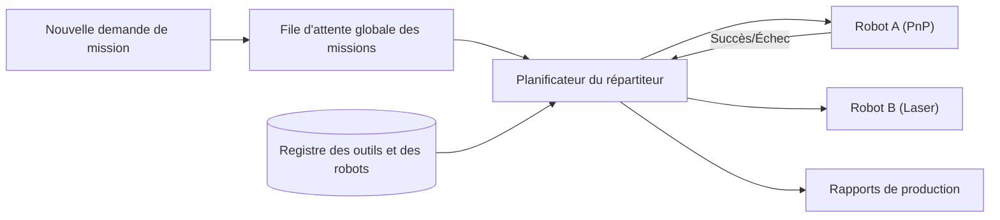

<p align="center">
  
</p>

# 📋 HYDRA-UMC-JOB-DISPATCHER

<p align="center"><a href="README.md">🇺🇸 English</a> | <a href="README_spa.md">🇪🇸 Español</a> | 🇫🇷 <b>Français</b> | <a href="README_ita.md">🇮🇹 Italiano</a> | <a href="README_deu.md">🇩🇪 Deutsch</a> | <a href="README_zho.md">🇨🇳 简体中文</a> | <a href="README_jpn.md">🇯🇵 日本語</a></p>

### ⚙️ File d'attente de missions basée sur les priorités pour les flottes de robots hétérogènes

<p align="left">
  
  
  
</p>

---

## 1. 🛠️ APERÇU TECHNIQUE

**HYDRA-UMC-JOB-DISPATCHER** est le moteur d'allocation de tâches de l'orchestrateur. Il gère une file d'attente globale de missions, distribuant les travaux aux robots individuels en fonction de leur disponibilité actuelle, de leur emplacement et de l'outil attaché (URTC).

Il garantit que les tâches hautement prioritaires (ex : « Réparation de défaut d'urgence ») contournent le flux de production normal et coordonne les séquences d'assemblage en plusieurs étapes qui nécessitent que différents robots travaillent en tandem.

### Caractéristiques principales :
* 📋 **Mise en file d'attente dynamique :** Priorisation et planification intelligentes des missions.
* ⚖️ **Routage sensible aux outils :** Achemine automatiquement les travaux vers le robot disposant de la tête URTC correcte.
* 🔄 **Missions en plusieurs étapes :** Gère les dépendances entre les tâches (ex : « Pick » doit avoir lieu avant « Place »).
* 📡 **Persistance :** État de mission tolérant aux pannes à l'aide d'un stockage Redis/Base de données local.
* 🔁 **Soumission idempotente (v0) :** Déduplication réelle et facultative basée sur `DedupKey` via `POST /jobs/submit` - une resoumission d'un job en cours ou déjà terminé est renvoyée inchangée, et une nouvelle tentative après un vrai échec réutilise le même ID de job au lieu d'exécuter le travail deux fois. L'ordre de priorité est déterministe à travers des exécutions répétées, couvert par un test de régression explicite.

---

## 2. 🔄 FLUX DU DISPATCHER



---

## 3. 🧱 ARCHITECTURE & DÉCISIONS DE CONCEPTION

* **Pourquoi la logique réelle vit sous `src/`, pas à la racine du dépôt.** `src/dispatcher` (le moteur de planification) et `src/api` (les handlers HTTP) contiennent l'implémentation réelle ; `main.go`/`version.go` restent à la racine comme point d'entrée qui les relie.
* **Pourquoi l'attribution des tâches vérifie la disponibilité de l'outil via URTC.** Une tâche nécessitant une tête d'outil spécifique n'est attribuable qu'à un robot dont la tête d'outil contrôlée par URTC est réellement présente et inactive - vérifier cela avant l'attribution (pas après un échec de prise) évite qu'un robot n'arrive à un poste qu'il ne peut en réalité pas utiliser. `src/dispatcher.Engine.DispatchOnce` applique déjà cela aujourd'hui par correspondance exacte `RequiredTool`/`Robot.Tool` ; il ne parle pas encore à un vrai URTC via CAN pour confirmer que la tête d'outil est physiquement attachée (le moteur ne connaît que ce que déclare l'enregistrement du robot via `POST /robots`).
* **Pourquoi l'ordonnanceur est réel aujourd'hui mais pas la persistance.** `src/dispatcher` implémente le véritable algorithme que décrit le diagramme "DISPATCHER FLOW" du README : une file globale triée par priorité, un routage tenant compte de l'outil, et des dépendances multi-étapes (une tâche reste `blocked` tant que chaque tâche de son `DependsOn` n'atteint pas `done`). Tout cela ne vit qu'en mémoire - l'état d'`Engine` reste derrière des méthodes exportées précisément pour qu'un stockage adossé à Redis/une BD puisse remplacer ce qu'il y a derrière ces méthodes plus tard sans changer chaque appelant. Prouver que l'algorithme d'ordonnancement lui-même était correct est venu en premier.
* **Pourquoi l'API HTTP est du JSON/HTTP simple, pas du gRPC.** C'est une surface de contrôle orientée humain/exploitation (soumettre une tâche, enregistrer un robot, demander ce qui s'est passé) - `hydra.common.v1` (le contrat gRPC partagé de l'écosystème, voir `HYDRA-UMC-ORCHESTRATOR/proto/`) reste réservé au trafic nœud-à-nœud, selon la portée déjà documentée de ce proto.
* **Comment cela s'intègre dans le reste de l'écosystème.** Un service frère sous HYDRA-UMC-ORCHESTRATOR - transforme les décisions au niveau mission en attributions concrètes de tâches par robot, vérifiées contre la disponibilité d'outils d'URTC et les propres trajectoires de HYDRA-UMC-PATH-PLANNER-3D.
* **Pourquoi `POST /jobs/submit` est une nouvelle route plutôt qu'un changement de `POST /jobs`.** `AddJob()`/`POST /jobs` insèrent toujours et échouent sur une collision d'ID - ce contrat de bas niveau reste intact. `SubmitJob()`/`POST /jobs/submit` ajoute par-dessus une déduplication réelle et facultative via `Job.DedupKey` : le même motif utilisé dans tout l'écosystème (un point d'entrée protégé ajouté à côté d'une primitive de bas niveau inchangée, pas un changement de comportement greffé dessus).
* **Pourquoi une nouvelle tentative après un échec réutilise le même ID de job plutôt que d'en créer un nouveau.** L'alternative - créer un nouveau job à chaque tentative - disperserait l'historique d'une même unité logique de travail sur plusieurs ID et ne donnerait à l'appelant aucun moyen de distinguer « ceci a échoué une fois et est retenté » de « ceci est un nouveau travail sans rapport ». Réinitialiser le job d'origine à `Pending` garde tout son cycle de vie (y compris la tentative échouée) sous un seul ID.

---

## 📂 STRUCTURE DES RÉPERTOIRES

```text
HYDRA-UMC-JOB-DISPATCHER/
├── src/
│   ├── dispatcher/    # Le véritable moteur de planification : file,
│   │                  # routage tenant compte de l'outil, dépendances multi-étapes
│   └── api/           # Handlers JSON/HTTP simples encapsulant le moteur
├── docs/
│   └── API.md         # Référence réelle des endpoints HTTP (requêtes, réponses, codes de statut)
├── build/             # Binaires compilés (sortie de build.sh/build.bat)
├── go.mod / go.sum    # Définition du module Go
├── version.go         # const Version = "X.Y.Z" (go.mod n'a pas ce champ)
├── main.go            # Point d'entrée : relie le moteur à l'API HTTP et écoute
├── bump_version.py    # Incrément de version type compteur kilométrique
├── build.sh/.bat      # Incrémente la version puis `go build`
├── run.sh/.bat        # Exécute le binaire compilé
└── README.md
```

Élagué du modèle original : `hardware/`, `firmware/`, `os/`,
`images/` et `scripts/` — il s'agit d'un service purement logiciel
(binaire Go) sans matériel ni firmware propres, sans image de système
d'exploitation à maintenir, et sans contenu de médias/scripts utilitaires
encore suffisant pour justifier leurs propres dossiers. Voir
[`docs/API.md`](docs/API.md) pour la référence complète des endpoints HTTP.

---

## 🔧 BUILD & RUN

Une véritable file de missions priorisées avec une API HTTP, pas
seulement un squelette qui compile.

```bash
# Windows
build.bat
run.bat -addr :8090

# Linux / macOS
./build.sh
./run.sh -addr :8090
```

`build.sh`/`build.bat` incrémentent la version dans `version.go` (règle du
compteur kilométrique de l'écosystème, voir `bump_version.py` - `go.mod`
n'a pas de champ de version natif pour les binaires d'application) puis
exécutent `go build`. `run.sh`/`run.bat` exécutent directement le binaire
résultant.

```bash
# Enregistrer un robot, soumettre une tâche, la répartir, puis la marquer terminée
curl -X POST localhost:8090/robots -d '{"id":"robot-a","tool":"PnP","available":true}'
curl -X POST localhost:8090/jobs   -d '{"id":"job-1","priority":5,"requiredTool":"PnP"}'
curl -X POST localhost:8090/dispatch -d '{}'
curl -X POST localhost:8090/jobs/complete -d '{"id":"job-1","success":true}'
curl localhost:8090/jobs
curl localhost:8090/robots
```

```bash
# Soumission idempotente : une requête retentée avec le même dedupKey
# n'exécute jamais deux fois le même job, même si le client utilise un id différent.
curl -X POST localhost:8090/jobs/submit -d '{"id":"job-2","priority":5,"requiredTool":"PnP","dedupKey":"req-abc"}'
# -> {"ID":"job-2", ..., "result":"created"}
curl -X POST localhost:8090/jobs/submit -d '{"id":"job-2-retry","priority":5,"requiredTool":"PnP","dedupKey":"req-abc"}'
# -> {"ID":"job-2", ..., "result":"duplicate"} - même job, inchangé

# Après un vrai échec, une nouvelle tentative avec le même dedupKey réutilise l'ID de job-2 :
curl -X POST localhost:8090/jobs/complete -d '{"id":"job-2","success":false}'
curl -X POST localhost:8090/jobs/submit -d '{"id":"job-2-retry-2","priority":5,"requiredTool":"PnP","dedupKey":"req-abc"}'
# -> {"ID":"job-2", "Status":"pending", ..., "result":"retried"}
```

```bash
go test ./...   # src/dispatcher (algorithme d'ordonnancement) +
                 # src/api (allers-retours HTTP réels via httptest)
```

---

## 🚀 ROADMAP
* **Phase 1 :** Synchronisation déterministe d'essaim sur TSN et réduction de la gigue sub-ms.
* **Phase 2 :** Planification de trajectoires 3D avec évitement dynamique d'obstacles dans les cellules multi-robots.
* **Phase 3 :** Optimisation de la répartition des tâches multi-robots à l'aide de la disponibilité des ressources en temps réel.
* **Phase 4 :** Estimation de la durée des travaux pilotée par l'IA pour une meilleure planification et coordination des flottes hétérogènes.

---

## 🔗 Projets Liés

Ce projet fait partie d'un écosystème robotique plus large du même auteur (JuanenRac / Electro Hobby 3D), couvrant firmware, logiciel de contrôle, nœuds IA et outillage de flotte. Bon à savoir, car une demande pourrait en réalité concerner l'un de ces projets plutôt que ce dépôt.

### Famille

**Parent :** **[HYDRA-UMC-ORCHESTRATOR](https://github.com/JuanenRac/HYDRA-UMC-ORCHESTRATOR)** — le parent d'intégration que sert ce répartiteur.

**Frères et sœurs :**
- **[HYDRA-UMC-SWARM-SYNC](https://github.com/JuanenRac/HYDRA-UMC-SWARM-SYNC)** — service d'orchestration frère, même parent.
- **[HYDRA-UMC-PATH-PLANNER-3D](https://github.com/JuanenRac/HYDRA-UMC-PATH-PLANNER-3D)** — service d'orchestration frère, même parent.
- **[HYDRA-UMC-NODE-HEALING](https://github.com/JuanenRac/HYDRA-UMC-NODE-HEALING)** — service d'orchestration frère, même parent.

### Relation Directe (hors de la famille)

- **[URTC](https://github.com/JuanenRac/URTC)** — assigne les tâches selon la tête d'outil réellement disponible.

### Reste de l'Écosystème

**Plateforme HYDRA-UMC** — la cellule de micro-usine multi-robot
- **[HYDRA-UMC](https://github.com/JuanenRac/HYDRA-UMC)** — la carte mère CM5 + STM32H745 orchestrant jusqu'à 8 bras robotiques.
- **[HYDRA-UMC-SERVER](https://github.com/JuanenRac/HYDRA-UMC-SERVER)** — le backend Express/WebSocket auquel parle chaque client de contrôle.
- **[HYDRA-UMC-STUDIO](https://github.com/JuanenRac/HYDRA-UMC-STUDIO)** — tableau de bord de contrôle web, visualisation 3D multi-robot.
- **[HYDRA-UMC-ANDROID-CONTROL](https://github.com/JuanenRac/HYDRA-UMC-ANDROID-CONTROL)** — application de contrôle Android via Wi-Fi/Bluetooth.
- **[HYDRA-UMC-IOS-CONTROL](https://github.com/JuanenRac/HYDRA-UMC-IOS-CONTROL)** — application de contrôle iOS/iPadOS construite en Flutter.
- **[HYDRA-UMC-SUITE](https://github.com/JuanenRac/HYDRA-UMC-SUITE)** — centre de commande d'essaim de bureau (Python/PySide6).
- **[HYDRA-UMC-EDITOR-URDF](https://github.com/JuanenRac/HYDRA-UMC-EDITOR-URDF)** — éditeur de modèles URDF de bureau pour le catalogue de robots.
- **[HYDRA-UMC-DSI](https://github.com/JuanenRac/HYDRA-UMC-DSI)** — interface tactile native pour l'écran DSI embarqué.

**Plateforme URTC** — le contrôleur de tête d'outil que porte chaque bras HYDRA-UMC
- **[URTC](https://github.com/JuanenRac/URTC)** — contrôleur de tête d'outil sur bus CAN, 25 profils d'outil.
- **[URTC-FLASHER](https://github.com/JuanenRac/URTC-FLASHER)** — outil de bureau de flashage CAN-OTA + SWD/JTAG.
- **[URTC-TESTER](https://github.com/JuanenRac/URTC-TESTER)** — outil de bureau de diagnostic CAN en direct.
- **[URTC-WEB-STUDIO](https://github.com/JuanenRac/URTC-WEB-STUDIO)** — alternative basée navigateur via l'API Web Serial.

**🎥 Vision AI Node (Hailo-8)**
- [HYDRA-UMC-VISION-NODE](https://github.com/JuanenRac/HYDRA-UMC-VISION-NODE)
- [HYDRA-UMC-VISION-STREAMER](https://github.com/JuanenRac/HYDRA-UMC-VISION-STREAMER)
- [HYDRA-UMC-DETECTION-HEF](https://github.com/JuanenRac/HYDRA-UMC-DETECTION-HEF)
- [HYDRA-UMC-SAFETY-ZONES](https://github.com/JuanenRac/HYDRA-UMC-SAFETY-ZONES)
- [HYDRA-UMC-VISUAL-SERVOING-API](https://github.com/JuanenRac/HYDRA-UMC-VISUAL-SERVOING-API)

**🧠 Cognitive AI Node (Hailo-10)**
- [HYDRA-UMC-COGNITIVE-NODE](https://github.com/JuanenRac/HYDRA-UMC-COGNITIVE-NODE)
- [HYDRA-UMC-VLA-ENGINE](https://github.com/JuanenRac/HYDRA-UMC-VLA-ENGINE)
- [HYDRA-UMC-VOICE-UI](https://github.com/JuanenRac/HYDRA-UMC-VOICE-UI)
- [HYDRA-UMC-SEMANTIC-PLANNER](https://github.com/JuanenRac/HYDRA-UMC-SEMANTIC-PLANNER)
- [HYDRA-UMC-DOCS-QA](https://github.com/JuanenRac/HYDRA-UMC-DOCS-QA)

**🎮 Digital Twin & Simulation**
- [HYDRA-UMC-TWIN](https://github.com/JuanenRac/HYDRA-UMC-TWIN)
- [HYDRA-UMC-PHYSICS-REPLICA](https://github.com/JuanenRac/HYDRA-UMC-PHYSICS-REPLICA)
- [HYDRA-UMC-HIL-BRIDGE](https://github.com/JuanenRac/HYDRA-UMC-HIL-BRIDGE)
- [HYDRA-UMC-SYNTHETIC-DATA-GEN](https://github.com/JuanenRac/HYDRA-UMC-SYNTHETIC-DATA-GEN)

**📊 Data & Analytics**
- [HYDRA-UMC-DATALAKE](https://github.com/JuanenRac/HYDRA-UMC-DATALAKE)
- [HYDRA-UMC-TELEMETRY-COLLECTOR](https://github.com/JuanenRac/HYDRA-UMC-TELEMETRY-COLLECTOR)
- [HYDRA-UMC-ANOMALY-DETECTOR](https://github.com/JuanenRac/HYDRA-UMC-ANOMALY-DETECTOR)
- [HYDRA-UMC-PRODUCTION-REPORTS](https://github.com/JuanenRac/HYDRA-UMC-PRODUCTION-REPORTS)

**🏭 Industrial Gateway**
- [HYDRA-UMC-GATEWAY-INDUSTRIAL](https://github.com/JuanenRac/HYDRA-UMC-GATEWAY-INDUSTRIAL)
- [HYDRA-UMC-OPCUA-SERVER](https://github.com/JuanenRac/HYDRA-UMC-OPCUA-SERVER)
- [HYDRA-UMC-MQTT-BROKER](https://github.com/JuanenRac/HYDRA-UMC-MQTT-BROKER)
- [HYDRA-UMC-MTCONNECT-ADAPTER](https://github.com/JuanenRac/HYDRA-UMC-MTCONNECT-ADAPTER)

**🛠️ Complementary Tools**
- [URTC-SMART-RACK](https://github.com/JuanenRac/URTC-SMART-RACK)
- [URTC-VISION-TOOL](https://github.com/JuanenRac/URTC-VISION-TOOL)
- [HYDRA-UMC-WATCH](https://github.com/JuanenRac/HYDRA-UMC-WATCH)
- [HYDRA-UMC-TOOL-CLI](https://github.com/JuanenRac/HYDRA-UMC-TOOL-CLI)
- [HYDRA-UMC-DASHBOARD-AI](https://github.com/JuanenRac/HYDRA-UMC-DASHBOARD-AI)


## 👤 AUTEUR
**JuanenRac** (Electro Hobby 3D)
📧 electrohobby3d@gmail.com

## 📜 LICENCE
GPL-3.0 - Voir le fichier LICENSE pour plus de détails.

## 🛠️ BUILD & RUN

Utilisez la vérification de compilation sans versionnement avant une compilation de publication :

| Action | Windows | Linux / macOS |
|---|---|---|
| Vérification de compilation (sans modifier la version ni le CHANGELOG) | `build-test.bat` | `./build-test.sh` |
| Exécution / développement (si disponible) | `run*.bat` ou `dev*.bat` | `./run*.sh` ou `./dev*.sh` |

`build-test.bat` et `build-test.sh` compilent ou valident la pile du projet sans incrémenter `hydra-umc.project.json` ni modifier `CHANGELOG.md`. Ils peuvent uniquement créer les sorties normales du compilateur. Les scripts existants `build*.bat`, `build*.sh`, `run*` et `dev*` conservent leur comportement spécifique de versionnement ou d'exécution ; utilisez-les lorsque ce comportement est requis.