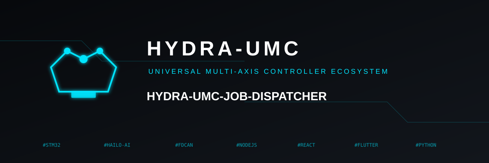
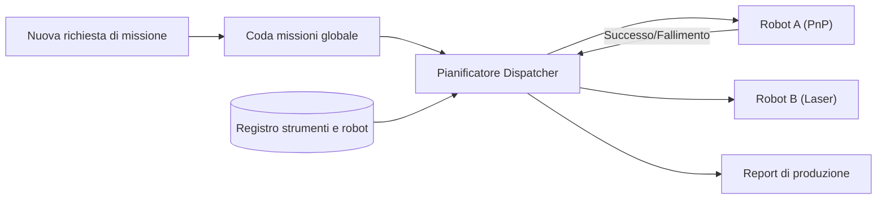

<p align="center">
  
</p>

# 📋 HYDRA-UMC-JOB-DISPATCHER

<p align="center"><a href="README.md">🇺🇸 English</a> | <a href="README_spa.md">🇪🇸 Español</a> | <a href="README_fra.md">🇫🇷 Français</a> | 🇮🇹 <b>Italiano</b> | <a href="README_deu.md">🇩🇪 Deutsch</a> | <a href="README_zho.md">🇨🇳 简体中文</a> | <a href="README_jpn.md">🇯🇵 日本語</a></p>

### ⚙️ Coda di missioni basata sulle priorità per flotte di robot eterogenee

<p align="left">
  
  
  
</p>

---

## 1. 🛠️ PANORAMICA TECNICA

**HYDRA-UMC-JOB-DISPATCHER** è il motore di allocazione dei compiti dell'Orchestratore. Gestisce una coda di missioni globale, distribuendo i lavori ai singoli robot in base alla loro disponibilità attuale, posizione e strumento collegato (URTC).

Garantisce che i compiti ad alta priorità (ad esempio, «Riparazione difetti di emergenza») bypassino il normale flusso di produzione e coordina le sequenze di assemblaggio in più fasi che richiedono il lavoro in tandem di diversi robot.

### Caratteristiche principali:
* 📋 **Code dinamiche:** Priorità e pianificazione intelligente delle missioni.
* ⚖️ **Routing consapevole degli strumenti:** Instrada automaticamente i lavori al robot con la testina URTC corretta.
* 🔄 **Missioni multi-fase:** Gestisce le dipendenze tra i compiti (es. «Pick» deve avvenire prima di «Place»).
* 📡 **Persistenza:** Stato della missione tollerante ai guasti utilizzando l'archiviazione locale Redis/Database.

---

## 2. 🔄 FLUSSO DEL DISPATCHER



---

## 3. 🧱 ARCHITETTURA E DECISIONI DI PROGETTAZIONE

* **Perché la logica reale vive sotto `src/` e non nella radice del repo.** `src/dispatcher` (il motore di pianificazione) e `src/api` (gli handler HTTP) contengono l'implementazione reale; `main.go`/`version.go` restano nella radice come punto di ingresso che li collega.
* **Perché l'assegnazione dei lavori controlla la disponibilità dell'utensile via URTC.** Un lavoro che richiede una specifica testa utensile è assegnabile solo a un robot la cui testa utensile controllata da URTC è realmente presente e inattiva - controllarlo prima dell'assegnazione (non dopo un prelievo fallito) evita che un robot arrivi a una stazione che in realtà non può usare. `src/dispatcher.Engine.DispatchOnce` applica già questo oggi confrontando esattamente `RequiredTool` e `Robot.Tool`; non parla ancora con un vero URTC via CAN per confermare che la testa utensile sia fisicamente collegata (il motore conosce solo ciò che dichiara la registrazione del robot via `POST /robots`).
* **Perché lo scheduler è già reale oggi ma la persistenza no.** `src/dispatcher` implementa il vero algoritmo descritto dal diagramma "DISPATCHER FLOW" del README: una coda globale ordinata per priorità, instradamento consapevole dell'utensile, e dipendenze multi-fase (un lavoro resta `blocked` finché ogni suo `DependsOn` non raggiunge `done`). Tutto questo vive solo in memoria - lo stato di `Engine` resta dietro metodi esportati proprio perché uno storage basato su Redis/DB possa sostituire ciò che sta dietro quei metodi in seguito senza cambiare ogni chiamante. Dimostrare che l'algoritmo di scheduling in sé fosse corretto è venuto prima.
* **Perché l'API HTTP è JSON/HTTP semplice, non gRPC.** È una superficie di controllo rivolta a umani/operatori (inviare un lavoro, registrare un robot, chiedere cosa è successo) - `hydra.common.v1` (il contratto gRPC condiviso dell'ecosistema, vedi `HYDRA-UMC-ORCHESTRATOR/proto/`) resta riservato al traffico nodo-a-nodo, secondo l'ambito già documentato di quel proto.
* **Come si inserisce nel resto dell'ecosistema.** Un servizio fratello sotto HYDRA-UMC-ORCHESTRATOR - trasforma decisioni a livello di missione in assegnazioni concrete di lavoro per robot, verificate contro la disponibilità utensili di URTC e i percorsi propri di HYDRA-UMC-PATH-PLANNER-3D.

---

## 📂 STRUTTURA DELLE CARTELLE

```text
HYDRA-UMC-JOB-DISPATCHER/
├── src/
│   ├── dispatcher/    # Il vero motore di pianificazione: coda,
│   │                  # instradamento consapevole dell'utensile, dipendenze multi-fase
│   └── api/           # Handler JSON/HTTP semplici che avvolgono il motore
├── build/             # Binari compilati (output di build.sh/build.bat)
├── go.mod / go.sum    # Definizione del modulo Go
├── version.go         # const Version = "X.Y.Z" (go.mod non ha questo campo)
├── main.go            # Punto di ingresso: collega il motore all'API HTTP e ascolta
├── bump_version.py    # Bump di versione stile contachilometri
├── build.sh/.bat      # Aggiorna la versione, poi `go build`
├── run.sh/.bat        # Esegue il binario compilato
└── README.md
```

Rimossi dal template originale: `hardware/`, `firmware/`, `os/`, `docs/`,
`images/` e `scripts/` — è un servizio puramente software (binario Go)
senza hardware o firmware propri, senza un'immagine del sistema operativo
da mantenere, e senza contenuto di documentazione/media/script di utilità
ancora sufficiente da giustificare cartelle proprie.

---

## 🔧 BUILD & RUN

Una vera coda di missioni con priorità e API HTTP, non solo uno scheletro
che compila.

```bash
# Windows
build.bat
run.bat -addr :8090

# Linux / macOS
./build.sh
./run.sh -addr :8090
```

`build.sh`/`build.bat` aggiornano la versione in `version.go` (regola
contachilometri dell'ecosistema, vedi `bump_version.py` - `go.mod` non ha
un campo di versione nativo per i binari applicativi) e poi eseguono
`go build`. `run.sh`/`run.bat` eseguono direttamente il binario risultante.

```bash
# Registra un robot, invia un lavoro, distribuiscilo, poi segnalo completato
curl -X POST localhost:8090/robots -d '{"id":"robot-a","tool":"PnP","available":true}'
curl -X POST localhost:8090/jobs   -d '{"id":"job-1","priority":5,"requiredTool":"PnP"}'
curl -X POST localhost:8090/dispatch -d '{}'
curl -X POST localhost:8090/jobs/complete -d '{"id":"job-1","success":true}'
curl localhost:8090/jobs
curl localhost:8090/robots
```

```bash
go test ./...   # src/dispatcher (algoritmo di scheduling) +
                 # src/api (round-trip HTTP reali via httptest)
```

---

## 🚀 ROADMAP
* **Fase 1:** Sincronizzazione deterministica dello sciame su TSN e riduzione del jitter sub-ms.
* **Fase 2:** Pianificazione dei percorsi 3D con evitamento dinamico degli ostacoli in celle multi-robot.
* **Fase 3:** Ottimizzazione del dispacciamento dei lavori multi-robot utilizzando la disponibilità delle risorse in tempo reale.
* **Fase 4:** Stima della durata del lavoro guidata dall'IA per una migliore pianificazione e coordinamento della flotta eterogenea.

---

## 🔗 Progetti Correlati

Questo progetto fa parte di un ecosistema robotico più ampio dello stesso autore (JuanenRac / Electro Hobby 3D), che copre firmware, software di controllo, nodi IA e strumenti di flotta. Utile saperlo, perché una richiesta potrebbe in realtà riguardare uno di questi progetti anziché questo repository.

### Famiglia

**Genitore:** **[HYDRA-UMC-ORCHESTRATOR](https://github.com/JuanenRac/HYDRA-UMC-ORCHESTRATOR)** — il genitore di integrazione servito da questo dispatcher.

**Fratelli:**
- **[HYDRA-UMC-SWARM-SYNC](https://github.com/JuanenRac/HYDRA-UMC-SWARM-SYNC)** — servizio di orchestrazione fratello, stesso genitore.
- **[HYDRA-UMC-PATH-PLANNER-3D](https://github.com/JuanenRac/HYDRA-UMC-PATH-PLANNER-3D)** — servizio di orchestrazione fratello, stesso genitore.
- **[HYDRA-UMC-NODE-HEALING](https://github.com/JuanenRac/HYDRA-UMC-NODE-HEALING)** — servizio di orchestrazione fratello, stesso genitore.

### Relazione Diretta (fuori dalla famiglia)

- **[URTC](https://github.com/JuanenRac/URTC)** — assegna i lavori in base a quale testa utensile è realmente disponibile.

### Resto dell'Ecosistema

**Piattaforma HYDRA-UMC** — la cella di micro-fabbrica multi-robot
- **[HYDRA-UMC](https://github.com/JuanenRac/HYDRA-UMC)** — la scheda madre CM5 + STM32H745 che orchestra fino a 8 bracci robotici.
- **[HYDRA-UMC-SERVER](https://github.com/JuanenRac/HYDRA-UMC-SERVER)** — il backend Express/WebSocket con cui parla ogni client di controllo.
- **[HYDRA-UMC-STUDIO](https://github.com/JuanenRac/HYDRA-UMC-STUDIO)** — dashboard di controllo web, visualizzazione 3D multi-robot.
- **[HYDRA-UMC-ANDROID-CONTROL](https://github.com/JuanenRac/HYDRA-UMC-ANDROID-CONTROL)** — app di controllo Android via Wi-Fi/Bluetooth.
- **[HYDRA-UMC-IOS-CONTROL](https://github.com/JuanenRac/HYDRA-UMC-IOS-CONTROL)** — app di controllo iOS/iPadOS costruita in Flutter.
- **[HYDRA-UMC-SUITE](https://github.com/JuanenRac/HYDRA-UMC-SUITE)** — centro di comando sciame desktop (Python/PySide6).
- **[HYDRA-UMC-EDITOR-URDF](https://github.com/JuanenRac/HYDRA-UMC-EDITOR-URDF)** — editor desktop di modelli URDF per il catalogo robot.
- **[HYDRA-UMC-DSI](https://github.com/JuanenRac/HYDRA-UMC-DSI)** — interfaccia touch nativa per lo schermo DSI a bordo.

**Piattaforma URTC** — il controller della testa utensile che ogni braccio HYDRA-UMC porta con sé
- **[URTC](https://github.com/JuanenRac/URTC)** — controller testa utensile su bus CAN, 25 profili utensile.
- **[URTC-FLASHER](https://github.com/JuanenRac/URTC-FLASHER)** — strumento desktop di flashing CAN-OTA + SWD/JTAG.
- **[URTC-TESTER](https://github.com/JuanenRac/URTC-TESTER)** — strumento desktop di diagnostica CAN live.
- **[URTC-WEB-STUDIO](https://github.com/JuanenRac/URTC-WEB-STUDIO)** — alternativa basata su browser via Web Serial API.

**🎥 Vision AI Node (Hailo-8)**
- [HYDRA-UMC-VISION-NODE](https://github.com/JuanenRac/HYDRA-UMC-VISION-NODE)
- [HYDRA-UMC-VISION-STREAMER](https://github.com/JuanenRac/HYDRA-UMC-VISION-STREAMER)
- [HYDRA-UMC-DETECTION-HEF](https://github.com/JuanenRac/HYDRA-UMC-DETECTION-HEF)
- [HYDRA-UMC-SAFETY-ZONES](https://github.com/JuanenRac/HYDRA-UMC-SAFETY-ZONES)
- [HYDRA-UMC-VISUAL-SERVOING-API](https://github.com/JuanenRac/HYDRA-UMC-VISUAL-SERVOING-API)

**🧠 Cognitive AI Node (Hailo-10)**
- [HYDRA-UMC-COGNITIVE-NODE](https://github.com/JuanenRac/HYDRA-UMC-COGNITIVE-NODE)
- [HYDRA-UMC-VLA-ENGINE](https://github.com/JuanenRac/HYDRA-UMC-VLA-ENGINE)
- [HYDRA-UMC-VOICE-UI](https://github.com/JuanenRac/HYDRA-UMC-VOICE-UI)
- [HYDRA-UMC-SEMANTIC-PLANNER](https://github.com/JuanenRac/HYDRA-UMC-SEMANTIC-PLANNER)
- [HYDRA-UMC-DOCS-QA](https://github.com/JuanenRac/HYDRA-UMC-DOCS-QA)

**🎮 Digital Twin & Simulation**
- [HYDRA-UMC-TWIN](https://github.com/JuanenRac/HYDRA-UMC-TWIN)
- [HYDRA-UMC-PHYSICS-REPLICA](https://github.com/JuanenRac/HYDRA-UMC-PHYSICS-REPLICA)
- [HYDRA-UMC-HIL-BRIDGE](https://github.com/JuanenRac/HYDRA-UMC-HIL-BRIDGE)
- [HYDRA-UMC-SYNTHETIC-DATA-GEN](https://github.com/JuanenRac/HYDRA-UMC-SYNTHETIC-DATA-GEN)

**📊 Data & Analytics**
- [HYDRA-UMC-DATALAKE](https://github.com/JuanenRac/HYDRA-UMC-DATALAKE)
- [HYDRA-UMC-TELEMETRY-COLLECTOR](https://github.com/JuanenRac/HYDRA-UMC-TELEMETRY-COLLECTOR)
- [HYDRA-UMC-ANOMALY-DETECTOR](https://github.com/JuanenRac/HYDRA-UMC-ANOMALY-DETECTOR)
- [HYDRA-UMC-PRODUCTION-REPORTS](https://github.com/JuanenRac/HYDRA-UMC-PRODUCTION-REPORTS)

**🏭 Industrial Gateway**
- [HYDRA-UMC-GATEWAY-INDUSTRIAL](https://github.com/JuanenRac/HYDRA-UMC-GATEWAY-INDUSTRIAL)
- [HYDRA-UMC-OPCUA-SERVER](https://github.com/JuanenRac/HYDRA-UMC-OPCUA-SERVER)
- [HYDRA-UMC-MQTT-BROKER](https://github.com/JuanenRac/HYDRA-UMC-MQTT-BROKER)
- [HYDRA-UMC-MTCONNECT-ADAPTER](https://github.com/JuanenRac/HYDRA-UMC-MTCONNECT-ADAPTER)

**🛠️ Complementary Tools**
- [URTC-SMART-RACK](https://github.com/JuanenRac/URTC-SMART-RACK)
- [URTC-VISION-TOOL](https://github.com/JuanenRac/URTC-VISION-TOOL)
- [HYDRA-UMC-WATCH](https://github.com/JuanenRac/HYDRA-UMC-WATCH)
- [HYDRA-UMC-TOOL-CLI](https://github.com/JuanenRac/HYDRA-UMC-TOOL-CLI)
- [HYDRA-UMC-DASHBOARD-AI](https://github.com/JuanenRac/HYDRA-UMC-DASHBOARD-AI)


## 👤 AUTORE
**JuanenRac** (Electro Hobby 3D)
📧 electrohobby3d@gmail.com

## 📜 LICENZA
GPL-3.0 - Vedere LICENSE per i dettagli.

## Progetti correlati

> Canonical public ecosystem relationship map.

**Direct integrations:**
[HYDRA-UMC-OS](https://github.com/JuanenRac/HYDRA-UMC-OS) · [HYDRA-UMC-SDK](https://github.com/JuanenRac/HYDRA-UMC-SDK) · [HYDRA-UMC-SERVER](https://github.com/JuanenRac/HYDRA-UMC-SERVER) · [URTC](https://github.com/JuanenRac/URTC) · [HYDRA-UMC-ORCHESTRATOR](https://github.com/JuanenRac/HYDRA-UMC-ORCHESTRATOR) · [HYDRA-UMC-SWARM-SYNC](https://github.com/JuanenRac/HYDRA-UMC-SWARM-SYNC) · [HYDRA-UMC-NODE-HEALING](https://github.com/JuanenRac/HYDRA-UMC-NODE-HEALING) · [HYDRA-UMC-UPDATER](https://github.com/JuanenRac/HYDRA-UMC-UPDATER)

**Platform and contracts:**
[HYDRA-UMC-OS](https://github.com/JuanenRac/HYDRA-UMC-OS) · [HYDRA-UMC-SDK](https://github.com/JuanenRac/HYDRA-UMC-SDK)

**Rest of the ecosystem:**
All remaining public repositories are grouped by the seven ecosystem layers in the [JuanenRac ecosystem dashboard](https://juanenrac.github.io/JuanenRac/).
