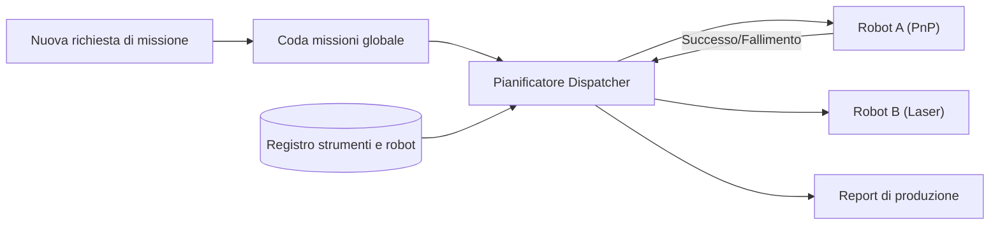

<p align="center">
  
</p>

# 📋 HYDRA-UMC-JOB-DISPATCHER

<p align="center"><a href="README.md">🇺🇸 English</a> | <a href="README_spa.md">🇪🇸 Español</a> | <a href="README_fra.md">🇫🇷 Français</a> | 🇮🇹 <b>Italiano</b> | <a href="README_deu.md">🇩🇪 Deutsch</a> | <a href="README_zho.md">🇨🇳 简体中文</a> | <a href="README_jpn.md">🇯🇵 日本語</a></p>

### ⚙️ Coda di missioni basata sulle priorità per flotte di robot eterogenee

<p align="left">
  
  
  
</p>

---

## 1. 🛠️ PANORAMICA TECNICA

**HYDRA-UMC-JOB-DISPATCHER** è il motore di allocazione dei compiti dell'Orchestratore. Gestisce una coda di missioni globale, distribuendo i lavori ai singoli robot in base alla loro disponibilità attuale, posizione e strumento collegato (URTC).

Garantisce che i compiti ad alta priorità (ad esempio, «Riparazione difetti di emergenza») bypassino il normale flusso di produzione e coordina le sequenze di assemblaggio in più fasi che richiedono il lavoro in tandem di diversi robot.

### Caratteristiche principali:
* 📋 **Code dinamiche:** Priorità e pianificazione intelligente delle missioni.
* ⚖️ **Routing consapevole degli strumenti:** Instrada automaticamente i lavori al robot con la testina URTC corretta.
* 🔄 **Missioni multi-fase:** Gestisce le dipendenze tra i compiti (es. «Pick» deve avvenire prima di «Place»).
* 📡 **Persistenza:** Stato della missione tollerante ai guasti utilizzando l'archiviazione locale Redis/Database.
* 🔁 **Invio Idempotente (v0):** Deduplicazione reale e opzionale basata su `DedupKey` tramite `POST /jobs/submit` - un reinvio di un job in corso o già completato viene restituito invariato, e un nuovo tentativo dopo un fallimento reale riutilizza lo stesso ID del job invece di eseguire il lavoro due volte. L'ordine di priorità è deterministico attraverso esecuzioni ripetute, coperto da un test di regressione esplicito.

---

## 2. 🔄 FLUSSO DEL DISPATCHER



---

## 3. 🧱 ARCHITETTURA E DECISIONI DI PROGETTAZIONE

* **Perché la logica reale vive sotto `src/` e non nella radice del repo.** `src/dispatcher` (il motore di pianificazione) e `src/api` (gli handler HTTP) contengono l'implementazione reale; `main.go`/`version.go` restano nella radice come punto di ingresso che li collega.
* **Perché l'assegnazione dei lavori controlla la disponibilità dell'utensile via URTC.** Un lavoro che richiede una specifica testa utensile è assegnabile solo a un robot la cui testa utensile controllata da URTC è realmente presente e inattiva - controllarlo prima dell'assegnazione (non dopo un prelievo fallito) evita che un robot arrivi a una stazione che in realtà non può usare. `src/dispatcher.Engine.DispatchOnce` applica già questo oggi confrontando esattamente `RequiredTool` e `Robot.Tool`; non parla ancora con un vero URTC via CAN per confermare che la testa utensile sia fisicamente collegata (il motore conosce solo ciò che dichiara la registrazione del robot via `POST /robots`).
* **Perché lo scheduler è già reale oggi ma la persistenza no.** `src/dispatcher` implementa il vero algoritmo descritto dal diagramma "DISPATCHER FLOW" del README: una coda globale ordinata per priorità, instradamento consapevole dell'utensile, e dipendenze multi-fase (un lavoro resta `blocked` finché ogni suo `DependsOn` non raggiunge `done`). Tutto questo vive solo in memoria - lo stato di `Engine` resta dietro metodi esportati proprio perché uno storage basato su Redis/DB possa sostituire ciò che sta dietro quei metodi in seguito senza cambiare ogni chiamante. Dimostrare che l'algoritmo di scheduling in sé fosse corretto è venuto prima.
* **Perché l'API HTTP è JSON/HTTP semplice, non gRPC.** È una superficie di controllo rivolta a umani/operatori (inviare un lavoro, registrare un robot, chiedere cosa è successo) - `hydra.common.v1` (il contratto gRPC condiviso dell'ecosistema, vedi `HYDRA-UMC-ORCHESTRATOR/proto/`) resta riservato al traffico nodo-a-nodo, secondo l'ambito già documentato di quel proto.
* **Come si inserisce nel resto dell'ecosistema.** Un servizio fratello sotto HYDRA-UMC-ORCHESTRATOR - trasforma decisioni a livello di missione in assegnazioni concrete di lavoro per robot, verificate contro la disponibilità utensili di URTC e i percorsi propri di HYDRA-UMC-PATH-PLANNER-3D.
* **Perché `POST /jobs/submit` è una nuova rotta invece di modificare `POST /jobs`.** `AddJob()`/`POST /jobs` inseriscono sempre e falliscono su una collisione di ID - quel contratto di basso livello resta intatto. `SubmitJob()`/`POST /jobs/submit` aggiunge sopra una deduplicazione reale e opzionale tramite `Job.DedupKey`: lo stesso schema usato in tutto l'ecosistema (un punto di ingresso con verifica aggiunto accanto a una primitiva di basso livello invariata, non un cambio di comportamento innestato su di essa).
* **Perché un nuovo tentativo dopo un fallimento riutilizza lo stesso ID del job invece di crearne uno nuovo.** L'alternativa - generare un nuovo job a ogni tentativo - disperderebbe la cronologia di un'unica unità logica di lavoro su più ID e non darebbe a chi chiama modo di distinguere "questo è fallito una volta e viene ritentato" da "questo è nuovo lavoro senza relazione". Ripristinare il job originale a `Pending` mantiene tutto il suo ciclo di vita (incluso il tentativo fallito) sotto un unico ID.

---

## 📂 STRUTTURA DELLE CARTELLE

```text
HYDRA-UMC-JOB-DISPATCHER/
├── src/
│   ├── dispatcher/    # Il vero motore di pianificazione: coda,
│   │                  # instradamento consapevole dell'utensile, dipendenze multi-fase
│   └── api/           # Handler JSON/HTTP semplici che avvolgono il motore
├── docs/
│   └── API.md         # Riferimento reale degli endpoint HTTP (richieste, risposte, codici di stato)
├── images/            # Media e diagrammi
├── systemd/
│   └── hydra-umc-job-dispatcher.service # Unità systemd della coda missioni a priorità sulla CM5 locale
├── tools/
│   ├── build_test.py  # Controllo build/compilazione senza incremento di versione
│   └── ci_validate.py # Validazione manifest/CHANGELOG/docs usata dalla CI
├── build/             # Binari compilati (output di build.sh/build.bat)
├── go.mod / go.sum    # Definizione del modulo Go
├── version.go         # const Version = "X.Y.Z" (go.mod non ha questo campo)
├── main.go            # Punto di ingresso: collega il motore all'API HTTP e ascolta
├── bump_version.py    # Bump di versione stile contachilometri
├── bump_manifest_version.py # Sincronizza la versione di hydra-umc.project.json con quella nativa (--sync)
├── build.sh/.bat      # Aggiorna la versione, poi `go build`
├── run.sh/.bat        # Esegue il binario compilato
└── README.md
```

Rimossi dal template originale: `hardware/`, `firmware/` e `os/` — è un
servizio puramente software (binario Go) senza hardware o firmware propri
e senza un'immagine del sistema operativo da mantenere. Vedi
[`docs/API.md`](docs/API.md) per il riferimento completo degli endpoint HTTP.

---

## 🔧 BUILD ED ESECUZIONE

Una vera coda di missioni con priorità e API HTTP, non solo uno scheletro
che compila.

```bash
# Windows
build.bat
run.bat -addr :8090

# Linux / macOS
./build.sh
./run.sh -addr :8090
```

`build.sh`/`build.bat` aggiornano la versione in `version.go` (regola
contachilometri dell'ecosistema, vedi `bump_version.py` - `go.mod` non ha
un campo di versione nativo per i binari applicativi) e poi eseguono
`go build`. `run.sh`/`run.bat` eseguono direttamente il binario risultante.

```bash
# Registra un robot, invia un lavoro, distribuiscilo, poi segnalo completato
curl -X POST localhost:8090/robots -d '{"id":"robot-a","tool":"PnP","available":true}'
curl -X POST localhost:8090/jobs   -d '{"id":"job-1","priority":5,"requiredTool":"PnP"}'
curl -X POST localhost:8090/dispatch -d '{}'
curl -X POST localhost:8090/jobs/complete -d '{"id":"job-1","success":true}'
curl localhost:8090/jobs
curl localhost:8090/robots
```

```bash
# Invio idempotente: una richiesta ritentata con lo stesso dedupKey non
# esegue mai due volte lo stesso job, anche se il client usa un id diverso.
curl -X POST localhost:8090/jobs/submit -d '{"id":"job-2","priority":5,"requiredTool":"PnP","dedupKey":"req-abc"}'
# -> {"ID":"job-2", ..., "result":"created"}
curl -X POST localhost:8090/jobs/submit -d '{"id":"job-2-retry","priority":5,"requiredTool":"PnP","dedupKey":"req-abc"}'
# -> {"ID":"job-2", ..., "result":"duplicate"} - stesso job, invariato

# Dopo un fallimento reale, un nuovo tentativo con lo stesso dedupKey riutilizza l'ID di job-2:
curl -X POST localhost:8090/jobs/complete -d '{"id":"job-2","success":false}'
curl -X POST localhost:8090/jobs/submit -d '{"id":"job-2-retry-2","priority":5,"requiredTool":"PnP","dedupKey":"req-abc"}'
# -> {"ID":"job-2", "Status":"pending", ..., "result":"retried"}
```

```bash
go test ./...   # src/dispatcher (algoritmo di scheduling) +
                 # src/api (round-trip HTTP reali via httptest)
```

---

## 🚀 TABELLA DI MARCIA
* **Fase 1:** Sincronizzazione deterministica dello sciame su TSN e riduzione del jitter sub-ms.
* **Fase 2:** Pianificazione dei percorsi 3D con evitamento dinamico degli ostacoli in celle multi-robot.
* **Fase 3:** Ottimizzazione del dispacciamento dei lavori multi-robot utilizzando la disponibilità delle risorse in tempo reale.
* **Fase 4:** Stima della durata del lavoro guidata dall'IA per una migliore pianificazione e coordinamento della flotta eterogenea.

---

## 🔗 Progetti Correlati

Questo progetto fa parte dell'ecosistema robotico HYDRA-UMC dello stesso autore (JuanenRac / Electro Hobby 3D). Vale la pena conoscerlo, poiché una richiesta potrebbe in realtà riguardare uno di questi invece di questo repository.

**Progetto Padre**
- **[HYDRA-UMC-ORCHESTRATOR](https://github.com/JuanenRac/HYDRA-UMC-ORCHESTRATOR)** — hub di integrazione con un vero contratto di health-report gRPC/Protobuf e una macchina a stati di missione; il genitore di cui questo repository è un servizio di orchestrazione specifico, all'interno del proprio livello di coordinamento dello sciame.

**Progetti Fratelli** — gli altri servizi di orchestrazione del livello di coordinamento dello sciame proprio di HYDRA-UMC-ORCHESTRATOR
- **[HYDRA-UMC-SWARM-SYNC](https://github.com/JuanenRac/HYDRA-UMC-SWARM-SYNC)** — vera sincronizzazione di stato CRDT LWW-Element-Map, con property test per la convergenza multi-cella.
- **[HYDRA-UMC-PATH-PLANNER-3D](https://github.com/JuanenRac/HYDRA-UMC-PATH-PLANNER-3D)** — vero pianificatore di percorsi 3D basato su RRT, con vera validazione delle collisioni ostacolo/spazio di lavoro.
- **[HYDRA-UMC-NODE-HEALING](https://github.com/JuanenRac/HYDRA-UMC-NODE-HEALING)** — vero watchdog di salute della flotta basato su gRPC, con retry/backoff e rilevamento di discrepanza d'identità.

**Direttamente Correlati**
- **[URTC](https://github.com/JuanenRac/URTC)** — firmware per la scheda fisica dell'Universal Robot Tool Controller, oltre 25 profili utensile su bus CAN — assegna i lavori in base a quale delle proprie teste utensile di URTC è effettivamente disponibile.
- **[HYDRA-UMC-PRODUCTION-REPORTS](https://github.com/JuanenRac/HYDRA-UMC-PRODUCTION-REPORTS)** — vero calcolo OEE/disponibilità sullo storico di DATALAKE, con esportazione CSV riproducibile — la destinazione prevista per i log di completamento missione; questo dispatcher è la fonte reale prevista dei propri dati OEE `production_event` una volta che i completamenti saranno collegati per scriverli (non ancora implementato, tracciato sul lato di quel progetto).

**Fa Anche Parte dell'Ecosistema**

*Hardware e Piattaforma di Base*
- **[HYDRA-UMC](https://github.com/JuanenRac/HYDRA-UMC)** — la scheda madre fisica del braccio robotico: host CM5 + coprocessore STM32H745 dual-core, che coordina fino a 8 bracci utensile via CAN-OTA/SPI-OTA.
- **[HYDRA-UMC-OS](https://github.com/JuanenRac/HYDRA-UMC-OS)** — livello prodotto riproducibile su Raspberry Pi OS per il CM5: agente in sola lettura, config/profili validati, provisioning WiFi al primo contatto.
- **[HYDRA-UMC-SDK](https://github.com/JuanenRac/HYDRA-UMC-SDK)** — il contratto JSON-Schema condiviso e la barriera di sicurezza contro cui ogni bridge valida i propri comandi.

*Backend Centrale e Client*
- **[HYDRA-UMC-SERVER](https://github.com/JuanenRac/HYDRA-UMC-SERVER)** — il vero backend headless (REST/WebSocket) con cui parla davvero ogni client di controllo.
- **[HYDRA-UMC-STUDIO](https://github.com/JuanenRac/HYDRA-UMC-STUDIO)** — dashboard di controllo web con visualizzazione 3D multi-robot in tempo reale.
- **[HYDRA-UMC-SUITE](https://github.com/JuanenRac/HYDRA-UMC-SUITE)** — centro di comando sciame desktop (PySide6) per più server contemporaneamente, pacchettizzato come eseguibile standalone.
- **[HYDRA-UMC-ANDROID-CONTROL](https://github.com/JuanenRac/HYDRA-UMC-ANDROID-CONTROL)** — app di controllo nativa per Android con login biometrico e un companion Wear OS abbinato.
- **[HYDRA-UMC-IOS-CONTROL](https://github.com/JuanenRac/HYDRA-UMC-IOS-CONTROL)** — app di controllo per iOS/iPadOS (Flutter) con sincronizzazione WebSocket in tempo reale.
- **[HYDRA-UMC-DSI](https://github.com/JuanenRac/HYDRA-UMC-DSI)** — interfaccia touch nativa per il touchscreen DSI da 7" a bordo, incorporata direttamente nel CM5.
- **[HYDRA-UMC-EDITOR-URDF](https://github.com/JuanenRac/HYDRA-UMC-EDITOR-URDF)** — creatore/editor grafico desktop di URDF che invia i modelli finiti al catalogo di STUDIO.
- **[HYDRA-UMC-BRIDGE-AMR](https://github.com/JuanenRac/HYDRA-UMC-BRIDGE-AMR)** — barriera di coordinamento per flotte AGV/AMR tramite un publisher MQTT VDA 5050 reale.
- **[HYDRA-UMC-BRIDGE-CNC](https://github.com/JuanenRac/HYDRA-UMC-BRIDGE-CNC)** — coordinatore ad alto livello per celle CNC con accesso reale a stato/byte di controllo GRBL.
- **[HYDRA-UMC-BRIDGE-DROIDS](https://github.com/JuanenRac/HYDRA-UMC-BRIDGE-DROIDS)** — barriera di coordinamento per droidi con zampe/umanoidi, con un vero mittente di comandi per Boston Dynamics Spot.
- **[HYDRA-UMC-BRIDGE-LASER](https://github.com/JuanenRac/HYDRA-UMC-BRIDGE-LASER)** — coordinatore di sicurezza per celle laser che legge 3 salvaguardie GPIO reali di chiave/involucro/interblocco.
- **[HYDRA-UMC-BRIDGE-OPENPNP](https://github.com/JuanenRac/HYDRA-UMC-BRIDGE-OPENPNP)** — coordinatore ad alto livello sicuro per il flusso schede del pick-and-place OpenPnP.
- **[HYDRA-UMC-BRIDGE-PRINTER3D](https://github.com/JuanenRac/HYDRA-UMC-BRIDGE-PRINTER3D)** — barriera di coordinamento sicura per stampanti 3D Moonraker/Klipper, con comandi di lavoro reali e controllati.
- **[HYDRA-UMC-BRIDGE-ROS2](https://github.com/JuanenRac/HYDRA-UMC-BRIDGE-ROS2)** — coordinatore di sicurezza con un vero trasporto ROS 2 rclpy, importato in modo lazy.
- **[HYDRA-UMC-BRIDGE-UAV](https://github.com/JuanenRac/HYDRA-UMC-BRIDGE-UAV)** — barriera di coordinamento per UAV dotati di fotocamera, con un vero mittente di comandi MAVLink.

*Piattaforma Strumenti URTC*
- **[URTC-FLASHER](https://github.com/JuanenRac/URTC-FLASHER)** — strumento desktop con GUI per il flashing delle schede URTC, CAN-OTA più SWD/JTAG a chip intero.
- **[URTC-TESTER](https://github.com/JuanenRac/URTC-TESTER)** — strumento desktop di diagnostica CAN-bus dal vivo per schede URTC, un pannello per profilo utensile.
- **[URTC-WEB-STUDIO](https://github.com/JuanenRac/URTC-WEB-STUDIO)** — alternativa basata su browser a URTC-TESTER tramite la Web Serial API, senza installazione locale.

*Nodo IA Visione (Hailo-8)*
- **[HYDRA-UMC-VISION-NODE](https://github.com/JuanenRac/HYDRA-UMC-VISION-NODE)** — hub di integrazione per la pipeline di visione Hailo-8, con un vero controllo di prontezza hardware per fase.
- **[HYDRA-UMC-DETECTION-HEF](https://github.com/JuanenRac/HYDRA-UMC-DETECTION-HEF)** — registro reale di modelli compilati con verifica di caricamento sicuro per architettura Hailo/checksum.
- **[HYDRA-UMC-VISION-STREAMER](https://github.com/JuanenRac/HYDRA-UMC-VISION-STREAMER)** — generatore reale di pipeline GStreamer + config MediaMTX, con una vera barriera di integrazione HailoRT.
- **[HYDRA-UMC-VISUAL-SERVOING-API](https://github.com/JuanenRac/HYDRA-UMC-VISUAL-SERVOING-API)** — vera legge di correzione Position-Based Visual Servoing, con cancello di sicurezza sullo stato di zona a monte.
- **[HYDRA-UMC-SAFETY-ZONES](https://github.com/JuanenRac/HYDRA-UMC-SAFETY-ZONES)** — vero controllo di violazione zona e richiesta E-STOP, con imposizione della freschezza di calibrazione.

*Nodo IA Cognitivo (Hailo-10)*
- **[HYDRA-UMC-COGNITIVE-NODE](https://github.com/JuanenRac/HYDRA-UMC-COGNITIVE-NODE)** — hub di integrazione per la pipeline cognitiva Hailo-10 (orchestrazione LLM/VLA/voce).
- **[HYDRA-UMC-VLA-ENGINE](https://github.com/JuanenRac/HYDRA-UMC-VLA-ENGINE)** — vera codifica/decodifica di token d'azione e generazione di traiettoria per un modello Vision-Language-Action.
- **[HYDRA-UMC-VOICE-UI](https://github.com/JuanenRac/HYDRA-UMC-VOICE-UI)** — vero front-end vocale (VAD + parser di intenti) con un relay verso Watch limitato e soggetto a conferma.
- **[HYDRA-UMC-SEMANTIC-PLANNER](https://github.com/JuanenRac/HYDRA-UMC-SEMANTIC-PLANNER)** — vera scomposizione dei task basata su regole e recupero semantico degli errori sui codici errore MCU.
- **[HYDRA-UMC-DOCS-QA](https://github.com/JuanenRac/HYDRA-UMC-DOCS-QA)** — vera ricerca documentale TF-IDF (solo libreria standard) sui documenti Markdown di questo ecosistema.

*Gemello Digitale e Simulazione*
- **[HYDRA-UMC-TWIN](https://github.com/JuanenRac/HYDRA-UMC-TWIN)** — hub di integrazione per il motore di gemello digitale, con un vero contratto di sincronizzazione per compatibilità di versione.
- **[HYDRA-UMC-HIL-BRIDGE](https://github.com/JuanenRac/HYDRA-UMC-HIL-BRIDGE)** — vero interblocco di sicurezza hardware-in-the-loop che instrada i comandi tra simulazione e hardware reale.
- **[HYDRA-UMC-PHYSICS-REPLICA](https://github.com/JuanenRac/HYDRA-UMC-PHYSICS-REPLICA)** — vera cinematica diretta e validazione dei limiti articolari su un vero sottoinsieme URDF.
- **[HYDRA-UMC-SYNTHETIC-DATA-GEN](https://github.com/JuanenRac/HYDRA-UMC-SYNTHETIC-DATA-GEN)** — vero generatore procedurale di scene 2D con esportazione di annotazioni YOLO/COCO.

*Dati e Analisi*
- **[HYDRA-UMC-DATALAKE](https://github.com/JuanenRac/HYDRA-UMC-DATALAKE)** — vero archivio di serie temporali basato su sqlite3, con una vera API HTTP di ingestione/query.
- **[HYDRA-UMC-ANOMALY-DETECTOR](https://github.com/JuanenRac/HYDRA-UMC-ANOMALY-DETECTOR)** — vero rilevatore di anomalie FFT + baseline statistica, con monitoraggio della deriva.
- **[HYDRA-UMC-TELEMETRY-COLLECTOR](https://github.com/JuanenRac/HYDRA-UMC-TELEMETRY-COLLECTOR)** — vera pipeline di ingestione CAN/WebSocket verso DATALAKE, con deduplicazione per sequenza.

*Gateway Industriale*
- **[HYDRA-UMC-GATEWAY-INDUSTRIAL](https://github.com/JuanenRac/HYDRA-UMC-GATEWAY-INDUSTRIAL)** — hub di integrazione che inoltra ai protocolli industriali, con un vero livello di allowlist dei comandi/backpressure.
- **[HYDRA-UMC-OPCUA-SERVER](https://github.com/JuanenRac/HYDRA-UMC-OPCUA-SERVER)** — vero spazio di indirizzi OPC-UA, verificato con una vera sessione client del protocollo binario.
- **[HYDRA-UMC-MQTT-BROKER](https://github.com/JuanenRac/HYDRA-UMC-MQTT-BROKER)** — vero broker MQTT con autenticazione opzionale per client e ACL sui topic.
- **[HYDRA-UMC-MTCONNECT-ADAPTER](https://github.com/JuanenRac/HYDRA-UMC-MTCONNECT-ADAPTER)** — veri endpoint XML `/probe` e `/current` di MTConnect, con output in modalità degradata.

*Strumenti Complementari e Operazioni dell'Ecosistema*
- **[HYDRA-UMC-DASHBOARD-AI](https://github.com/JuanenRac/HYDRA-UMC-DASHBOARD-AI)** — pannelli Smart Summaries e Anomaly Highlighting su DATALAKE/ANOMALY-DETECTOR, con un fallback statistico onesto.
- **[HYDRA-UMC-TOOL-CLI](https://github.com/JuanenRac/HYDRA-UMC-TOOL-CLI)** — CLI di flotta con un vero e stabile contratto di exit-code, un client live reale della stessa API di HYDRA-UMC-SERVER.
- **[HYDRA-UMC-WATCH](https://github.com/JuanenRac/HYDRA-UMC-WATCH)** — app companion WearOS con avvisi aptici reali e un relay vocale verso il telefono abbinato.
- **[URTC-SMART-RACK](https://github.com/JuanenRac/URTC-SMART-RACK)** — firmware per un rack di montaggio schede con decodifica reale dell'ID utensile e logica di preriscaldamento Smart Idle.
- **[URTC-VISION-TOOL](https://github.com/JuanenRac/URTC-VISION-TOOL)** — firmware più un vero companion di visione Python per una testa utensile di ispezione termica/RGB.
- **[HYDRA-UMC-UPDATER](https://github.com/JuanenRac/HYDRA-UMC-UPDATER)** — strumento amministrativo desktop che scopre, clona e aggiorna ogni repository di questo ecosistema.


---

## 📚 Documentazione e Comunità

- **[CONTRIBUTING.md](CONTRIBUTING.md)** — stack tecnologico e linee guida di codifica per una pull request.
- **[CODE_OF_CONDUCT.md](CODE_OF_CONDUCT.md)** — gli standard di comportamento attesi in questa comunità.
- **[SECURITY.md](SECURITY.md)** — come segnalare una vulnerabilità, e le reali aree di attenzione sulla sicurezza di questo progetto.
- **[SUPPORT.md](SUPPORT.md)** — dove porre domande e segnalare bug.
- **[LICENSE.md](LICENSE.md)** — la licenza propria di questo progetto.

## 👤 AUTORE
**JuanenRac** (Electro Hobby 3D)
📧 electrohobby3d@gmail.com
📺 [youtube.com/@electrohobby3d](https://youtube.com/@electrohobby3d)

## 📜 LICENZA
GPL-3.0 - Vedere LICENSE per i dettagli.
