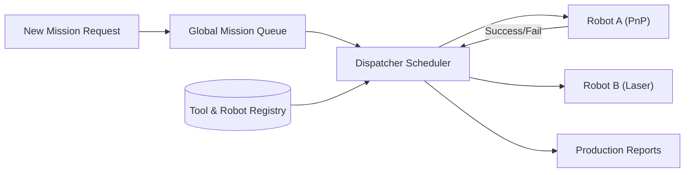

<p align="center">
  
</p>

# 📋 HYDRA-UMC-JOB-DISPATCHER

<p align="center"><a href="README.md">🇺🇸 English</a> | <a href="README_spa.md">🇪🇸 Español</a> | <a href="README_fra.md">🇫🇷 Français</a> | <a href="README_ita.md">🇮🇹 Italiano</a> | <a href="README_deu.md">🇩🇪 Deutsch</a> | <a href="README_zho.md">🇨🇳 简体中文</a> | 🇯🇵 <b>日本語</b></p>

### ⚙️ 異種ロボットフリート向けの優先度ベースのミッションキュー

<p align="left">
  
  
  
</p>

---

## 1. 🛠️ 技術概要

**HYDRA-UMC-JOB-DISPATCHER** は、オーケストレーターのタスク割り当て
エンジンです。グローバルなミッションキューを管理し、各ロボットの現在の
可用性、位置、装着されている工具（URTC）に基づいてジョブを分配します。

高優先度タスク（例：「緊急欠陥修正」）が通常の生産フローをバイパスする
ことを保証し、異なるロボットが連携して動作する必要のあるマルチステップ
組立シーケンスを調整します。

### 主な機能：
* 📋 **動的キューイング：** インテリジェントなミッションの優先順位付けとスケジューリング。
* ⚖️ **工具認識ルーティング：** 正しい URTC ヘッドを持つロボットへ自動的にジョブをルーティングします。
* 🔄 **マルチステージミッション：** タスク間の依存関係を管理します（例：「ピック」は「プレース」より先に発生する必要があります）。
* 📡 **永続性：** ローカルの Redis/データベースストレージを用いた耐障害性のあるミッション状態管理。
* 🔁 **冪等な送信（v0）：** `POST /jobs/submit` による実際の、任意の `DedupKey` ベースの重複排除——進行中または既に完了したジョブを再送信すると変更されずに返され、実際の失敗後の再試行は同じジョブ ID を再利用し、作業を二重に実行しません。優先順位の順序は繰り返し実行しても決定論的であり、明示的な回帰テストでカバーされています。

---

## 2. 🔄 ディスパッチャーフロー



---

## 3. 🧱 アーキテクチャと設計上の決定

* **実際のロジックがリポジトリのルートではなく `src/` の下にある理由。** `src/dispatcher`（スケジューリングエンジン）と `src/api`（HTTP ハンドラ）が実際の実装を保持しています。`main.go`/`version.go` はそれらを結びつけるエントリポイントとしてリポジトリのルートに残ります。
* **ジョブの割当てが URTC 経由で工具の可用性をチェックする理由。** 特定の工具ヘッドを必要とするジョブは、その URTC 制御の工具ヘッドが実際に存在しアイドル状態であるロボットにのみ分配可能です——ディスパッチ前（ピック失敗後ではなく）にこれをチェックすることで、ロボットが実際には使用できないステーションに到着することを防ぎます。`src/dispatcher.Engine.DispatchOnce` は今日すでに `RequiredTool`/`Robot.Tool` の完全一致でこれを実施しています；工具ヘッドが物理的に取り付けられていることを確認するために CAN 経由で実際の URTC とまだ通信していません（エンジンはロボットの登録が主張する内容しか知りません——`src/api` の `POST /robots` を参照）。
* **スケジューラは今日すでに本物だが、永続化はまだ本物ではない理由。** `src/dispatcher` は README の "DISPATCHER FLOW" 図が説明する実際のアルゴリズムを実装しています：優先度順に並んだグローバルキュー、工具を意識したルーティング、さらに多段階依存関係（`DependsOn` 内のすべてのジョブが `done` に達するまで、ジョブは `blocked` のまま）。これらはすべてメモリ上にのみ存在します——`Engine` の状態は、後で Redis/DB バックエンドのストアが、各呼び出し側を変えることなくこれらのメソッドの背後にあるものを置き換えられるよう、あえてエクスポートされたメソッドの背後に保持されています。スケジューリングアルゴリズム自体が正しいことを証明することが最初に来ました。
* **HTTP API が gRPC ではなくプレーンな JSON/HTTP である理由。** これは人間/運用向けの制御サーフェース（ジョブを送信し、ロボットを登録し、何が起こったか尋ねる）です——`hydra.common.v1`（エコシステム共通の gRPC 契約、`HYDRA-UMC-ORCHESTRATOR/proto/` 参照）は、その proto 自体の既に文書化された適用範囲に従い、ノード間通信用に予約されたままです。
* **エコシステムの他の部分との関係。** HYDRA-UMC-ORCHESTRATOR の下の兄弟サービスです——ミッションレベルの決定を、URTC の工具可用性と HYDRA-UMC-PATH-PLANNER-3D 自身のルートに照らしてチェックされた、具体的なロボットごとのジョブ割当てに変換します。
* **`POST /jobs/submit` が `POST /jobs` を変更するのではなく新しいルートである理由。** `AddJob()`/`POST /jobs` は常に挿入を行い、ID の衝突ではエラーになります——この低レベルの契約は変更されません。`SubmitJob()`/`POST /jobs/submit` は `Job.DedupKey` を介してその上に実際の、任意の重複排除を重ねます——これはエコシステム全体で使われているのと同じパターンです（変更されない低レベルのプリミティブの隣に安全策付きのエントリポイントを追加するのであって、それに動作の変更を接ぎ木するのではありません）。
* **失敗後の再試行が新しいジョブを作成するのではなく同じジョブ ID を再利用する理由。** 代替案——再試行のたびに新しいジョブを生成する——は、一つの論理的な作業単位の履歴を複数の ID に分散させてしまい、呼び出し側には「これは一度失敗して再試行されている」のか「これは無関係な新しい作業」なのかを区別する手段がなくなります。元のジョブを `Pending` にリセットすることで、失敗した試行を含むそのライフサイクル全体が一つの ID の下に保たれます。

---

## 📂 リポジトリ構成

```text
HYDRA-UMC-JOB-DISPATCHER/
├── src/
│   ├── dispatcher/    # 実際のスケジューリングエンジン：キュー、
│   │                  # 工具を意識したルーティング、多段階依存関係
│   └── api/           # エンジンを包む単純な JSON/HTTP ハンドラー
├── docs/
│   └── API.md         # 本物の HTTP エンドポイントリファレンス（リクエスト、レスポンス、ステータスコード）
├── build/             # コンパイル済みバイナリ(build.sh/build.bat の出力)
├── go.mod / go.sum    # Go モジュール定義
├── version.go         # const Version = "X.Y.Z"(go.mod にはアプリバージョンフィールドがありません)
├── main.go            # エントリポイント：エンジンを HTTP API に接続してリッスン
├── bump_version.py    # オドメーター式バージョンインクリメント、build.sh/.bat が実行
├── build.sh/.bat      # バージョンを増加させ、その後 `go build` を実行
├── run.sh/.bat        # コンパイル済みバイナリを実行
└── README.md
```

元のテンプレートから省略：`hardware/`、`firmware/`、`os/`、
`images/`、`scripts/` —— これは純粋なソフトウェアサービス(Go バイナリ)
であり、専用のハードウェアやファームウェア、維持すべき
オペレーティングシステムイメージもなく、専用フォルダを正当化するほどの
メディア/ユーティリティスクリプトの内容もまだありません。完全な HTTP
エンドポイントリファレンスは [`docs/API.md`](docs/API.md) を参照。

---

## 🔧 ビルドと実行

コンパイルできるだけの骨組みではなく、優先度付きの本物のジョブ
キューと HTTP API です。

```bash
# Windows
build.bat
run.bat -addr :8090

# Linux / macOS
./build.sh
./run.sh -addr :8090
```

`build.sh`/`build.bat` は `version.go` のバージョンを増加させ（エコ
システム全体で統一されたオドメーター規則、`bump_version.py` を参照——
`go.mod` にはアプリケーションバイナリ向けのネイティブなバージョン
フィールドがありません）、その後 `go build` を実行します。
`run.sh`/`run.bat` は生成されたバイナリを直接実行します。

```bash
# ロボットを登録し、ジョブを送信し、ディスパッチし、完了としてマークする
curl -X POST localhost:8090/robots -d '{"id":"robot-a","tool":"PnP","available":true}'
curl -X POST localhost:8090/jobs   -d '{"id":"job-1","priority":5,"requiredTool":"PnP"}'
curl -X POST localhost:8090/dispatch -d '{}'
curl -X POST localhost:8090/jobs/complete -d '{"id":"job-1","success":true}'
curl localhost:8090/jobs
curl localhost:8090/robots
```

```bash
# 冪等な送信：同じ dedupKey を持つ再試行リクエストは、クライアントが
# 異なる id を使っても、同じジョブを二度実行することは決してありません。
curl -X POST localhost:8090/jobs/submit -d '{"id":"job-2","priority":5,"requiredTool":"PnP","dedupKey":"req-abc"}'
# -> {"ID":"job-2", ..., "result":"created"}
curl -X POST localhost:8090/jobs/submit -d '{"id":"job-2-retry","priority":5,"requiredTool":"PnP","dedupKey":"req-abc"}'
# -> {"ID":"job-2", ..., "result":"duplicate"} - 同じジョブ、変更なし

# 実際の失敗の後、同じ dedupKey での再試行は job-2 の ID を再利用します：
curl -X POST localhost:8090/jobs/complete -d '{"id":"job-2","success":false}'
curl -X POST localhost:8090/jobs/submit -d '{"id":"job-2-retry-2","priority":5,"requiredTool":"PnP","dedupKey":"req-abc"}'
# -> {"ID":"job-2", "Status":"pending", ..., "result":"retried"}
```

```bash
go test ./...   # src/dispatcher(スケジューリングアルゴリズム) +
                 # src/api(httptest による実際の HTTP 往復テスト)
```

---

## 🚀 ロードマップ
* **フェーズ 1：** TSN による決定論的スウォーム同期とサブミリ秒ジッタの低減。
* **フェーズ 2：** マルチロボットセルにおける動的障害物回避を伴う 3D パスプランニング。
* **フェーズ 3：** リアルタイムのリソース可用性を用いたマルチロボットジョブディスパッチの最適化。
* **フェーズ 4：** より優れたスケジューリングのための AI 駆動のジョブ時間推定と異種ロボットフリートの協調。

---

## 🔗 関連プロジェクト

本プロジェクトは、同一著者（JuanenRac / Electro Hobby 3D）による、
ファームウェア、制御ソフトウェア、AI ノード、フリート管理ツールにまたがる、
より大きなロボティクスエコシステムの一部です。ご要望が実際にはこれらの
プロジェクトのいずれかに関するものであり、本リポジトリのものではない
可能性もあるため、知っておく価値があります。

### プロジェクトファミリー

**親プロジェクト：** **[HYDRA-UMC-ORCHESTRATOR](https://github.com/JuanenRac/HYDRA-UMC-ORCHESTRATOR)** —— 本ディスパッチャーが仕える統合親プロジェクト。

**兄弟プロジェクト：**
- **[HYDRA-UMC-SWARM-SYNC](https://github.com/JuanenRac/HYDRA-UMC-SWARM-SYNC)** —— 同じ親プロジェクトを持つ兄弟オーケストレーションサービス。
- **[HYDRA-UMC-PATH-PLANNER-3D](https://github.com/JuanenRac/HYDRA-UMC-PATH-PLANNER-3D)** —— 同じ親プロジェクトを持つ兄弟オーケストレーションサービス。
- **[HYDRA-UMC-NODE-HEALING](https://github.com/JuanenRac/HYDRA-UMC-NODE-HEALING)** —— 同じ親プロジェクトを持つ兄弟オーケストレーションサービス。

### 直接関連（ファミリー外）

- **[URTC](https://github.com/JuanenRac/URTC)** —— 実際に利用可能な工具ヘッドに基づいてジョブを割り当てます。

### エコシステムのその他のプロジェクト

**HYDRA-UMC プラットフォーム** — マルチロボット・マイクロファクトリーセル
- **[HYDRA-UMC](https://github.com/JuanenRac/HYDRA-UMC)** — 最大 8 台のロボットアームを統括する CM5 + STM32H745 マザーボード。
- **[HYDRA-UMC-SERVER](https://github.com/JuanenRac/HYDRA-UMC-SERVER)** — すべての制御クライアントが接続する Express/WebSocket バックエンド。
- **[HYDRA-UMC-STUDIO](https://github.com/JuanenRac/HYDRA-UMC-STUDIO)** — Web ベースの制御ダッシュボード、マルチロボット 3D 可視化。
- **[HYDRA-UMC-ANDROID-CONTROL](https://github.com/JuanenRac/HYDRA-UMC-ANDROID-CONTROL)** — Wi-Fi/Bluetooth 経由の Android 制御アプリ。
- **[HYDRA-UMC-IOS-CONTROL](https://github.com/JuanenRac/HYDRA-UMC-IOS-CONTROL)** — Flutter で構築された iOS/iPadOS 制御アプリ。
- **[HYDRA-UMC-SUITE](https://github.com/JuanenRac/HYDRA-UMC-SUITE)** — デスクトップ版群制御コマンドセンター（Python/PySide6）。
- **[HYDRA-UMC-EDITOR-URDF](https://github.com/JuanenRac/HYDRA-UMC-EDITOR-URDF)** — ロボットカタログ向けのデスクトップ版 URDF モデルエディター。
- **[HYDRA-UMC-DSI](https://github.com/JuanenRac/HYDRA-UMC-DSI)** — 機載 DSI タッチスクリーン用のネイティブタッチ UI。

**URTC プラットフォーム** — すべての HYDRA-UMC ロボットアームが搭載するツールヘッドコントローラー
- **[URTC](https://github.com/JuanenRac/URTC)** — CAN バスツールヘッドコントローラー、25 種類のツールプロファイル。
- **[URTC-FLASHER](https://github.com/JuanenRac/URTC-FLASHER)** — デスクトップ版 CAN-OTA + SWD/JTAG フラッシュツール。
- **[URTC-TESTER](https://github.com/JuanenRac/URTC-TESTER)** — デスクトップ版ライブ CAN バス診断ツール。
- **[URTC-WEB-STUDIO](https://github.com/JuanenRac/URTC-WEB-STUDIO)** — Web Serial API によるブラウザベースの代替版。

**🎥 ビジョン AI ノード（Hailo-8）**
- [HYDRA-UMC-VISION-NODE](https://github.com/JuanenRac/HYDRA-UMC-VISION-NODE)
- [HYDRA-UMC-VISION-STREAMER](https://github.com/JuanenRac/HYDRA-UMC-VISION-STREAMER)
- [HYDRA-UMC-DETECTION-HEF](https://github.com/JuanenRac/HYDRA-UMC-DETECTION-HEF)
- [HYDRA-UMC-SAFETY-ZONES](https://github.com/JuanenRac/HYDRA-UMC-SAFETY-ZONES)
- [HYDRA-UMC-VISUAL-SERVOING-API](https://github.com/JuanenRac/HYDRA-UMC-VISUAL-SERVOING-API)

**🧠 認知 AI ノード（Hailo-10）**
- [HYDRA-UMC-COGNITIVE-NODE](https://github.com/JuanenRac/HYDRA-UMC-COGNITIVE-NODE)
- [HYDRA-UMC-VLA-ENGINE](https://github.com/JuanenRac/HYDRA-UMC-VLA-ENGINE)
- [HYDRA-UMC-VOICE-UI](https://github.com/JuanenRac/HYDRA-UMC-VOICE-UI)
- [HYDRA-UMC-SEMANTIC-PLANNER](https://github.com/JuanenRac/HYDRA-UMC-SEMANTIC-PLANNER)
- [HYDRA-UMC-DOCS-QA](https://github.com/JuanenRac/HYDRA-UMC-DOCS-QA)

**🎮 デジタルツインとシミュレーション**
- [HYDRA-UMC-TWIN](https://github.com/JuanenRac/HYDRA-UMC-TWIN)
- [HYDRA-UMC-PHYSICS-REPLICA](https://github.com/JuanenRac/HYDRA-UMC-PHYSICS-REPLICA)
- [HYDRA-UMC-HIL-BRIDGE](https://github.com/JuanenRac/HYDRA-UMC-HIL-BRIDGE)
- [HYDRA-UMC-SYNTHETIC-DATA-GEN](https://github.com/JuanenRac/HYDRA-UMC-SYNTHETIC-DATA-GEN)

**📊 データと分析**
- [HYDRA-UMC-DATALAKE](https://github.com/JuanenRac/HYDRA-UMC-DATALAKE)
- [HYDRA-UMC-TELEMETRY-COLLECTOR](https://github.com/JuanenRac/HYDRA-UMC-TELEMETRY-COLLECTOR)
- [HYDRA-UMC-ANOMALY-DETECTOR](https://github.com/JuanenRac/HYDRA-UMC-ANOMALY-DETECTOR)
- [HYDRA-UMC-PRODUCTION-REPORTS](https://github.com/JuanenRac/HYDRA-UMC-PRODUCTION-REPORTS)

**🏭 産業用ゲートウェイ**
- [HYDRA-UMC-GATEWAY-INDUSTRIAL](https://github.com/JuanenRac/HYDRA-UMC-GATEWAY-INDUSTRIAL)
- [HYDRA-UMC-OPCUA-SERVER](https://github.com/JuanenRac/HYDRA-UMC-OPCUA-SERVER)
- [HYDRA-UMC-MQTT-BROKER](https://github.com/JuanenRac/HYDRA-UMC-MQTT-BROKER)
- [HYDRA-UMC-MTCONNECT-ADAPTER](https://github.com/JuanenRac/HYDRA-UMC-MTCONNECT-ADAPTER)

**🛠️ 補完ツール**
- [URTC-SMART-RACK](https://github.com/JuanenRac/URTC-SMART-RACK)
- [URTC-VISION-TOOL](https://github.com/JuanenRac/URTC-VISION-TOOL)
- [HYDRA-UMC-WATCH](https://github.com/JuanenRac/HYDRA-UMC-WATCH)
- [HYDRA-UMC-TOOL-CLI](https://github.com/JuanenRac/HYDRA-UMC-TOOL-CLI)
- [HYDRA-UMC-DASHBOARD-AI](https://github.com/JuanenRac/HYDRA-UMC-DASHBOARD-AI)


## 👤 作者
**JuanenRac**（Electro Hobby 3D）
📧 electrohobby3d@gmail.com

## 📜 ライセンス
GPL-3.0 —— 詳細は LICENSE を参照してください。
