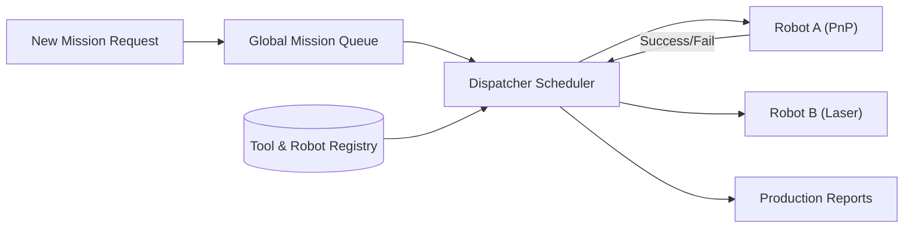

<p align="center">
  
</p>

# 📋 HYDRA-UMC-JOB-DISPATCHER

<p align="center"><a href="README.md">🇺🇸 English</a> | <a href="README_spa.md">🇪🇸 Español</a> | <a href="README_fra.md">🇫🇷 Français</a> | <a href="README_ita.md">🇮🇹 Italiano</a> | <a href="README_deu.md">🇩🇪 Deutsch</a> | <a href="README_zho.md">🇨🇳 简体中文</a> | 🇯🇵 <b>日本語</b></p>

### ⚙️ 異種ロボットフリート向けの優先度ベースのミッションキュー

<p align="left">
  
  
  
</p>

---

## 1. 🛠️ 技術概要

**HYDRA-UMC-JOB-DISPATCHER** は、オーケストレーターのタスク割り当て
エンジンです。グローバルなミッションキューを管理し、各ロボットの現在の
可用性、位置、装着されている工具（URTC）に基づいてジョブを分配します。

高優先度タスク（例：「緊急欠陥修正」）が通常の生産フローをバイパスする
ことを保証し、異なるロボットが連携して動作する必要のあるマルチステップ
組立シーケンスを調整します。

### 主な機能：
* 📋 **動的キューイング：** インテリジェントなミッションの優先順位付けとスケジューリング。
* ⚖️ **工具認識ルーティング：** 正しい URTC ヘッドを持つロボットへ自動的にジョブをルーティングします。
* 🔄 **マルチステージミッション：** タスク間の依存関係を管理します（例：「ピック」は「プレース」より先に発生する必要があります）。
* 📡 **永続性：** ローカルの Redis/データベースストレージを用いた耐障害性のあるミッション状態管理。
* 🔁 **冪等な送信（v0）：** `POST /jobs/submit` による実際の、任意の `DedupKey` ベースの重複排除——進行中または既に完了したジョブを再送信すると変更されずに返され、実際の失敗後の再試行は同じジョブ ID を再利用し、作業を二重に実行しません。優先順位の順序は繰り返し実行しても決定論的であり、明示的な回帰テストでカバーされています。

---

## 2. 🔄 ディスパッチャーフロー



---

## 3. 🧱 アーキテクチャと設計上の決定

* **実際のロジックがリポジトリのルートではなく `src/` の下にある理由。** `src/dispatcher`（スケジューリングエンジン）と `src/api`（HTTP ハンドラ）が実際の実装を保持しています。`main.go`/`version.go` はそれらを結びつけるエントリポイントとしてリポジトリのルートに残ります。
* **ジョブの割当てが URTC 経由で工具の可用性をチェックする理由。** 特定の工具ヘッドを必要とするジョブは、その URTC 制御の工具ヘッドが実際に存在しアイドル状態であるロボットにのみ分配可能です——ディスパッチ前（ピック失敗後ではなく）にこれをチェックすることで、ロボットが実際には使用できないステーションに到着することを防ぎます。`src/dispatcher.Engine.DispatchOnce` は今日すでに `RequiredTool`/`Robot.Tool` の完全一致でこれを実施しています；工具ヘッドが物理的に取り付けられていることを確認するために CAN 経由で実際の URTC とまだ通信していません（エンジンはロボットの登録が主張する内容しか知りません——`src/api` の `POST /robots` を参照）。
* **スケジューラは今日すでに本物だが、永続化はまだ本物ではない理由。** `src/dispatcher` は README の "DISPATCHER FLOW" 図が説明する実際のアルゴリズムを実装しています：優先度順に並んだグローバルキュー、工具を意識したルーティング、さらに多段階依存関係（`DependsOn` 内のすべてのジョブが `done` に達するまで、ジョブは `blocked` のまま）。これらはすべてメモリ上にのみ存在します——`Engine` の状態は、後で Redis/DB バックエンドのストアが、各呼び出し側を変えることなくこれらのメソッドの背後にあるものを置き換えられるよう、あえてエクスポートされたメソッドの背後に保持されています。スケジューリングアルゴリズム自体が正しいことを証明することが最初に来ました。
* **HTTP API が gRPC ではなくプレーンな JSON/HTTP である理由。** これは人間/運用向けの制御サーフェース（ジョブを送信し、ロボットを登録し、何が起こったか尋ねる）です——`hydra.common.v1`（エコシステム共通の gRPC 契約、`HYDRA-UMC-ORCHESTRATOR/proto/` 参照）は、その proto 自体の既に文書化された適用範囲に従い、ノード間通信用に予約されたままです。
* **エコシステムの他の部分との関係。** HYDRA-UMC-ORCHESTRATOR の下の兄弟サービスです——ミッションレベルの決定を、URTC の工具可用性と HYDRA-UMC-PATH-PLANNER-3D 自身のルートに照らしてチェックされた、具体的なロボットごとのジョブ割当てに変換します。
* **`POST /jobs/submit` が `POST /jobs` を変更するのではなく新しいルートである理由。** `AddJob()`/`POST /jobs` は常に挿入を行い、ID の衝突ではエラーになります——この低レベルの契約は変更されません。`SubmitJob()`/`POST /jobs/submit` は `Job.DedupKey` を介してその上に実際の、任意の重複排除を重ねます——これはエコシステム全体で使われているのと同じパターンです（変更されない低レベルのプリミティブの隣に安全策付きのエントリポイントを追加するのであって、それに動作の変更を接ぎ木するのではありません）。
* **失敗後の再試行が新しいジョブを作成するのではなく同じジョブ ID を再利用する理由。** 代替案——再試行のたびに新しいジョブを生成する——は、一つの論理的な作業単位の履歴を複数の ID に分散させてしまい、呼び出し側には「これは一度失敗して再試行されている」のか「これは無関係な新しい作業」なのかを区別する手段がなくなります。元のジョブを `Pending` にリセットすることで、失敗した試行を含むそのライフサイクル全体が一つの ID の下に保たれます。

---

## 📂 リポジトリ構成

```text
HYDRA-UMC-JOB-DISPATCHER/
├── src/
│   ├── dispatcher/    # 実際のスケジューリングエンジン：キュー、
│   │                  # 工具を意識したルーティング、多段階依存関係
│   └── api/           # エンジンを包む単純な JSON/HTTP ハンドラー
├── docs/
│   └── API.md         # 本物の HTTP エンドポイントリファレンス（リクエスト、レスポンス、ステータスコード）
├── images/            # メディアと図版
├── systemd/
│   └── hydra-umc-job-dispatcher.service # CM5 上のローカル優先度ミッションキュー用 systemd ユニット
├── tools/
│   ├── build_test.py  # バージョンを更新しないビルド/コンパイル確認
│   └── ci_validate.py # CI が使用する manifest/CHANGELOG/docs の検証
├── build/             # コンパイル済みバイナリ(build.sh/build.bat の出力)
├── go.mod / go.sum    # Go モジュール定義
├── version.go         # const Version = "X.Y.Z"(go.mod にはアプリバージョンフィールドがありません)
├── main.go            # エントリポイント：エンジンを HTTP API に接続してリッスン
├── bump_version.py    # オドメーター式バージョンインクリメント、build.sh/.bat が実行
├── bump_manifest_version.py # hydra-umc.project.json のバージョンをネイティブ側と同期（--sync）
├── build.sh/.bat      # バージョンを増加させ、その後 `go build` を実行
├── run.sh/.bat        # コンパイル済みバイナリを実行
└── README.md
```

元のテンプレートから省略：`hardware/`、`firmware/`、`os/` —— これは
純粋なソフトウェアサービス(Go バイナリ)であり、専用のハードウェアや
ファームウェア、維持すべきオペレーティングシステムイメージもありません。
完全な HTTP エンドポイントリファレンスは [`docs/API.md`](docs/API.md) を参照。

---

## 🔧 ビルドと実行

コンパイルできるだけの骨組みではなく、優先度付きの本物のジョブ
キューと HTTP API です。

```bash
# Windows
build.bat
run.bat -addr :8090

# Linux / macOS
./build.sh
./run.sh -addr :8090
```

`build.sh`/`build.bat` は `version.go` のバージョンを増加させ（エコ
システム全体で統一されたオドメーター規則、`bump_version.py` を参照——
`go.mod` にはアプリケーションバイナリ向けのネイティブなバージョン
フィールドがありません）、その後 `go build` を実行します。
`run.sh`/`run.bat` は生成されたバイナリを直接実行します。

```bash
# ロボットを登録し、ジョブを送信し、ディスパッチし、完了としてマークする
curl -X POST localhost:8090/robots -d '{"id":"robot-a","tool":"PnP","available":true}'
curl -X POST localhost:8090/jobs   -d '{"id":"job-1","priority":5,"requiredTool":"PnP"}'
curl -X POST localhost:8090/dispatch -d '{}'
curl -X POST localhost:8090/jobs/complete -d '{"id":"job-1","success":true}'
curl localhost:8090/jobs
curl localhost:8090/robots
```

```bash
# 冪等な送信：同じ dedupKey を持つ再試行リクエストは、クライアントが
# 異なる id を使っても、同じジョブを二度実行することは決してありません。
curl -X POST localhost:8090/jobs/submit -d '{"id":"job-2","priority":5,"requiredTool":"PnP","dedupKey":"req-abc"}'
# -> {"ID":"job-2", ..., "result":"created"}
curl -X POST localhost:8090/jobs/submit -d '{"id":"job-2-retry","priority":5,"requiredTool":"PnP","dedupKey":"req-abc"}'
# -> {"ID":"job-2", ..., "result":"duplicate"} - 同じジョブ、変更なし

# 実際の失敗の後、同じ dedupKey での再試行は job-2 の ID を再利用します：
curl -X POST localhost:8090/jobs/complete -d '{"id":"job-2","success":false}'
curl -X POST localhost:8090/jobs/submit -d '{"id":"job-2-retry-2","priority":5,"requiredTool":"PnP","dedupKey":"req-abc"}'
# -> {"ID":"job-2", "Status":"pending", ..., "result":"retried"}
```

```bash
go test ./...   # src/dispatcher(スケジューリングアルゴリズム) +
                 # src/api(httptest による実際の HTTP 往復テスト)
```

---

## 🚀 ロードマップ
* **フェーズ 1：** TSN による決定論的スウォーム同期とサブミリ秒ジッタの低減。
* **フェーズ 2：** マルチロボットセルにおける動的障害物回避を伴う 3D パスプランニング。
* **フェーズ 3：** リアルタイムのリソース可用性を用いたマルチロボットジョブディスパッチの最適化。
* **フェーズ 4：** より優れたスケジューリングのための AI 駆動のジョブ時間推定と異種ロボットフリートの協調。

---

## 🔗 関連プロジェクト

本プロジェクトは、同じ作者(JuanenRac / Electro Hobby 3D)による HYDRA-UMC ロボティクスエコシステムの一部です。リクエストが実はこの中のどれかについてのものである可能性があるため、知っておく価値があります。

**親プロジェクト**
- **[HYDRA-UMC-ORCHESTRATOR](https://github.com/JuanenRac/HYDRA-UMC-ORCHESTRATOR)** — 実際の gRPC/Protobuf ヘルスレポート契約とミッションステートマシンを持つ統合ハブ。本リポジトリは、その自身のスウォーム調整レイヤー内における特定のオーケストレーションサービスとして、この親の一部を成す。

**兄弟プロジェクト** —— HYDRA-UMC-ORCHESTRATOR 自身のスウォーム調整レイヤーにおける他のオーケストレーションサービス
- **[HYDRA-UMC-SWARM-SYNC](https://github.com/JuanenRac/HYDRA-UMC-SWARM-SYNC)** — 複数セルの収束についてプロパティテストされた、実際の CRDT LWW-Element-Map 状態同期。
- **[HYDRA-UMC-PATH-PLANNER-3D](https://github.com/JuanenRac/HYDRA-UMC-PATH-PLANNER-3D)** — 実際の障害物/ワークスペース衝突検証を備えた、実際の RRT ベースの 3D 経路プランナー。
- **[HYDRA-UMC-NODE-HEALING](https://github.com/JuanenRac/HYDRA-UMC-NODE-HEALING)** — リトライ/バックオフとアイデンティティ不一致検出を備えた、実際の gRPC ベースのフリートヘルスウォッチドッグ。

**直接関連**
- **[URTC](https://github.com/JuanenRac/URTC)** — 物理的な Universal Robot Tool Controller 基板向けファームウェア、CAN バス経由の 25 以上のツールプロファイル ——URTC 自身のどのツールヘッドが実際に利用可能かに基づいてジョブを割り当てる。
- **[HYDRA-UMC-PRODUCTION-REPORTS](https://github.com/JuanenRac/HYDRA-UMC-PRODUCTION-REPORTS)** — DATALAKE の履歴に対する実際の OEE/稼働率計算、再現可能な CSV エクスポート付き ——ミッション完了ログの想定される送信先。完了処理が書き込みに接続されれば、本ディスパッチャーが自身の OEE `production_event` データの実際の情報源になる予定(未実装、そのプロジェクト側で追跡中)。

**エコシステムの他のプロジェクト**

*コアハードウェア&プラットフォーム*
- **[HYDRA-UMC](https://github.com/JuanenRac/HYDRA-UMC)** — 実際のロボットアームのマザーボード——CM5 ホスト + デュアルコア STM32H745、CAN-OTA/SPI-OTA 経由で最大 8 本のツールアームを統括。
- **[HYDRA-UMC-OS](https://github.com/JuanenRac/HYDRA-UMC-OS)** — CM5 向けの再現可能な Raspberry Pi OS プロダクト層——読み取り専用エージェント、検証済み設定/プロファイル、WiFi 初回接続プロビジョニング。
- **[HYDRA-UMC-SDK](https://github.com/JuanenRac/HYDRA-UMC-SDK)** — すべてのブリッジが自身のコマンドを検証する共有 JSON-Schema 契約と安全ゲートの境界。

*コアバックエンド&クライアント*
- **[HYDRA-UMC-SERVER](https://github.com/JuanenRac/HYDRA-UMC-SERVER)** — すべての制御クライアントが実際に通信する、本物のヘッドレスバックエンド(REST/WebSocket)。
- **[HYDRA-UMC-STUDIO](https://github.com/JuanenRac/HYDRA-UMC-STUDIO)** — リアルタイムのマルチロボット 3D 可視化を備えたウェブ制御ダッシュボード。
- **[HYDRA-UMC-SUITE](https://github.com/JuanenRac/HYDRA-UMC-SUITE)** — 複数のサーバーを同時に扱えるデスクトップ(PySide6)スウォームコマンドセンター、スタンドアロン実行ファイルとしてパッケージ化。
- **[HYDRA-UMC-ANDROID-CONTROL](https://github.com/JuanenRac/HYDRA-UMC-ANDROID-CONTROL)** — 生体認証ログインとペアリングされた Wear OS コンパニオンを備えたネイティブ Android 制御アプリ。
- **[HYDRA-UMC-IOS-CONTROL](https://github.com/JuanenRac/HYDRA-UMC-IOS-CONTROL)** — リアルタイム WebSocket 同期を備えた iOS/iPadOS 制御アプリ(Flutter)。
- **[HYDRA-UMC-DSI](https://github.com/JuanenRac/HYDRA-UMC-DSI)** — 本体搭載の 7 インチ DSI タッチスクリーン向けネイティブタッチ UI、CM5 自体に組み込み。
- **[HYDRA-UMC-EDITOR-URDF](https://github.com/JuanenRac/HYDRA-UMC-EDITOR-URDF)** — 完成したモデルを STUDIO 自身のカタログへ送信するデスクトップ用グラフィカル URDF 作成/編集ツール。
- **[HYDRA-UMC-BRIDGE-AMR](https://github.com/JuanenRac/HYDRA-UMC-BRIDGE-AMR)** — 実際の VDA 5050 MQTT パブリッシャーによる AGV/AMR フリートの調整境界。
- **[HYDRA-UMC-BRIDGE-CNC](https://github.com/JuanenRac/HYDRA-UMC-BRIDGE-CNC)** — 実際の GRBL ステータス/制御バイトへのアクセスを持つ、CNC セルの高レベルコーディネーター。
- **[HYDRA-UMC-BRIDGE-DROIDS](https://github.com/JuanenRac/HYDRA-UMC-BRIDGE-DROIDS)** — 実際の Boston Dynamics Spot コマンド送信機能を持つ、脚型/ヒューマノイドドロイドの調整境界。
- **[HYDRA-UMC-BRIDGE-LASER](https://github.com/JuanenRac/HYDRA-UMC-BRIDGE-LASER)** — 実際のキー/筐体/インターロック GPIO セーフガード 3 系統を読み取る、レーザーセルの安全コーディネーター。
- **[HYDRA-UMC-BRIDGE-OPENPNP](https://github.com/JuanenRac/HYDRA-UMC-BRIDGE-OPENPNP)** — OpenPnP ピックアンドプレースの基板フローを安全に統括する高レベルコーディネーター。
- **[HYDRA-UMC-BRIDGE-PRINTER3D](https://github.com/JuanenRac/HYDRA-UMC-BRIDGE-PRINTER3D)** — 実際にゲート制御されたジョブコマンドを持つ、Moonraker/Klipper 3D プリンター向けの安全な調整境界。
- **[HYDRA-UMC-BRIDGE-ROS2](https://github.com/JuanenRac/HYDRA-UMC-BRIDGE-ROS2)** — 実際の遅延インポート rclpy ROS 2 トランスポートを持つ安全コーディネーター。
- **[HYDRA-UMC-BRIDGE-UAV](https://github.com/JuanenRac/HYDRA-UMC-BRIDGE-UAV)** — 実際の MAVLink コマンド送信機能を持つ、カメラ搭載 UAV の調整境界。

*URTC ツールプラットフォーム*
- **[URTC-FLASHER](https://github.com/JuanenRac/URTC-FLASHER)** — URTC 基板用のデスクトップ GUI 書き込みツール、CAN-OTA およびフルチップ SWD/JTAG。
- **[URTC-TESTER](https://github.com/JuanenRac/URTC-TESTER)** — URTC 基板向けのデスクトップ CAN バスライブ診断ツール、ツールプロファイルごとに 1 パネル。
- **[URTC-WEB-STUDIO](https://github.com/JuanenRac/URTC-WEB-STUDIO)** — Web Serial API を使ったブラウザベースの URTC-TESTER の代替、ローカルインストール不要。

*ビジョン AI ノード(Hailo-8)*
- **[HYDRA-UMC-VISION-NODE](https://github.com/JuanenRac/HYDRA-UMC-VISION-NODE)** — Hailo-8 ビジョンパイプラインの統合ハブ、段階ごとの実際のハードウェア準備状況チェック付き。
- **[HYDRA-UMC-DETECTION-HEF](https://github.com/JuanenRac/HYDRA-UMC-DETECTION-HEF)** — Hailo アーキテクチャ/チェックサムによる安全読み込み検証を備えた、実際のコンパイル済みモデルレジストリ。
- **[HYDRA-UMC-VISION-STREAMER](https://github.com/JuanenRac/HYDRA-UMC-VISION-STREAMER)** — 実際の HailoRT 統合境界を持つ、実際の GStreamer パイプライン + MediaMTX 設定生成器。
- **[HYDRA-UMC-VISUAL-SERVOING-API](https://github.com/JuanenRac/HYDRA-UMC-VISUAL-SERVOING-API)** — 上流のゾーン状態に応じて安全ゲート制御される、実際の Position-Based Visual Servoing 補正則。
- **[HYDRA-UMC-SAFETY-ZONES](https://github.com/JuanenRac/HYDRA-UMC-SAFETY-ZONES)** — キャリブレーションの鮮度を強制する、実際のゾーン侵入チェックと E-STOP 要求。

*コグニティブ AI ノード(Hailo-10)*
- **[HYDRA-UMC-COGNITIVE-NODE](https://github.com/JuanenRac/HYDRA-UMC-COGNITIVE-NODE)** — Hailo-10 コグニティブパイプライン(LLM/VLA/音声オーケストレーション)の統合ハブ。
- **[HYDRA-UMC-VLA-ENGINE](https://github.com/JuanenRac/HYDRA-UMC-VLA-ENGINE)** — Vision-Language-Action モデル向けの、実際のアクショントークンのエンコード/デコードと軌道生成。
- **[HYDRA-UMC-VOICE-UI](https://github.com/JuanenRac/HYDRA-UMC-VOICE-UI)** — 確認ゲート付きの限定的な Watch リレーを備えた、実際の音声フロントエンド(VAD + 意図解析)。
- **[HYDRA-UMC-SEMANTIC-PLANNER](https://github.com/JuanenRac/HYDRA-UMC-SEMANTIC-PLANNER)** — MCU エラーコードに対する、実際のルールベースのタスク分解と意味的エラー復旧。
- **[HYDRA-UMC-DOCS-QA](https://github.com/JuanenRac/HYDRA-UMC-DOCS-QA)** — このエコシステム自身の Markdown ドキュメントに対する、標準ライブラリのみの実際の TF-IDF 文書検索。

*デジタルツイン&シミュレーション*
- **[HYDRA-UMC-TWIN](https://github.com/JuanenRac/HYDRA-UMC-TWIN)** — 実際のバージョン互換性同期契約を持つ、デジタルツインエンジンの統合ハブ。
- **[HYDRA-UMC-HIL-BRIDGE](https://github.com/JuanenRac/HYDRA-UMC-HIL-BRIDGE)** — シミュレーションと実際のハードウェアの間でコマンドをルーティングする、実際のハードウェア・イン・ザ・ループ安全インターロック。
- **[HYDRA-UMC-PHYSICS-REPLICA](https://github.com/JuanenRac/HYDRA-UMC-PHYSICS-REPLICA)** — 実際の URDF サブセットに対する、実際の順運動学と関節限界検証。
- **[HYDRA-UMC-SYNTHETIC-DATA-GEN](https://github.com/JuanenRac/HYDRA-UMC-SYNTHETIC-DATA-GEN)** — YOLO/COCO アノテーションのエクスポート機能を持つ、実際のプロシージャル 2D シーンジェネレーター。

*データ&分析*
- **[HYDRA-UMC-DATALAKE](https://github.com/JuanenRac/HYDRA-UMC-DATALAKE)** — 実際の取り込み/クエリ HTTP API を備えた、実際の sqlite3 ベースの時系列ストア。
- **[HYDRA-UMC-ANOMALY-DETECTOR](https://github.com/JuanenRac/HYDRA-UMC-ANOMALY-DETECTOR)** — ドリフト監視を備えた、実際の FFT + 統計ベースラインによる異常検知器。
- **[HYDRA-UMC-TELEMETRY-COLLECTOR](https://github.com/JuanenRac/HYDRA-UMC-TELEMETRY-COLLECTOR)** — シーケンス重複排除機能を備えた、DATALAKE への実際の CAN/WebSocket 取り込みパイプライン。

*産業用ゲートウェイ*
- **[HYDRA-UMC-GATEWAY-INDUSTRIAL](https://github.com/JuanenRac/HYDRA-UMC-GATEWAY-INDUSTRIAL)** — 実際のコマンド許可リスト/バックプレッシャー層を持つ、産業用プロトコルへ中継する統合ハブ。
- **[HYDRA-UMC-OPCUA-SERVER](https://github.com/JuanenRac/HYDRA-UMC-OPCUA-SERVER)** — 実際のバイナリプロトコルクライアントセッションで検証された、実際の OPC-UA アドレス空間。
- **[HYDRA-UMC-MQTT-BROKER](https://github.com/JuanenRac/HYDRA-UMC-MQTT-BROKER)** — クライアント単位のオプション認証とトピック ACL を備えた、実際の MQTT ブローカー。
- **[HYDRA-UMC-MTCONNECT-ADAPTER](https://github.com/JuanenRac/HYDRA-UMC-MTCONNECT-ADAPTER)** — 縮退モード出力を備えた、実際の MTConnect `/probe` および `/current` XML エンドポイント。

*補完ツール&エコシステム運用*
- **[HYDRA-UMC-DASHBOARD-AI](https://github.com/JuanenRac/HYDRA-UMC-DASHBOARD-AI)** — 誠実な統計フォールバックを備えた、DATALAKE/ANOMALY-DETECTOR 上のスマートサマリーと異常ハイライトパネル。
- **[HYDRA-UMC-TOOL-CLI](https://github.com/JuanenRac/HYDRA-UMC-TOOL-CLI)** — 実際の安定した終了コード契約を持つフリート CLI、HYDRA-UMC-SERVER 自身の API の本物のライブクライアント。
- **[HYDRA-UMC-WATCH](https://github.com/JuanenRac/HYDRA-UMC-WATCH)** — 実際の触覚アラートとペアリングされたスマートフォンへの音声リレーを備えた WearOS コンパニオンアプリ。
- **[URTC-SMART-RACK](https://github.com/JuanenRac/URTC-SMART-RACK)** — 実際の工具 ID デコードと Smart Idle 予熱ロジックを備えた、基板搭載ラック用ファームウェア。
- **[URTC-VISION-TOOL](https://github.com/JuanenRac/URTC-VISION-TOOL)** — サーマル/RGB 検査ツールヘッド向けの、ファームウェアと実際の Python ビジョンコンパニオン。
- **[HYDRA-UMC-UPDATER](https://github.com/JuanenRac/HYDRA-UMC-UPDATER)** — このエコシステム内のすべてのリポジトリを検出・クローン・更新する、管理用デスクトップツール。


---

## 📚 ドキュメント & コミュニティ

- **[CONTRIBUTING.md](CONTRIBUTING.md)** —— プルリクエストのための技術スタックとコーディング指針。
- **[CODE_OF_CONDUCT.md](CODE_OF_CONDUCT.md)** —— このコミュニティで期待される行動規範。
- **[SECURITY.md](SECURITY.md)** —— 脆弱性の報告方法と、このプロジェクトの実際のセキュリティ重点領域。
- **[SUPPORT.md](SUPPORT.md)** —— 質問の投稿先とバグの報告先。
- **[LICENSE.md](LICENSE.md)** —— このプロジェクト自身のライセンス。

## 👤 作者
**JuanenRac** (Electro Hobby 3D)
📧 electrohobby3d@gmail.com
📺 [youtube.com/@electrohobby3d](https://youtube.com/@electrohobby3d)

## 📜 ライセンス
GPL-3.0 —— 詳細は LICENSE を参照してください。
