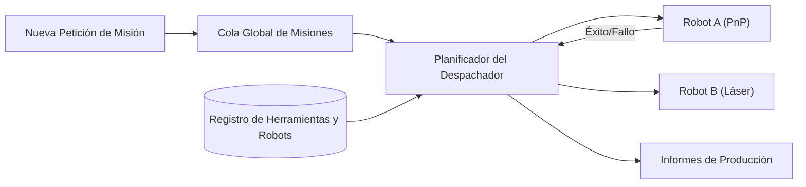

<p align="center">
  
</p>

# 📋 HYDRA-UMC-JOB-DISPATCHER

<p align="center"><a href="README.md">🇺🇸 English</a> | 🇪🇸 <b>Español</b> | <a href="README_fra.md">🇫🇷 Français</a> | <a href="README_ita.md">🇮🇹 Italiano</a> | <a href="README_deu.md">🇩🇪 Deutsch</a> | <a href="README_zho.md">🇨🇳 简体中文</a> | <a href="README_jpn.md">🇯🇵 日本語</a></p>

### ⚙️ Cola de Misiones Basada en Prioridades para Flotas de Robots Heterogéneas

<p align="left">
  
  
  
</p>

---

## 1. 🛠️ VISIÓN GENERAL TÉCNICA

**HYDRA-UMC-JOB-DISPATCHER** es el motor de asignación de tareas del Orquestador. Gestiona una cola global de misiones, distribuyendo trabajos a robots individuales en función de su disponibilidad actual, ubicación y herramienta instalada (URTC).

Asegura que las tareas de alta prioridad (ej. "Reparación de Defecto de Emergencia") omitan el flujo de producción normal, y coordina secuencias de ensamblaje multi-paso que requieren que diferentes robots trabajen en tándem.

### Características Clave:
* 📋 **Colas Dinámicas:** Priorización e itineración inteligente de misiones.
* ⚖️ **Enrutamiento Consciente de Herramientas:** Enruta automáticamente los trabajos al robot con el cabezal URTC correcto.
* 🔄 **Misiones Multi-Etapa:** Gestiona dependencias entre tareas (ej. "Pick" debe ocurrir antes de "Place").
* 📡 **Persistencia:** Estado de misión tolerante a fallos usando almacenamiento local Redis/Base de datos.
* 🔁 **Envío Idempotente (v0):** Deduplicación real y opcional basada en `DedupKey` vía `POST /jobs/submit` - un reenvío de un job en curso o ya terminado se devuelve sin cambios, y un reintento tras un fallo real reutiliza el mismo ID de job en vez de ejecutar el trabajo dos veces. El orden por prioridad es determinista entre ejecuciones repetidas, cubierto por un test de regresión explícito.

---

## 2. 🔄 FLUJO DEL DESPACHADOR



---

## 3. 🧱 ARQUITECTURA Y DECISIONES DE DISEÑO

* **Por qué la lógica real vive bajo `src/` y no en la raíz del repo.** `src/dispatcher` (el motor de planificación) y `src/api` (los handlers HTTP) contienen la implementación real; `main.go`/`version.go` siguen en la raíz como el punto de entrada que los conecta.
* **Por qué la asignación de trabajos comprueba la disponibilidad de herramienta vía URTC.** Un trabajo que necesita un cabezal de herramienta concreto solo es asignable a un robot cuyo cabezal controlado por URTC esté realmente presente e inactivo - comprobar esto antes de asignar (no después de una recogida fallida) evita que un robot llegue a una estación que en realidad no puede usar. `src/dispatcher.Engine.DispatchOnce` ya aplica esto hoy comparando `RequiredTool` contra `Robot.Tool` de forma exacta; todavía no habla con un URTC real por CAN para confirmar que el cabezal está físicamente conectado (el motor solo conoce lo que declara el registro del robot vía `POST /robots`).
* **Por qué el planificador ya es real hoy pero la persistencia no.** `src/dispatcher` implementa el algoritmo real que describe el diagrama "DISPATCHER FLOW" del README: una cola global ordenada por prioridad, enrutamiento consciente de herramienta, y dependencias multi-etapa (un trabajo se queda `blocked` hasta que todos sus `DependsOn` llegan a `done`). Todo eso vive solo en memoria - el estado de `Engine` se mantiene detrás de métodos exportados precisamente para que un almacén respaldado por Redis/BD pueda sustituir lo que hay detrás de esos métodos más adelante sin cambiar a cada llamador. Probar que el algoritmo de planificación en sí era correcto vino primero.
* **Por qué la API HTTP es JSON/HTTP plano, no gRPC.** Es una superficie de control orientada a humanos/operación (enviar un trabajo, registrar un robot, preguntar qué pasó) - `hydra.common.v1` (el contrato gRPC compartido del ecosistema, ver `HYDRA-UMC-ORCHESTRATOR/proto/`) queda reservado para el tráfico nodo-a-nodo, según el alcance ya documentado de ese proto.
* **Cómo encaja en el resto del ecosistema.** Un servicio hermano bajo HYDRA-UMC-ORCHESTRATOR - convierte decisiones a nivel de misión en asignaciones concretas de trabajo por robot, contrastadas con la disponibilidad de herramienta de URTC y las propias rutas de HYDRA-UMC-PATH-PLANNER-3D.
* **Por qué `POST /jobs/submit` es una ruta nueva en vez de cambiar `POST /jobs`.** `AddJob()`/`POST /jobs` siempre insertan y fallan ante una colisión de ID - ese contrato de bajo nivel queda intacto. `SubmitJob()`/`POST /jobs/submit` añade deduplicación real y opcional encima vía `Job.DedupKey`: el mismo patrón usado en todo el ecosistema (un punto de entrada con verja añadido junto a una primitiva de bajo nivel sin tocar, no un cambio de comportamiento incrustado en ella).
* **Por qué un reintento tras un fallo reutiliza el mismo ID de job en vez de crear uno nuevo.** La alternativa - generar un job nuevo en cada reintento - dispersaría el historial de una única unidad lógica de trabajo entre varios IDs y no daría a quien llama forma de distinguir "esto falló una vez y se está reintentando" de "esto es trabajo nuevo sin relación". Reiniciar el job original a `Pending` mantiene todo su ciclo de vida (incluido el intento fallido) bajo un único ID.

---

## 📂 ESTRUCTURA DE DIRECTORIOS

```text
HYDRA-UMC-JOB-DISPATCHER/
├── src/
│   ├── dispatcher/    # El motor de planificación real: cola, enrutamiento
│   │                  # consciente de herramienta, dependencias multi-etapa
│   └── api/           # Handlers JSON/HTTP planos que envuelven el motor
├── docs/
│   └── API.md         # Referencia real de endpoints HTTP (peticiones, respuestas, codigos de estado)
├── build/             # Binarios compilados (salida de build.sh/build.bat)
├── go.mod / go.sum    # Definición del módulo Go
├── version.go         # const Version = "X.Y.Z" (go.mod no tiene ese campo)
├── main.go            # Punto de entrada: conecta el motor a la API HTTP y escucha
├── bump_version.py    # Bump de versión tipo cuentakilómetros
├── build.sh/.bat      # Sube la versión y ejecuta `go build`
├── run.sh/.bat        # Ejecuta el binario compilado
└── README.md
```

Podado de la plantilla original: `hardware/`, `firmware/`, `os/`,
`images/` y `scripts/` — es un servicio de software puro (binario Go) sin
hardware ni firmware propios, sin imagen de sistema operativo que mantener,
y sin contenido de medios/scripts de utilidad todavía suficiente para
justificar sus propias carpetas. Ver [`docs/API.md`](docs/API.md) para la
referencia completa de endpoints HTTP.

---

## 🔧 BUILD & RUN

Una cola de misiones con prioridad real y API HTTP, no solo un esqueleto
que compila.

```bash
# Windows
build.bat
run.bat -addr :8090

# Linux / macOS
./build.sh
./run.sh -addr :8090
```

`build.sh`/`build.bat` suben la versión en `version.go` (regla
cuentakilómetros del ecosistema, ver `bump_version.py` - `go.mod` no tiene
campo de versión nativo para binarios de aplicación) y luego ejecutan
`go build`. `run.sh`/`run.bat` ejecutan directamente el binario resultante.

```bash
# Registrar un robot, enviar un trabajo, despacharlo y marcarlo como hecho
curl -X POST localhost:8090/robots -d '{"id":"robot-a","tool":"PnP","available":true}'
curl -X POST localhost:8090/jobs   -d '{"id":"job-1","priority":5,"requiredTool":"PnP"}'
curl -X POST localhost:8090/dispatch -d '{}'
curl -X POST localhost:8090/jobs/complete -d '{"id":"job-1","success":true}'
curl localhost:8090/jobs
curl localhost:8090/robots
```

```bash
# Envío idempotente: una peticion reintentada con el mismo dedupKey
# nunca ejecuta el mismo job dos veces, aunque el cliente use un id distinto.
curl -X POST localhost:8090/jobs/submit -d '{"id":"job-2","priority":5,"requiredTool":"PnP","dedupKey":"req-abc"}'
# -> {"ID":"job-2", ..., "result":"created"}
curl -X POST localhost:8090/jobs/submit -d '{"id":"job-2-retry","priority":5,"requiredTool":"PnP","dedupKey":"req-abc"}'
# -> {"ID":"job-2", ..., "result":"duplicate"} - mismo job, sin cambios

# Tras un fallo real, un reintento con el mismo dedupKey reutiliza el ID de job-2:
curl -X POST localhost:8090/jobs/complete -d '{"id":"job-2","success":false}'
curl -X POST localhost:8090/jobs/submit -d '{"id":"job-2-retry-2","priority":5,"requiredTool":"PnP","dedupKey":"req-abc"}'
# -> {"ID":"job-2", "Status":"pending", ..., "result":"retried"}
```

```bash
go test ./...   # src/dispatcher (algoritmo de planificacion) +
                 # src/api (round-trips HTTP reales via httptest)
```

---

## 🚀 HOJA DE RUTA
* **Fase 1:** Sincronización determinista de enjambre sobre TSN y reducción de jitter sub-ms.
* **Fase 2:** Planificación de trayectorias 3D con evitación dinámica de obstáculos en celdas multi-robot.
* **Fase 3:** Optimización del despacho de trabajos multi-robot utilizando disponibilidad de recursos en tiempo real.
* **Fase 4:** Estimación de duración de trabajos impulsada por IA para una mejor planificación y coordinación de flotas heterogéneas.

---

## 🔗 Proyectos Relacionados

Este proyecto forma parte de un ecosistema de robótica más amplio del mismo autor (JuanenRac / Electro Hobby 3D), que abarca firmware, software de control, nodos de IA y herramientas de flota. Vale la pena conocerlo, ya que una petición podría en realidad ser sobre uno de estos proyectos en vez de sobre este repositorio.

### Familia

**Padre:** **[HYDRA-UMC-ORCHESTRATOR](https://github.com/JuanenRac/HYDRA-UMC-ORCHESTRATOR)** — el padre de integración al que sirve este despachador.

**Hermanos:**
- **[HYDRA-UMC-SWARM-SYNC](https://github.com/JuanenRac/HYDRA-UMC-SWARM-SYNC)** — servicio de orquestación hermano, mismo padre.
- **[HYDRA-UMC-PATH-PLANNER-3D](https://github.com/JuanenRac/HYDRA-UMC-PATH-PLANNER-3D)** — servicio de orquestación hermano, mismo padre.
- **[HYDRA-UMC-NODE-HEALING](https://github.com/JuanenRac/HYDRA-UMC-NODE-HEALING)** — servicio de orquestación hermano, mismo padre.

### Relación Directa (fuera de la familia)

- **[URTC](https://github.com/JuanenRac/URTC)** — asigna tareas según qué cabezal de herramienta está realmente disponible.

### Resto del Ecosistema

**Plataforma HYDRA-UMC** — la célula de micro-fábrica multi-robot
- **[HYDRA-UMC](https://github.com/JuanenRac/HYDRA-UMC)** — la placa base CM5 + STM32H745 que orquesta hasta 8 brazos robóticos.
- **[HYDRA-UMC-SERVER](https://github.com/JuanenRac/HYDRA-UMC-SERVER)** — el backend Express/WebSocket con el que habla cada cliente de control.
- **[HYDRA-UMC-STUDIO](https://github.com/JuanenRac/HYDRA-UMC-STUDIO)** — panel de control web, visualización 3D multi-robot.
- **[HYDRA-UMC-ANDROID-CONTROL](https://github.com/JuanenRac/HYDRA-UMC-ANDROID-CONTROL)** — app de control Android por Wi-Fi/Bluetooth.
- **[HYDRA-UMC-IOS-CONTROL](https://github.com/JuanenRac/HYDRA-UMC-IOS-CONTROL)** — app de control iOS/iPadOS construida en Flutter.
- **[HYDRA-UMC-SUITE](https://github.com/JuanenRac/HYDRA-UMC-SUITE)** — centro de mando de enjambre de escritorio (Python/PySide6).
- **[HYDRA-UMC-EDITOR-URDF](https://github.com/JuanenRac/HYDRA-UMC-EDITOR-URDF)** — editor de modelos URDF de escritorio para el catálogo de robots.
- **[HYDRA-UMC-DSI](https://github.com/JuanenRac/HYDRA-UMC-DSI)** — interfaz táctil nativa para la pantalla DSI integrada.

**Plataforma URTC** — el controlador de cabezal de herramienta que lleva cada brazo HYDRA-UMC
- **[URTC](https://github.com/JuanenRac/URTC)** — controlador de cabezal de herramienta CAN, 25 perfiles de herramienta.
- **[URTC-FLASHER](https://github.com/JuanenRac/URTC-FLASHER)** — herramienta de escritorio de flasheo CAN-OTA + SWD/JTAG.
- **[URTC-TESTER](https://github.com/JuanenRac/URTC-TESTER)** — herramienta de escritorio de diagnóstico CAN en vivo.
- **[URTC-WEB-STUDIO](https://github.com/JuanenRac/URTC-WEB-STUDIO)** — alternativa basada en navegador vía Web Serial API.

**🎥 Vision AI Node (Hailo-8)**
- [HYDRA-UMC-VISION-NODE](https://github.com/JuanenRac/HYDRA-UMC-VISION-NODE)
- [HYDRA-UMC-VISION-STREAMER](https://github.com/JuanenRac/HYDRA-UMC-VISION-STREAMER)
- [HYDRA-UMC-DETECTION-HEF](https://github.com/JuanenRac/HYDRA-UMC-DETECTION-HEF)
- [HYDRA-UMC-SAFETY-ZONES](https://github.com/JuanenRac/HYDRA-UMC-SAFETY-ZONES)
- [HYDRA-UMC-VISUAL-SERVOING-API](https://github.com/JuanenRac/HYDRA-UMC-VISUAL-SERVOING-API)

**🧠 Cognitive AI Node (Hailo-10)**
- [HYDRA-UMC-COGNITIVE-NODE](https://github.com/JuanenRac/HYDRA-UMC-COGNITIVE-NODE)
- [HYDRA-UMC-VLA-ENGINE](https://github.com/JuanenRac/HYDRA-UMC-VLA-ENGINE)
- [HYDRA-UMC-VOICE-UI](https://github.com/JuanenRac/HYDRA-UMC-VOICE-UI)
- [HYDRA-UMC-SEMANTIC-PLANNER](https://github.com/JuanenRac/HYDRA-UMC-SEMANTIC-PLANNER)
- [HYDRA-UMC-DOCS-QA](https://github.com/JuanenRac/HYDRA-UMC-DOCS-QA)

**🎮 Digital Twin & Simulation**
- [HYDRA-UMC-TWIN](https://github.com/JuanenRac/HYDRA-UMC-TWIN)
- [HYDRA-UMC-PHYSICS-REPLICA](https://github.com/JuanenRac/HYDRA-UMC-PHYSICS-REPLICA)
- [HYDRA-UMC-HIL-BRIDGE](https://github.com/JuanenRac/HYDRA-UMC-HIL-BRIDGE)
- [HYDRA-UMC-SYNTHETIC-DATA-GEN](https://github.com/JuanenRac/HYDRA-UMC-SYNTHETIC-DATA-GEN)

**📊 Data & Analytics**
- [HYDRA-UMC-DATALAKE](https://github.com/JuanenRac/HYDRA-UMC-DATALAKE)
- [HYDRA-UMC-TELEMETRY-COLLECTOR](https://github.com/JuanenRac/HYDRA-UMC-TELEMETRY-COLLECTOR)
- [HYDRA-UMC-ANOMALY-DETECTOR](https://github.com/JuanenRac/HYDRA-UMC-ANOMALY-DETECTOR)
- [HYDRA-UMC-PRODUCTION-REPORTS](https://github.com/JuanenRac/HYDRA-UMC-PRODUCTION-REPORTS)

**🏭 Industrial Gateway**
- [HYDRA-UMC-GATEWAY-INDUSTRIAL](https://github.com/JuanenRac/HYDRA-UMC-GATEWAY-INDUSTRIAL)
- [HYDRA-UMC-OPCUA-SERVER](https://github.com/JuanenRac/HYDRA-UMC-OPCUA-SERVER)
- [HYDRA-UMC-MQTT-BROKER](https://github.com/JuanenRac/HYDRA-UMC-MQTT-BROKER)
- [HYDRA-UMC-MTCONNECT-ADAPTER](https://github.com/JuanenRac/HYDRA-UMC-MTCONNECT-ADAPTER)

**🛠️ Complementary Tools**
- [URTC-SMART-RACK](https://github.com/JuanenRac/URTC-SMART-RACK)
- [URTC-VISION-TOOL](https://github.com/JuanenRac/URTC-VISION-TOOL)
- [HYDRA-UMC-WATCH](https://github.com/JuanenRac/HYDRA-UMC-WATCH)
- [HYDRA-UMC-TOOL-CLI](https://github.com/JuanenRac/HYDRA-UMC-TOOL-CLI)
- [HYDRA-UMC-DASHBOARD-AI](https://github.com/JuanenRac/HYDRA-UMC-DASHBOARD-AI)


## 👤 AUTOR
**JuanenRac** (Electro Hobby 3D)
📧 electrohobby3d@gmail.com

## 📜 LICENCIA
GPL-3.0 - Ver archivo LICENSE para más detalles.

## 🛠️ BUILD & RUN

Usa la comprobación de compilación sin versionado antes de una compilación de publicación:

| Acción | Windows | Linux / macOS |
|---|---|---|
| Comprobación de compilación (sin cambiar versión ni CHANGELOG) | `build-test.bat` | `./build-test.sh` |
| Ejecución / desarrollo (cuando exista) | `run*.bat` o `dev*.bat` | `./run*.sh` o `./dev*.sh` |

`build-test.bat` y `build-test.sh` compilan o validan el stack del proyecto sin incrementar `hydra-umc.project.json` ni modificar `CHANGELOG.md`. Solo pueden crear salidas normales del compilador. Los scripts existentes `build*.bat`, `build*.sh`, `run*` y `dev*` conservan su comportamiento específico de versión o ejecución; úsalos cuando necesites ese comportamiento.