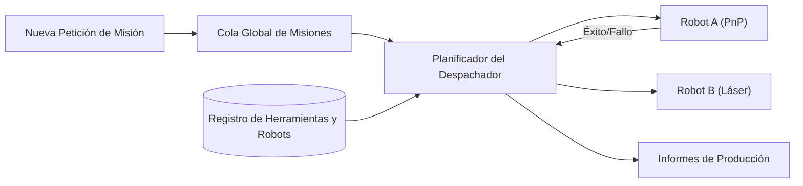

<p align="center">
  
</p>

# 📋 HYDRA-UMC-JOB-DISPATCHER

<p align="center"><a href="README.md">🇺🇸 English</a> | 🇪🇸 <b>Español</b> | <a href="README_fra.md">🇫🇷 Français</a> | <a href="README_ita.md">🇮🇹 Italiano</a> | <a href="README_deu.md">🇩🇪 Deutsch</a> | <a href="README_zho.md">🇨🇳 简体中文</a> | <a href="README_jpn.md">🇯🇵 日本語</a></p>

### ⚙️ Cola de Misiones Basada en Prioridades para Flotas de Robots Heterogéneas

<p align="left">
  
  
  
</p>

---

## 1. 🛠️ VISIÓN GENERAL TÉCNICA

**HYDRA-UMC-JOB-DISPATCHER** es el motor de asignación de tareas del Orquestador. Gestiona una cola global de misiones, distribuyendo trabajos a robots individuales en función de su disponibilidad actual, ubicación y herramienta instalada (URTC).

Asegura que las tareas de alta prioridad (ej. "Reparación de Defecto de Emergencia") omitan el flujo de producción normal, y coordina secuencias de ensamblaje multi-paso que requieren que diferentes robots trabajen en tándem.

### Características Clave:
* 📋 **Colas Dinámicas:** Priorización e itineración inteligente de misiones.
* ⚖️ **Enrutamiento Consciente de Herramientas:** Enruta automáticamente los trabajos al robot con el cabezal URTC correcto.
* 🔄 **Misiones Multi-Etapa:** Gestiona dependencias entre tareas (ej. "Pick" debe ocurrir antes de "Place").
* 📡 **Persistencia:** Estado de misión tolerante a fallos usando almacenamiento local Redis/Base de datos.
* 🔁 **Envío Idempotente (v0):** Deduplicación real y opcional basada en `DedupKey` vía `POST /jobs/submit` - un reenvío de un job en curso o ya terminado se devuelve sin cambios, y un reintento tras un fallo real reutiliza el mismo ID de job en vez de ejecutar el trabajo dos veces. El orden por prioridad es determinista entre ejecuciones repetidas, cubierto por un test de regresión explícito.

---

## 2. 🔄 FLUJO DEL DESPACHADOR



---

## 3. 🧱 ARQUITECTURA Y DECISIONES DE DISEÑO

* **Por qué la lógica real vive bajo `src/` y no en la raíz del repo.** `src/dispatcher` (el motor de planificación) y `src/api` (los handlers HTTP) contienen la implementación real; `main.go`/`version.go` siguen en la raíz como el punto de entrada que los conecta.
* **Por qué la asignación de trabajos comprueba la disponibilidad de herramienta vía URTC.** Un trabajo que necesita un cabezal de herramienta concreto solo es asignable a un robot cuyo cabezal controlado por URTC esté realmente presente e inactivo - comprobar esto antes de asignar (no después de una recogida fallida) evita que un robot llegue a una estación que en realidad no puede usar. `src/dispatcher.Engine.DispatchOnce` ya aplica esto hoy comparando `RequiredTool` contra `Robot.Tool` de forma exacta; todavía no habla con un URTC real por CAN para confirmar que el cabezal está físicamente conectado (el motor solo conoce lo que declara el registro del robot vía `POST /robots`).
* **Por qué el planificador ya es real hoy pero la persistencia no.** `src/dispatcher` implementa el algoritmo real que describe el diagrama "DISPATCHER FLOW" del README: una cola global ordenada por prioridad, enrutamiento consciente de herramienta, y dependencias multi-etapa (un trabajo se queda `blocked` hasta que todos sus `DependsOn` llegan a `done`). Todo eso vive solo en memoria - el estado de `Engine` se mantiene detrás de métodos exportados precisamente para que un almacén respaldado por Redis/BD pueda sustituir lo que hay detrás de esos métodos más adelante sin cambiar a cada llamador. Probar que el algoritmo de planificación en sí era correcto vino primero.
* **Por qué la API HTTP es JSON/HTTP plano, no gRPC.** Es una superficie de control orientada a humanos/operación (enviar un trabajo, registrar un robot, preguntar qué pasó) - `hydra.common.v1` (el contrato gRPC compartido del ecosistema, ver `HYDRA-UMC-ORCHESTRATOR/proto/`) queda reservado para el tráfico nodo-a-nodo, según el alcance ya documentado de ese proto.
* **Cómo encaja en el resto del ecosistema.** Un servicio hermano bajo HYDRA-UMC-ORCHESTRATOR - convierte decisiones a nivel de misión en asignaciones concretas de trabajo por robot, contrastadas con la disponibilidad de herramienta de URTC y las propias rutas de HYDRA-UMC-PATH-PLANNER-3D.
* **Por qué `POST /jobs/submit` es una ruta nueva en vez de cambiar `POST /jobs`.** `AddJob()`/`POST /jobs` siempre insertan y fallan ante una colisión de ID - ese contrato de bajo nivel queda intacto. `SubmitJob()`/`POST /jobs/submit` añade deduplicación real y opcional encima vía `Job.DedupKey`: el mismo patrón usado en todo el ecosistema (un punto de entrada con verja añadido junto a una primitiva de bajo nivel sin tocar, no un cambio de comportamiento incrustado en ella).
* **Por qué un reintento tras un fallo reutiliza el mismo ID de job en vez de crear uno nuevo.** La alternativa - generar un job nuevo en cada reintento - dispersaría el historial de una única unidad lógica de trabajo entre varios IDs y no daría a quien llama forma de distinguir "esto falló una vez y se está reintentando" de "esto es trabajo nuevo sin relación". Reiniciar el job original a `Pending` mantiene todo su ciclo de vida (incluido el intento fallido) bajo un único ID.

---

## 📂 ESTRUCTURA DE DIRECTORIOS

```text
HYDRA-UMC-JOB-DISPATCHER/
├── src/
│   ├── dispatcher/    # El motor de planificación real: cola, enrutamiento
│   │                  # consciente de herramienta, dependencias multi-etapa
│   └── api/           # Handlers JSON/HTTP planos que envuelven el motor
├── docs/
│   └── API.md         # Referencia real de endpoints HTTP (peticiones, respuestas, codigos de estado)
├── images/            # Medios y diagramas
├── systemd/
│   └── hydra-umc-job-dispatcher.service # Unidad systemd de la cola de misiones por prioridad en la CM5 local
├── tools/
│   ├── build_test.py  # Comprobación de build/compilación sin subir versión
│   └── ci_validate.py # Validación de manifest/CHANGELOG/docs usada por la CI
├── build/             # Binarios compilados (salida de build.sh/build.bat)
├── go.mod / go.sum    # Definición del módulo Go
├── version.go         # const Version = "X.Y.Z" (go.mod no tiene ese campo)
├── main.go            # Punto de entrada: conecta el motor a la API HTTP y escucha
├── bump_version.py    # Bump de versión tipo cuentakilómetros
├── bump_manifest_version.py # Sincroniza la versión de hydra-umc.project.json con la nativa (--sync)
├── build.sh/.bat      # Sube la versión y ejecuta `go build`
├── run.sh/.bat        # Ejecuta el binario compilado
└── README.md
```

Podado de la plantilla original: `hardware/`, `firmware/` y `os/` — es un
servicio de software puro (binario Go) sin hardware ni firmware propios y
sin imagen de sistema operativo que mantener. Ver
[`docs/API.md`](docs/API.md) para la referencia completa de endpoints HTTP.

---

## 🔧 BUILD Y EJECUCIÓN

Una cola de misiones con prioridad real y API HTTP, no solo un esqueleto
que compila.

```bash
# Windows
build.bat
run.bat -addr :8090

# Linux / macOS
./build.sh
./run.sh -addr :8090
```

`build.sh`/`build.bat` suben la versión en `version.go` (regla
cuentakilómetros del ecosistema, ver `bump_version.py` - `go.mod` no tiene
campo de versión nativo para binarios de aplicación) y luego ejecutan
`go build`. `run.sh`/`run.bat` ejecutan directamente el binario resultante.

```bash
# Registrar un robot, enviar un trabajo, despacharlo y marcarlo como hecho
curl -X POST localhost:8090/robots -d '{"id":"robot-a","tool":"PnP","available":true}'
curl -X POST localhost:8090/jobs   -d '{"id":"job-1","priority":5,"requiredTool":"PnP"}'
curl -X POST localhost:8090/dispatch -d '{}'
curl -X POST localhost:8090/jobs/complete -d '{"id":"job-1","success":true}'
curl localhost:8090/jobs
curl localhost:8090/robots
```

```bash
# Envío idempotente: una peticion reintentada con el mismo dedupKey
# nunca ejecuta el mismo job dos veces, aunque el cliente use un id distinto.
curl -X POST localhost:8090/jobs/submit -d '{"id":"job-2","priority":5,"requiredTool":"PnP","dedupKey":"req-abc"}'
# -> {"ID":"job-2", ..., "result":"created"}
curl -X POST localhost:8090/jobs/submit -d '{"id":"job-2-retry","priority":5,"requiredTool":"PnP","dedupKey":"req-abc"}'
# -> {"ID":"job-2", ..., "result":"duplicate"} - mismo job, sin cambios

# Tras un fallo real, un reintento con el mismo dedupKey reutiliza el ID de job-2:
curl -X POST localhost:8090/jobs/complete -d '{"id":"job-2","success":false}'
curl -X POST localhost:8090/jobs/submit -d '{"id":"job-2-retry-2","priority":5,"requiredTool":"PnP","dedupKey":"req-abc"}'
# -> {"ID":"job-2", "Status":"pending", ..., "result":"retried"}
```

```bash
go test ./...   # src/dispatcher (algoritmo de planificacion) +
                 # src/api (round-trips HTTP reales via httptest)
```

---

## 🚀 HOJA DE RUTA
* **Fase 1:** Sincronización determinista de enjambre sobre TSN y reducción de jitter sub-ms.
* **Fase 2:** Planificación de trayectorias 3D con evitación dinámica de obstáculos en celdas multi-robot.
* **Fase 3:** Optimización del despacho de trabajos multi-robot utilizando disponibilidad de recursos en tiempo real.
* **Fase 4:** Estimación de duración de trabajos impulsada por IA para una mejor planificación y coordinación de flotas heterogéneas.

---

## 🔗 Proyectos Relacionados

Este proyecto es parte del ecosistema de robótica HYDRA-UMC del mismo autor (JuanenRac / Electro Hobby 3D). Vale la pena conocerlo, ya que una petición podría en realidad ser sobre alguno de estos en vez de sobre este repositorio.

**Proyecto Padre**
- **[HYDRA-UMC-ORCHESTRATOR](https://github.com/JuanenRac/HYDRA-UMC-ORCHESTRATOR)** — nodo de integración con un contrato real de informe de salud gRPC/Protobuf y una máquina de estados de misión; el padre del que este repositorio es un servicio de orquestación específico, dentro de su propia capa de coordinación de enjambre.

**Proyectos Hermanos** — los demás servicios de orquestación de la propia capa de coordinación de enjambre de HYDRA-UMC-ORCHESTRATOR
- **[HYDRA-UMC-SWARM-SYNC](https://github.com/JuanenRac/HYDRA-UMC-SWARM-SYNC)** — sincronización de estado real mediante CRDT LWW-Element-Map, con pruebas de propiedades para convergencia multi-celda.
- **[HYDRA-UMC-PATH-PLANNER-3D](https://github.com/JuanenRac/HYDRA-UMC-PATH-PLANNER-3D)** — planificador de rutas 3D real basado en RRT, con validación real de colisión de obstáculos/espacio de trabajo.
- **[HYDRA-UMC-NODE-HEALING](https://github.com/JuanenRac/HYDRA-UMC-NODE-HEALING)** — watchdog de salud de flota real basado en gRPC, con reintento/backoff y detección de discrepancia de identidad.

**Directamente Relacionados**
- **[URTC](https://github.com/JuanenRac/URTC)** — firmware para la placa física del Universal Robot Tool Controller, más de 25 perfiles de herramienta por bus CAN — asigna trabajos según cuál de los propios cabezales de herramienta de URTC está realmente disponible.
- **[HYDRA-UMC-PRODUCTION-REPORTS](https://github.com/JuanenRac/HYDRA-UMC-PRODUCTION-REPORTS)** — cálculo real de OEE/disponibilidad sobre el histórico de DATALAKE, con exportación CSV reproducible — el destino previsto para los registros de finalización de misión; este despachador es la fuente real prevista de sus propios datos OEE `production_event` una vez que las finalizaciones estén conectadas para escribirlos (aún no implementado, seguimiento en el propio proyecto).

**También Forma Parte del Ecosistema**

*Hardware y Plataforma Base*
- **[HYDRA-UMC](https://github.com/JuanenRac/HYDRA-UMC)** — la placa madre física del brazo robótico: host CM5 + coprocesador STM32H745 de doble núcleo, coordinando hasta 8 brazos herramienta por CAN-OTA/SPI-OTA.
- **[HYDRA-UMC-OS](https://github.com/JuanenRac/HYDRA-UMC-OS)** — capa de producto reproducible sobre Raspberry Pi OS para el CM5: agente de solo lectura, config/perfiles validados, aprovisionamiento WiFi de primer contacto.
- **[HYDRA-UMC-SDK](https://github.com/JuanenRac/HYDRA-UMC-SDK)** — el contrato JSON-Schema compartido y la barrera de seguridad contra la que cada bridge valida sus comandos.

*Backend Central y Clientes*
- **[HYDRA-UMC-SERVER](https://github.com/JuanenRac/HYDRA-UMC-SERVER)** — el backend headless real (REST/WebSocket) con el que habla de verdad cada cliente de control.
- **[HYDRA-UMC-STUDIO](https://github.com/JuanenRac/HYDRA-UMC-STUDIO)** — panel de control web con visualización 3D multi-robot en tiempo real.
- **[HYDRA-UMC-SUITE](https://github.com/JuanenRac/HYDRA-UMC-SUITE)** — centro de mando de enjambre de escritorio (PySide6) para varios servidores a la vez, empaquetado como ejecutable independiente.
- **[HYDRA-UMC-ANDROID-CONTROL](https://github.com/JuanenRac/HYDRA-UMC-ANDROID-CONTROL)** — app nativa de control para Android con inicio de sesión biométrico y un compañero Wear OS emparejado.
- **[HYDRA-UMC-IOS-CONTROL](https://github.com/JuanenRac/HYDRA-UMC-IOS-CONTROL)** — app de control para iOS/iPadOS (Flutter) con sincronización en tiempo real por WebSocket.
- **[HYDRA-UMC-DSI](https://github.com/JuanenRac/HYDRA-UMC-DSI)** — interfaz táctil nativa para la pantalla táctil DSI de 7" a bordo, embebida en el propio CM5.
- **[HYDRA-UMC-EDITOR-URDF](https://github.com/JuanenRac/HYDRA-UMC-EDITOR-URDF)** — creador/editor gráfico de URDF de escritorio que envía los modelos terminados al propio catálogo de STUDIO.
- **[HYDRA-UMC-BRIDGE-AMR](https://github.com/JuanenRac/HYDRA-UMC-BRIDGE-AMR)** — barrera de coordinación para flotas AGV/AMR mediante un publicador MQTT VDA 5050 real.
- **[HYDRA-UMC-BRIDGE-CNC](https://github.com/JuanenRac/HYDRA-UMC-BRIDGE-CNC)** — coordinador de alto nivel para celdas CNC con acceso real a estado/bytes de control GRBL.
- **[HYDRA-UMC-BRIDGE-DROIDS](https://github.com/JuanenRac/HYDRA-UMC-BRIDGE-DROIDS)** — barrera de coordinación para droides con patas/humanoides, con un emisor de comandos real para Boston Dynamics Spot.
- **[HYDRA-UMC-BRIDGE-LASER](https://github.com/JuanenRac/HYDRA-UMC-BRIDGE-LASER)** — coordinador de seguridad para celdas láser que lee 3 salvaguardas GPIO reales de llave/carcasa/enclavamiento.
- **[HYDRA-UMC-BRIDGE-OPENPNP](https://github.com/JuanenRac/HYDRA-UMC-BRIDGE-OPENPNP)** — coordinador de alto nivel seguro para el flujo de placas de pick-and-place OpenPnP.
- **[HYDRA-UMC-BRIDGE-PRINTER3D](https://github.com/JuanenRac/HYDRA-UMC-BRIDGE-PRINTER3D)** — barrera de coordinación segura para impresoras 3D Moonraker/Klipper, con comandos de trabajo reales y controlados.
- **[HYDRA-UMC-BRIDGE-ROS2](https://github.com/JuanenRac/HYDRA-UMC-BRIDGE-ROS2)** — coordinador de seguridad con un transporte ROS 2 rclpy real, importado de forma perezosa.
- **[HYDRA-UMC-BRIDGE-UAV](https://github.com/JuanenRac/HYDRA-UMC-BRIDGE-UAV)** — barrera de coordinación para UAV equipados con cámara, con un emisor de comandos MAVLink real.

*Plataforma de Herramientas URTC*
- **[URTC-FLASHER](https://github.com/JuanenRac/URTC-FLASHER)** — herramienta de escritorio con GUI para flashear placas URTC, CAN-OTA más SWD/JTAG de chip completo.
- **[URTC-TESTER](https://github.com/JuanenRac/URTC-TESTER)** — herramienta de escritorio de diagnóstico CAN-bus en vivo para placas URTC, un panel por perfil de herramienta.
- **[URTC-WEB-STUDIO](https://github.com/JuanenRac/URTC-WEB-STUDIO)** — alternativa basada en navegador a URTC-TESTER mediante la Web Serial API, sin instalación local.

*Nodo IA de Visión (Hailo-8)*
- **[HYDRA-UMC-VISION-NODE](https://github.com/JuanenRac/HYDRA-UMC-VISION-NODE)** — nodo de integración para el pipeline de visión Hailo-8, con una comprobación real de disponibilidad de hardware por etapa.
- **[HYDRA-UMC-DETECTION-HEF](https://github.com/JuanenRac/HYDRA-UMC-DETECTION-HEF)** — registro real de modelos compilados con verificación de carga segura por arquitectura Hailo/checksum.
- **[HYDRA-UMC-VISION-STREAMER](https://github.com/JuanenRac/HYDRA-UMC-VISION-STREAMER)** — generador real de pipeline GStreamer + config MediaMTX, con una frontera de integración HailoRT real.
- **[HYDRA-UMC-VISUAL-SERVOING-API](https://github.com/JuanenRac/HYDRA-UMC-VISUAL-SERVOING-API)** — ley de corrección real de Position-Based Visual Servoing, con puerta de seguridad según el estado de zona previo.
- **[HYDRA-UMC-SAFETY-ZONES](https://github.com/JuanenRac/HYDRA-UMC-SAFETY-ZONES)** — comprobación real de invasión de zona y solicitud de E-STOP, con exigencia de vigencia de calibración.

*Nodo IA Cognitivo (Hailo-10)*
- **[HYDRA-UMC-COGNITIVE-NODE](https://github.com/JuanenRac/HYDRA-UMC-COGNITIVE-NODE)** — nodo de integración para el pipeline cognitivo Hailo-10 (orquestación de LLM/VLA/voz).
- **[HYDRA-UMC-VLA-ENGINE](https://github.com/JuanenRac/HYDRA-UMC-VLA-ENGINE)** — codificación/decodificación real de tokens de acción y generación de trayectoria para un modelo Vision-Language-Action.
- **[HYDRA-UMC-VOICE-UI](https://github.com/JuanenRac/HYDRA-UMC-VOICE-UI)** — front-end de voz real (VAD + analizador de intención) con un relé a Watch acotado y con confirmación.
- **[HYDRA-UMC-SEMANTIC-PLANNER](https://github.com/JuanenRac/HYDRA-UMC-SEMANTIC-PLANNER)** — descomposición real de tareas basada en reglas y recuperación semántica de errores sobre códigos de error del MCU.
- **[HYDRA-UMC-DOCS-QA](https://github.com/JuanenRac/HYDRA-UMC-DOCS-QA)** — búsqueda real de documentos TF-IDF (solo librería estándar) sobre los propios documentos Markdown de este ecosistema.

*Gemelo Digital y Simulación*
- **[HYDRA-UMC-TWIN](https://github.com/JuanenRac/HYDRA-UMC-TWIN)** — nodo de integración para el motor de gemelo digital, con un contrato real de sincronización por compatibilidad de versión.
- **[HYDRA-UMC-HIL-BRIDGE](https://github.com/JuanenRac/HYDRA-UMC-HIL-BRIDGE)** — enclavamiento de seguridad real hardware-in-the-loop que enruta comandos entre simulación y hardware real.
- **[HYDRA-UMC-PHYSICS-REPLICA](https://github.com/JuanenRac/HYDRA-UMC-PHYSICS-REPLICA)** — cinemática directa real y validación de límites articulares sobre un subconjunto real de URDF.
- **[HYDRA-UMC-SYNTHETIC-DATA-GEN](https://github.com/JuanenRac/HYDRA-UMC-SYNTHETIC-DATA-GEN)** — generador real de escenas 2D procedurales con exportación de anotaciones YOLO/COCO.

*Datos y Analítica*
- **[HYDRA-UMC-DATALAKE](https://github.com/JuanenRac/HYDRA-UMC-DATALAKE)** — almacén de series temporales real respaldado por sqlite3, con una API HTTP real de ingesta/consulta.
- **[HYDRA-UMC-ANOMALY-DETECTOR](https://github.com/JuanenRac/HYDRA-UMC-ANOMALY-DETECTOR)** — detector de anomalías real basado en FFT + línea base estadística, con monitorización de deriva.
- **[HYDRA-UMC-TELEMETRY-COLLECTOR](https://github.com/JuanenRac/HYDRA-UMC-TELEMETRY-COLLECTOR)** — pipeline real de ingesta CAN/WebSocket hacia DATALAKE, con deduplicación por secuencia.

*Pasarela Industrial*
- **[HYDRA-UMC-GATEWAY-INDUSTRIAL](https://github.com/JuanenRac/HYDRA-UMC-GATEWAY-INDUSTRIAL)** — nodo de integración que retransmite a protocolos industriales, con una capa real de lista blanca de comandos/contrapresión.
- **[HYDRA-UMC-OPCUA-SERVER](https://github.com/JuanenRac/HYDRA-UMC-OPCUA-SERVER)** — espacio de direcciones OPC-UA real, verificado con una sesión de cliente real del protocolo binario.
- **[HYDRA-UMC-MQTT-BROKER](https://github.com/JuanenRac/HYDRA-UMC-MQTT-BROKER)** — broker MQTT real con autenticación por cliente opcional y ACL de tópicos.
- **[HYDRA-UMC-MTCONNECT-ADAPTER](https://github.com/JuanenRac/HYDRA-UMC-MTCONNECT-ADAPTER)** — endpoints XML reales `/probe` y `/current` de MTConnect, con salida en modo degradado.

*Herramientas Complementarias y Operaciones del Ecosistema*
- **[HYDRA-UMC-DASHBOARD-AI](https://github.com/JuanenRac/HYDRA-UMC-DASHBOARD-AI)** — paneles de Resúmenes Inteligentes y Resaltado de Anomalías sobre DATALAKE/ANOMALY-DETECTOR, con un respaldo estadístico honesto.
- **[HYDRA-UMC-TOOL-CLI](https://github.com/JuanenRac/HYDRA-UMC-TOOL-CLI)** — CLI de flota con un contrato real y estable de códigos de salida, cliente real y en vivo de la propia API de HYDRA-UMC-SERVER.
- **[HYDRA-UMC-WATCH](https://github.com/JuanenRac/HYDRA-UMC-WATCH)** — app compañera de WearOS con alertas hápticas reales y un relé de voz al teléfono emparejado.
- **[URTC-SMART-RACK](https://github.com/JuanenRac/URTC-SMART-RACK)** — firmware para un rack de montaje de placas con decodificación real de ID de herramienta y lógica de precalentamiento Smart Idle.
- **[URTC-VISION-TOOL](https://github.com/JuanenRac/URTC-VISION-TOOL)** — firmware más un compañero de visión real en Python para un cabezal de inspección térmica/RGB.
- **[HYDRA-UMC-UPDATER](https://github.com/JuanenRac/HYDRA-UMC-UPDATER)** — herramienta administrativa de escritorio que descubre, clona y actualiza cada repositorio de este ecosistema.


## 👤 AUTOR
**JuanenRac** (Electro Hobby 3D)
📧 electrohobby3d@gmail.com
📺 [youtube.com/@electrohobby3d](https://youtube.com/@electrohobby3d)

## 📜 LICENCIA
GPL-3.0 - Ver archivo LICENSE para más detalles.
