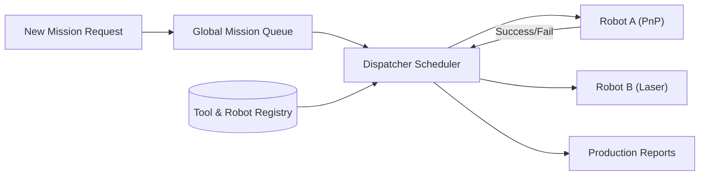

<p align="center">
  
</p>

# 📋 HYDRA-UMC-JOB-DISPATCHER

<p align="center"><a href="README.md">🇺🇸 English</a> | <a href="README_spa.md">🇪🇸 Español</a> | <a href="README_fra.md">🇫🇷 Français</a> | <a href="README_ita.md">🇮🇹 Italiano</a> | <a href="README_deu.md">🇩🇪 Deutsch</a> | 🇨🇳 <b>简体中文</b> | <a href="README_jpn.md">🇯🇵 日本語</a></p>

### ⚙️ 面向异构机器人车队的基于优先级的任务队列

<p align="left">
  
  
  
</p>

---

## 1. 🛠️ 技术概述

**HYDRA-UMC-JOB-DISPATCHER** 是编排器的任务分配引擎。它管理一个全局任务
队列，根据每个机器人当前的可用性、位置和所安装的工具（URTC），将任务分
发给各个机器人。

它确保高优先级任务（例如"紧急缺陷修复"）能够绕过正常的生产流程，并协调
需要不同机器人协同工作的多步骤装配序列。

### 关键特性：
* 📋 **动态队列：** 智能任务优先级排序与调度。
* ⚖️ **工具感知路由：** 自动将任务路由到装有正确 URTC 刀头的机器人。
* 🔄 **多阶段任务：** 管理任务之间的依赖关系（例如"抓取"必须先于"放置"发生）。
* 📡 **持久化：** 使用本地 Redis/数据库存储实现容错的任务状态。

---

## 2. 🔄 调度器流程



---

## 3. 🧱 架构与设计决策

* **为何真正的逻辑位于 `src/` 之下，而非仓库根目录。** `src/dispatcher`（调度引擎）和 `src/api`（HTTP 处理器）包含实际实现；`main.go`/`version.go` 仍留在仓库根目录，作为将它们连接起来的入口点。
* **为何任务分配会通过 URTC 检查工具可用性。** 需要特定刀头的任务只能被分发给实际装有相应 URTC 控制刀头且处于空闲状态的机器人——在分发前（而非在拾取失败后）进行此项检查，可以避免机器人到达一个它实际上无法使用的工位。`src/dispatcher.Engine.DispatchOnce` 现在已通过精确匹配 `RequiredTool`/`Robot.Tool` 来实现这一点；它尚未通过 CAN 与真实的 URTC 通信以确认刀头确实已物理连接（引擎只知道机器人注册时声明的内容——见 `src/api` 的 `POST /robots`）。
* **为何调度器今天已经真实可用，而持久化还不行。** `src/dispatcher` 实现了 README 中 "DISPATCHER FLOW" 图所描述的真实算法：一个按优先级排序的全局队列、工具感知的路由，以及多阶段依赖关系（一个任务会保持 `blocked` 状态，直到其 `DependsOn` 中的每个任务都达到 `done`）。这一切都只存在于内存中——`Engine` 的状态一直保持在导出的方法背后，正是为了日后能用基于 Redis/数据库的存储替换这些方法背后的内容，而无需改动每个调用者。证明调度算法本身正确是第一优先事项。
* **为何 HTTP API 是普通的 JSON/HTTP，而非 gRPC。** 这是一个面向人员/运维的控制平面（提交任务、注册机器人、查询发生了什么）——`hydra.common.v1`（生态系统共享的 gRPC 契约，见 `HYDRA-UMC-ORCHESTRATOR/proto/`）仍保留给节点对节点的流量，符合该 proto 自身已文档化的范围。
* **这如何融入生态系统的其余部分。** 作为 HYDRA-UMC-ORCHESTRATOR 下的同级服务——将任务级决策转化为具体的、按机器人分配的工作，并对照 URTC 工具可用性和 HYDRA-UMC-PATH-PLANNER-3D 自身的路线进行检查。

---

## 📂 目录结构

```text
HYDRA-UMC-JOB-DISPATCHER/
├── src/
│   ├── dispatcher/    # 真正的调度引擎：队列、工具感知路由、
│   │                  # 多阶段依赖关系
│   └── api/           # 封装引擎的简单 JSON/HTTP 处理器
├── build/             # 编译后的二进制文件（build.sh/build.bat 的输出）
├── go.mod / go.sum    # Go 模块定义
├── version.go         # const Version = "X.Y.Z"（go.mod 没有应用版本字段）
├── main.go            # 入口点：将引擎连接到 HTTP API 并监听
├── bump_version.py    # 里程表式版本递增，由 build.sh/.bat 运行
├── build.sh/.bat      # 递增版本号，然后执行 `go build`
├── run.sh/.bat        # 运行编译后的二进制文件
└── README.md
```

从原始模板中省略：`hardware/`、`firmware/`、`os/`、`docs/`、
`images/` 和 `scripts/`——这是一个纯软件服务（Go 二进制文件），
没有专属硬件或固件，没有需要维护的操作系统镜像，目前也还没有
足够多的文档/媒体/实用脚本内容值得为它们单独建立文件夹。

---

## 🔧 构建与运行

一个带有优先级和 HTTP API 的真实任务队列，而不只是一个能编译的骨架。

```bash
# Windows
build.bat
run.bat -addr :8090

# Linux / macOS
./build.sh
./run.sh -addr :8090
```

`build.sh`/`build.bat` 会递增 `version.go` 中的版本号（生态系统统一的
里程表规则，见 `bump_version.py`——`go.mod` 没有面向应用二进制文件的原生
版本字段），然后执行 `go build`。`run.sh`/`run.bat` 直接执行生成的二进
制文件。

```bash
# 注册一个机器人，提交一个任务，调度它，然后标记为完成
curl -X POST localhost:8090/robots -d '{"id":"robot-a","tool":"PnP","available":true}'
curl -X POST localhost:8090/jobs   -d '{"id":"job-1","priority":5,"requiredTool":"PnP"}'
curl -X POST localhost:8090/dispatch -d '{}'
curl -X POST localhost:8090/jobs/complete -d '{"id":"job-1","success":true}'
curl localhost:8090/jobs
curl localhost:8090/robots
```

```bash
go test ./...   # src/dispatcher（调度算法）+
                 # src/api（通过 httptest 的真实 HTTP 往返测试）
```

---

## 🚀 路线图
* **第一阶段：** 基于 TSN 的确定性集群同步与亚毫秒级抖动降低。
* **第二阶段：** 多机器人单元中带动态避障的 3D 路径规划。
* **第三阶段：** 利用实时资源可用性进行多机器人任务分发优化。
* **第四阶段：** AI 驱动的任务时长估算，以实现更优的调度和异构机器人车队协调。

---

## 🔗 相关项目

本项目是同一作者（JuanenRac / Electro Hobby 3D）打造的更大规模机器人生态
系统的一部分，涵盖固件、控制软件、AI 节点和车队工具。值得了解，因为某个
需求实际上可能是关于这些项目之一，而非本仓库。

### 项目族

**父项目：** **[HYDRA-UMC-ORCHESTRATOR](https://github.com/JuanenRac/HYDRA-UMC-ORCHESTRATOR)** —— 本调度器所服务的集成父项目。

**同族项目：**
- **[HYDRA-UMC-SWARM-SYNC](https://github.com/JuanenRac/HYDRA-UMC-SWARM-SYNC)** —— 同级编排服务，同一父项目。
- **[HYDRA-UMC-PATH-PLANNER-3D](https://github.com/JuanenRac/HYDRA-UMC-PATH-PLANNER-3D)** —— 同级编排服务，同一父项目。
- **[HYDRA-UMC-NODE-HEALING](https://github.com/JuanenRac/HYDRA-UMC-NODE-HEALING)** —— 同级编排服务，同一父项目。

### 直接相关（项目族之外）

- **[URTC](https://github.com/JuanenRac/URTC)** —— 根据实际可用的刀头分配任务。

### 生态系统的其余部分

**HYDRA-UMC 平台** —— 多机器人微工厂单元
- **[HYDRA-UMC](https://github.com/JuanenRac/HYDRA-UMC)** —— 协调最多 8 条机械臂的 CM5 + STM32H745 主板。
- **[HYDRA-UMC-SERVER](https://github.com/JuanenRac/HYDRA-UMC-SERVER)** —— 每个控制客户端所对接的 Express/WebSocket 后端。
- **[HYDRA-UMC-STUDIO](https://github.com/JuanenRac/HYDRA-UMC-STUDIO)** —— 基于 Web 的控制仪表盘，多机器人 3D 可视化。
- **[HYDRA-UMC-ANDROID-CONTROL](https://github.com/JuanenRac/HYDRA-UMC-ANDROID-CONTROL)** —— 通过 Wi-Fi/蓝牙的 Android 控制应用。
- **[HYDRA-UMC-IOS-CONTROL](https://github.com/JuanenRac/HYDRA-UMC-IOS-CONTROL)** —— 基于 Flutter 构建的 iOS/iPadOS 控制应用。
- **[HYDRA-UMC-SUITE](https://github.com/JuanenRac/HYDRA-UMC-SUITE)** —— 桌面端集群指挥中心（Python/PySide6）。
- **[HYDRA-UMC-EDITOR-URDF](https://github.com/JuanenRac/HYDRA-UMC-EDITOR-URDF)** —— 用于机器人目录的桌面端 URDF 模型编辑器。
- **[HYDRA-UMC-DSI](https://github.com/JuanenRac/HYDRA-UMC-DSI)** —— 机载 DSI 触摸屏的原生触控 UI。

**URTC 平台** —— 每台 HYDRA-UMC 机械臂搭载的工具头控制器
- **[URTC](https://github.com/JuanenRac/URTC)** —— CAN 总线工具头控制器，25 种工具配置。
- **[URTC-FLASHER](https://github.com/JuanenRac/URTC-FLASHER)** —— 桌面端 CAN-OTA + SWD/JTAG 刷写工具。
- **[URTC-TESTER](https://github.com/JuanenRac/URTC-TESTER)** —— 桌面端实时 CAN 总线诊断工具。
- **[URTC-WEB-STUDIO](https://github.com/JuanenRac/URTC-WEB-STUDIO)** —— 通过 Web Serial API 的浏览器端替代方案。

**🎥 视觉 AI 节点（Hailo-8）**
- [HYDRA-UMC-VISION-NODE](https://github.com/JuanenRac/HYDRA-UMC-VISION-NODE)
- [HYDRA-UMC-VISION-STREAMER](https://github.com/JuanenRac/HYDRA-UMC-VISION-STREAMER)
- [HYDRA-UMC-DETECTION-HEF](https://github.com/JuanenRac/HYDRA-UMC-DETECTION-HEF)
- [HYDRA-UMC-SAFETY-ZONES](https://github.com/JuanenRac/HYDRA-UMC-SAFETY-ZONES)
- [HYDRA-UMC-VISUAL-SERVOING-API](https://github.com/JuanenRac/HYDRA-UMC-VISUAL-SERVOING-API)

**🧠 认知 AI 节点（Hailo-10）**
- [HYDRA-UMC-COGNITIVE-NODE](https://github.com/JuanenRac/HYDRA-UMC-COGNITIVE-NODE)
- [HYDRA-UMC-VLA-ENGINE](https://github.com/JuanenRac/HYDRA-UMC-VLA-ENGINE)
- [HYDRA-UMC-VOICE-UI](https://github.com/JuanenRac/HYDRA-UMC-VOICE-UI)
- [HYDRA-UMC-SEMANTIC-PLANNER](https://github.com/JuanenRac/HYDRA-UMC-SEMANTIC-PLANNER)
- [HYDRA-UMC-DOCS-QA](https://github.com/JuanenRac/HYDRA-UMC-DOCS-QA)

**🎮 数字孪生与仿真**
- [HYDRA-UMC-TWIN](https://github.com/JuanenRac/HYDRA-UMC-TWIN)
- [HYDRA-UMC-PHYSICS-REPLICA](https://github.com/JuanenRac/HYDRA-UMC-PHYSICS-REPLICA)
- [HYDRA-UMC-HIL-BRIDGE](https://github.com/JuanenRac/HYDRA-UMC-HIL-BRIDGE)
- [HYDRA-UMC-SYNTHETIC-DATA-GEN](https://github.com/JuanenRac/HYDRA-UMC-SYNTHETIC-DATA-GEN)

**📊 数据与分析**
- [HYDRA-UMC-DATALAKE](https://github.com/JuanenRac/HYDRA-UMC-DATALAKE)
- [HYDRA-UMC-TELEMETRY-COLLECTOR](https://github.com/JuanenRac/HYDRA-UMC-TELEMETRY-COLLECTOR)
- [HYDRA-UMC-ANOMALY-DETECTOR](https://github.com/JuanenRac/HYDRA-UMC-ANOMALY-DETECTOR)
- [HYDRA-UMC-PRODUCTION-REPORTS](https://github.com/JuanenRac/HYDRA-UMC-PRODUCTION-REPORTS)

**🏭 工业网关**
- [HYDRA-UMC-GATEWAY-INDUSTRIAL](https://github.com/JuanenRac/HYDRA-UMC-GATEWAY-INDUSTRIAL)
- [HYDRA-UMC-OPCUA-SERVER](https://github.com/JuanenRac/HYDRA-UMC-OPCUA-SERVER)
- [HYDRA-UMC-MQTT-BROKER](https://github.com/JuanenRac/HYDRA-UMC-MQTT-BROKER)
- [HYDRA-UMC-MTCONNECT-ADAPTER](https://github.com/JuanenRac/HYDRA-UMC-MTCONNECT-ADAPTER)

**🛠️ 配套工具**
- [URTC-SMART-RACK](https://github.com/JuanenRac/URTC-SMART-RACK)
- [URTC-VISION-TOOL](https://github.com/JuanenRac/URTC-VISION-TOOL)
- [HYDRA-UMC-WATCH](https://github.com/JuanenRac/HYDRA-UMC-WATCH)
- [HYDRA-UMC-TOOL-CLI](https://github.com/JuanenRac/HYDRA-UMC-TOOL-CLI)
- [HYDRA-UMC-DASHBOARD-AI](https://github.com/JuanenRac/HYDRA-UMC-DASHBOARD-AI)


## 👤 作者
**JuanenRac**（Electro Hobby 3D）
📧 electrohobby3d@gmail.com

## 📜 许可证
GPL-3.0 —— 详见 LICENSE。
