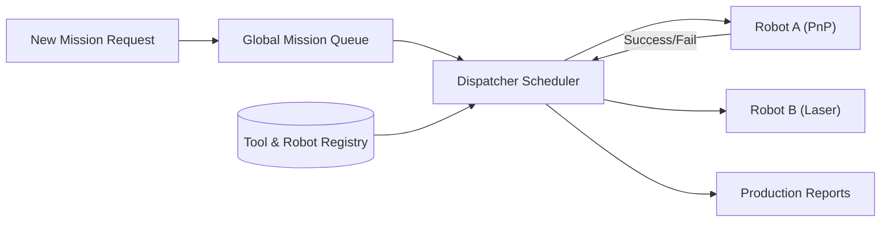

<p align="center">
  
</p>

# 📋 HYDRA-UMC-JOB-DISPATCHER

<p align="center"><a href="README.md">🇺🇸 English</a> | <a href="README_spa.md">🇪🇸 Español</a> | <a href="README_fra.md">🇫🇷 Français</a> | <a href="README_ita.md">🇮🇹 Italiano</a> | <a href="README_deu.md">🇩🇪 Deutsch</a> | 🇨🇳 <b>简体中文</b> | <a href="README_jpn.md">🇯🇵 日本語</a></p>

### ⚙️ 面向异构机器人车队的基于优先级的任务队列

<p align="left">
  
  
  
</p>

---

## 1. 🛠️ 技术概述

**HYDRA-UMC-JOB-DISPATCHER** 是编排器的任务分配引擎。它管理一个全局任务
队列，根据每个机器人当前的可用性、位置和所安装的工具（URTC），将任务分
发给各个机器人。

它确保高优先级任务（例如"紧急缺陷修复"）能够绕过正常的生产流程，并协调
需要不同机器人协同工作的多步骤装配序列。

### 关键特性：
* 📋 **动态队列：** 智能任务优先级排序与调度。
* ⚖️ **工具感知路由：** 自动将任务路由到装有正确 URTC 刀头的机器人。
* 🔄 **多阶段任务：** 管理任务之间的依赖关系（例如"抓取"必须先于"放置"发生）。
* 📡 **持久化：** 使用本地 Redis/数据库存储实现容错的任务状态。
* 🔁 **幂等提交（v0）：** 通过 `POST /jobs/submit` 实现真实的、可选的基于 `DedupKey` 的去重——重新提交一个进行中或已完成的任务会原样返回，而在真实失败后的重试会复用同一个任务 ID，而不是把工作执行两次。优先级顺序在重复运行之间是确定性的，由一个明确的回归测试覆盖。

---

## 2. 🔄 调度器流程



---

## 3. 🧱 架构与设计决策

* **为何真正的逻辑位于 `src/` 之下，而非仓库根目录。** `src/dispatcher`（调度引擎）和 `src/api`（HTTP 处理器）包含实际实现；`main.go`/`version.go` 仍留在仓库根目录，作为将它们连接起来的入口点。
* **为何任务分配会通过 URTC 检查工具可用性。** 需要特定刀头的任务只能被分发给实际装有相应 URTC 控制刀头且处于空闲状态的机器人——在分发前（而非在拾取失败后）进行此项检查，可以避免机器人到达一个它实际上无法使用的工位。`src/dispatcher.Engine.DispatchOnce` 现在已通过精确匹配 `RequiredTool`/`Robot.Tool` 来实现这一点；它尚未通过 CAN 与真实的 URTC 通信以确认刀头确实已物理连接（引擎只知道机器人注册时声明的内容——见 `src/api` 的 `POST /robots`）。
* **为何调度器今天已经真实可用，而持久化还不行。** `src/dispatcher` 实现了 README 中 "DISPATCHER FLOW" 图所描述的真实算法：一个按优先级排序的全局队列、工具感知的路由，以及多阶段依赖关系（一个任务会保持 `blocked` 状态，直到其 `DependsOn` 中的每个任务都达到 `done`）。这一切都只存在于内存中——`Engine` 的状态一直保持在导出的方法背后，正是为了日后能用基于 Redis/数据库的存储替换这些方法背后的内容，而无需改动每个调用者。证明调度算法本身正确是第一优先事项。
* **为何 HTTP API 是普通的 JSON/HTTP，而非 gRPC。** 这是一个面向人员/运维的控制平面（提交任务、注册机器人、查询发生了什么）——`hydra.common.v1`（生态系统共享的 gRPC 契约，见 `HYDRA-UMC-ORCHESTRATOR/proto/`）仍保留给节点对节点的流量，符合该 proto 自身已文档化的范围。
* **这如何融入生态系统的其余部分。** 作为 HYDRA-UMC-ORCHESTRATOR 下的同级服务——将任务级决策转化为具体的、按机器人分配的工作，并对照 URTC 工具可用性和 HYDRA-UMC-PATH-PLANNER-3D 自身的路线进行检查。
* **为何 `POST /jobs/submit` 是一个新路由，而不是修改 `POST /jobs`。** `AddJob()`/`POST /jobs` 始终执行插入，并在 ID 冲突时报错——这个底层契约保持不变。`SubmitJob()`/`POST /jobs/submit` 通过 `Job.DedupKey` 在其之上叠加了真实的、可选的去重——这与整个生态系统中使用的模式相同（在不变的底层原语旁边添加一个受保护的新入口点，而不是把行为改动强加在它身上）。
* **为何失败后的重试复用同一个任务 ID，而不是新建一个。** 另一种做法——每次重试都生成一个新任务——会把同一个逻辑工作单元的历史分散到多个 ID 上，调用方也无法分辨“这次失败了一次、正在重试”和“这是一项无关的新工作”。将原始任务重置为 `Pending`，可以让它整个生命周期（包括失败的那次尝试）都保留在同一个 ID 之下。

---

## 📂 目录结构

```text
HYDRA-UMC-JOB-DISPATCHER/
├── src/
│   ├── dispatcher/    # 真正的调度引擎：队列、工具感知路由、
│   │                  # 多阶段依赖关系
│   └── api/           # 封装引擎的简单 JSON/HTTP 处理器
├── docs/
│   └── API.md         # 真实的 HTTP 端点参考（请求、响应、状态码）
├── images/            # 媒体与图示
├── systemd/
│   └── hydra-umc-job-dispatcher.service # CM5 本地优先级任务队列的 systemd 单元
├── tools/
│   ├── build_test.py  # 不递增版本号的构建/编译检查
│   └── ci_validate.py # CI 使用的 manifest/CHANGELOG/docs 校验
├── build/             # 编译后的二进制文件（build.sh/build.bat 的输出）
├── go.mod / go.sum    # Go 模块定义
├── version.go         # const Version = "X.Y.Z"（go.mod 没有应用版本字段）
├── main.go            # 入口点：将引擎连接到 HTTP API 并监听
├── bump_version.py    # 里程表式版本递增，由 build.sh/.bat 运行
├── bump_manifest_version.py # 将 hydra-umc.project.json 的版本与原生版本同步（--sync）
├── build.sh/.bat      # 递增版本号，然后执行 `go build`
├── run.sh/.bat        # 运行编译后的二进制文件
└── README.md
```

从原始模板中省略：`hardware/`、`firmware/`、`os/`——这是一个纯软件
服务（Go 二进制文件），没有专属硬件或固件，也没有需要维护的操作系统
镜像。完整的 HTTP 端点参考见 [`docs/API.md`](docs/API.md)。

---

## 🔧 构建与运行

一个带有优先级和 HTTP API 的真实任务队列，而不只是一个能编译的骨架。

```bash
# Windows
build.bat
run.bat -addr :8090

# Linux / macOS
./build.sh
./run.sh -addr :8090
```

`build.sh`/`build.bat` 会递增 `version.go` 中的版本号（生态系统统一的
里程表规则，见 `bump_version.py`——`go.mod` 没有面向应用二进制文件的原生
版本字段），然后执行 `go build`。`run.sh`/`run.bat` 直接执行生成的二进
制文件。

```bash
# 注册一个机器人，提交一个任务，调度它，然后标记为完成
curl -X POST localhost:8090/robots -d '{"id":"robot-a","tool":"PnP","available":true}'
curl -X POST localhost:8090/jobs   -d '{"id":"job-1","priority":5,"requiredTool":"PnP"}'
curl -X POST localhost:8090/dispatch -d '{}'
curl -X POST localhost:8090/jobs/complete -d '{"id":"job-1","success":true}'
curl localhost:8090/jobs
curl localhost:8090/robots
```

```bash
# 幂等提交：使用相同 dedupKey 的重试请求永远不会让同一个任务执行两次，
# 即使客户端使用了不同的 id 也是如此。
curl -X POST localhost:8090/jobs/submit -d '{"id":"job-2","priority":5,"requiredTool":"PnP","dedupKey":"req-abc"}'
# -> {"ID":"job-2", ..., "result":"created"}
curl -X POST localhost:8090/jobs/submit -d '{"id":"job-2-retry","priority":5,"requiredTool":"PnP","dedupKey":"req-abc"}'
# -> {"ID":"job-2", ..., "result":"duplicate"} - 同一个任务，未改变

# 真实失败后，使用相同 dedupKey 的重试会复用 job-2 的 ID：
curl -X POST localhost:8090/jobs/complete -d '{"id":"job-2","success":false}'
curl -X POST localhost:8090/jobs/submit -d '{"id":"job-2-retry-2","priority":5,"requiredTool":"PnP","dedupKey":"req-abc"}'
# -> {"ID":"job-2", "Status":"pending", ..., "result":"retried"}
```

```bash
go test ./...   # src/dispatcher（调度算法）+
                 # src/api（通过 httptest 的真实 HTTP 往返测试）
```

---

## 🚀 路线图
* **第一阶段：** 基于 TSN 的确定性集群同步与亚毫秒级抖动降低。
* **第二阶段：** 多机器人单元中带动态避障的 3D 路径规划。
* **第三阶段：** 利用实时资源可用性进行多机器人任务分发优化。
* **第四阶段：** AI 驱动的任务时长估算，以实现更优的调度和异构机器人车队协调。

---

## 🔗 相关项目

本项目是同一作者(JuanenRac / Electro Hobby 3D)打造的 HYDRA-UMC 机器人生态系统的一部分。值得了解,因为某个请求实际上可能是关于这些项目之一,而非本仓库本身。

**父项目**
- **[HYDRA-UMC-ORCHESTRATOR](https://github.com/JuanenRac/HYDRA-UMC-ORCHESTRATOR)** — 具备真实 gRPC/Protobuf 健康报告契约与任务状态机的集成中枢;本仓库是其自身集群协调层中一个具体编排服务所属的父项目。

**兄弟项目** —— HYDRA-UMC-ORCHESTRATOR 自身集群协调层中的其他编排服务
- **[HYDRA-UMC-SWARM-SYNC](https://github.com/JuanenRac/HYDRA-UMC-SWARM-SYNC)** — 经过多单元收敛属性测试的真实 CRDT LWW-Element-Map 状态同步。
- **[HYDRA-UMC-PATH-PLANNER-3D](https://github.com/JuanenRac/HYDRA-UMC-PATH-PLANNER-3D)** — 具备真实障碍物/工作空间碰撞校验的真实基于 RRT 的三维路径规划器。
- **[HYDRA-UMC-NODE-HEALING](https://github.com/JuanenRac/HYDRA-UMC-NODE-HEALING)** — 具备重试/退避与身份不匹配检测的真实基于 gRPC 的车队健康看门狗。

**直接相关**
- **[URTC](https://github.com/JuanenRac/URTC)** — 面向实体 Universal Robot Tool Controller 板卡的固件，通过 CAN 总线支持 25 种以上工具配置 —— 根据 URTC 自身哪个工具头实际可用来分配作业。
- **[HYDRA-UMC-PRODUCTION-REPORTS](https://github.com/JuanenRac/HYDRA-UMC-PRODUCTION-REPORTS)** — 基于 DATALAKE 历史数据的真实 OEE/可用率计算，支持可复现的 CSV 导出 —— 任务完成日志的设想目标;一旦完成事件被接入以写入数据,本调度器将成为其自身 OEE `production_event` 数据的真实来源(尚未实现,由该项目自身跟踪)。

**生态系统中的其他项目**

*核心硬件与平台*
- **[HYDRA-UMC](https://github.com/JuanenRac/HYDRA-UMC)** — 机器人手臂的真实主板——CM5 主机 + 双核 STM32H745，通过 CAN-OTA/SPI-OTA 协调最多 8 条工具臂。
- **[HYDRA-UMC-OS](https://github.com/JuanenRac/HYDRA-UMC-OS)** — 面向 CM5 的可复现 Raspberry Pi OS 产品层——只读代理、经过验证的配置/配置文件、WiFi 首次配网。
- **[HYDRA-UMC-SDK](https://github.com/JuanenRac/HYDRA-UMC-SDK)** — 每个桥接都据此校验自身指令的共享 JSON-Schema 契约与安全门限边界。

*核心后端与客户端*
- **[HYDRA-UMC-SERVER](https://github.com/JuanenRac/HYDRA-UMC-SERVER)** — 每个控制客户端真正通信的真实无头后端(REST/WebSocket)。
- **[HYDRA-UMC-STUDIO](https://github.com/JuanenRac/HYDRA-UMC-STUDIO)** — 具有实时多机器人 3D 可视化的网页控制面板。
- **[HYDRA-UMC-SUITE](https://github.com/JuanenRac/HYDRA-UMC-SUITE)** — 面向多台服务器的桌面(PySide6)集群指挥中心，打包为独立可执行文件。
- **[HYDRA-UMC-ANDROID-CONTROL](https://github.com/JuanenRac/HYDRA-UMC-ANDROID-CONTROL)** — 具有生物识别登录和配对 Wear OS 伴侣应用的原生 Android 控制应用。
- **[HYDRA-UMC-IOS-CONTROL](https://github.com/JuanenRac/HYDRA-UMC-IOS-CONTROL)** — 具有实时 WebSocket 同步的 iOS/iPadOS 控制应用(Flutter)。
- **[HYDRA-UMC-DSI](https://github.com/JuanenRac/HYDRA-UMC-DSI)** — 面向机载 7 英寸 DSI 触摸屏的原生触控界面，直接嵌入 CM5 本体。
- **[HYDRA-UMC-EDITOR-URDF](https://github.com/JuanenRac/HYDRA-UMC-EDITOR-URDF)** — 将完成的模型推送到 STUDIO 自身目录的桌面版图形化 URDF 创建/编辑工具。
- **[HYDRA-UMC-BRIDGE-AMR](https://github.com/JuanenRac/HYDRA-UMC-BRIDGE-AMR)** — 通过真实的 VDA 5050 MQTT 发布者为 AGV/AMR 车队提供的协调边界。
- **[HYDRA-UMC-BRIDGE-CNC](https://github.com/JuanenRac/HYDRA-UMC-BRIDGE-CNC)** — 具备真实 GRBL 状态/控制字节访问能力的高层 CNC 单元协调器。
- **[HYDRA-UMC-BRIDGE-DROIDS](https://github.com/JuanenRac/HYDRA-UMC-BRIDGE-DROIDS)** — 面向足式/人形机器人的协调边界，具备真实的 Boston Dynamics Spot 指令发送器。
- **[HYDRA-UMC-BRIDGE-LASER](https://github.com/JuanenRac/HYDRA-UMC-BRIDGE-LASER)** — 读取 3 项真实钥匙/外壳/联锁 GPIO 安全信号的激光单元安全协调器。
- **[HYDRA-UMC-BRIDGE-OPENPNP](https://github.com/JuanenRac/HYDRA-UMC-BRIDGE-OPENPNP)** — 面向 OpenPnP 贴片机板级流程的安全高层协调器。
- **[HYDRA-UMC-BRIDGE-PRINTER3D](https://github.com/JuanenRac/HYDRA-UMC-BRIDGE-PRINTER3D)** — 面向 Moonraker/Klipper 3D 打印机的安全协调边界，具备真实的受控作业指令。
- **[HYDRA-UMC-BRIDGE-ROS2](https://github.com/JuanenRac/HYDRA-UMC-BRIDGE-ROS2)** — 具备真实的惰性导入 rclpy ROS 2 传输层的安全协调器。
- **[HYDRA-UMC-BRIDGE-UAV](https://github.com/JuanenRac/HYDRA-UMC-BRIDGE-UAV)** — 面向搭载摄像头的无人机的协调边界，具备真实的 MAVLink 指令发送器。

*URTC 工具平台*
- **[URTC-FLASHER](https://github.com/JuanenRac/URTC-FLASHER)** — 面向 URTC 板卡的桌面图形烧录工具，支持 CAN-OTA 以及全芯片 SWD/JTAG。
- **[URTC-TESTER](https://github.com/JuanenRac/URTC-TESTER)** — 面向 URTC 板卡的桌面实时 CAN 总线诊断工具，每种工具配置对应一个面板。
- **[URTC-WEB-STUDIO](https://github.com/JuanenRac/URTC-WEB-STUDIO)** — 通过 Web Serial API 实现的浏览器版 URTC-TESTER 替代方案，无需本地安装。

*视觉 AI 节点(Hailo-8)*
- **[HYDRA-UMC-VISION-NODE](https://github.com/JuanenRac/HYDRA-UMC-VISION-NODE)** — 面向 Hailo-8 视觉流水线的集成中枢，具备逐阶段的真实硬件就绪检测。
- **[HYDRA-UMC-DETECTION-HEF](https://github.com/JuanenRac/HYDRA-UMC-DETECTION-HEF)** — 具备 Hailo 架构/校验和安全加载验证的真实编译模型注册表。
- **[HYDRA-UMC-VISION-STREAMER](https://github.com/JuanenRac/HYDRA-UMC-VISION-STREAMER)** — 具备真实 HailoRT 集成边界的真实 GStreamer 流水线 + MediaMTX 配置生成器。
- **[HYDRA-UMC-VISUAL-SERVOING-API](https://github.com/JuanenRac/HYDRA-UMC-VISUAL-SERVOING-API)** — 具备真实 Position-Based Visual Servoing 修正律，并依据上游区域状态进行安全门控。
- **[HYDRA-UMC-SAFETY-ZONES](https://github.com/JuanenRac/HYDRA-UMC-SAFETY-ZONES)** — 具备校准新鲜度强制检查的真实区域入侵检测与 E-STOP 请求。

*认知 AI 节点(Hailo-10)*
- **[HYDRA-UMC-COGNITIVE-NODE](https://github.com/JuanenRac/HYDRA-UMC-COGNITIVE-NODE)** — 面向 Hailo-10 认知流水线(LLM/VLA/语音编排)的集成中枢。
- **[HYDRA-UMC-VLA-ENGINE](https://github.com/JuanenRac/HYDRA-UMC-VLA-ENGINE)** — 面向 Vision-Language-Action 模型的真实动作 token 编解码与轨迹生成。
- **[HYDRA-UMC-VOICE-UI](https://github.com/JuanenRac/HYDRA-UMC-VOICE-UI)** — 具备受限、需确认的 Watch 中继的真实语音前端(VAD + 意图解析)。
- **[HYDRA-UMC-SEMANTIC-PLANNER](https://github.com/JuanenRac/HYDRA-UMC-SEMANTIC-PLANNER)** — 基于真实规则的任务分解，以及针对 MCU 错误码的语义化错误恢复。
- **[HYDRA-UMC-DOCS-QA](https://github.com/JuanenRac/HYDRA-UMC-DOCS-QA)** — 面向本生态系统自身 Markdown 文档的真实纯标准库 TF-IDF 文档检索。

*数字孪生与仿真*
- **[HYDRA-UMC-TWIN](https://github.com/JuanenRac/HYDRA-UMC-TWIN)** — 面向数字孪生引擎的集成中枢，具备真实的版本兼容性同步契约。
- **[HYDRA-UMC-HIL-BRIDGE](https://github.com/JuanenRac/HYDRA-UMC-HIL-BRIDGE)** — 在仿真与真实硬件之间路由指令的真实硬件在环安全联锁。
- **[HYDRA-UMC-PHYSICS-REPLICA](https://github.com/JuanenRac/HYDRA-UMC-PHYSICS-REPLICA)** — 面向真实 URDF 子集的真实正向运动学与关节限位校验。
- **[HYDRA-UMC-SYNTHETIC-DATA-GEN](https://github.com/JuanenRac/HYDRA-UMC-SYNTHETIC-DATA-GEN)** — 具备 YOLO/COCO 标注导出功能的真实程序化 2D 场景生成器。

*数据与分析*
- **[HYDRA-UMC-DATALAKE](https://github.com/JuanenRac/HYDRA-UMC-DATALAKE)** — 具备真实数据摄入/查询 HTTP API 的真实 sqlite3 时序数据存储。
- **[HYDRA-UMC-ANOMALY-DETECTOR](https://github.com/JuanenRac/HYDRA-UMC-ANOMALY-DETECTOR)** — 具备漂移监测能力的真实 FFT + 统计基线异常检测器。
- **[HYDRA-UMC-TELEMETRY-COLLECTOR](https://github.com/JuanenRac/HYDRA-UMC-TELEMETRY-COLLECTOR)** — 面向 DATALAKE 的真实 CAN/WebSocket 数据摄入管道，支持序列去重。

*工业网关*
- **[HYDRA-UMC-GATEWAY-INDUSTRIAL](https://github.com/JuanenRac/HYDRA-UMC-GATEWAY-INDUSTRIAL)** — 中继至工业协议的集成中枢，具备真实的指令白名单/背压控制层。
- **[HYDRA-UMC-OPCUA-SERVER](https://github.com/JuanenRac/HYDRA-UMC-OPCUA-SERVER)** — 经真实二进制协议客户端会话验证的真实 OPC-UA 地址空间。
- **[HYDRA-UMC-MQTT-BROKER](https://github.com/JuanenRac/HYDRA-UMC-MQTT-BROKER)** — 具备可选按客户端认证与主题 ACL 的真实 MQTT 代理。
- **[HYDRA-UMC-MTCONNECT-ADAPTER](https://github.com/JuanenRac/HYDRA-UMC-MTCONNECT-ADAPTER)** — 具备降级模式输出的真实 MTConnect `/probe` 与 `/current` XML 端点。

*辅助工具与生态系统运维*
- **[HYDRA-UMC-DASHBOARD-AI](https://github.com/JuanenRac/HYDRA-UMC-DASHBOARD-AI)** — 基于 DATALAKE/ANOMALY-DETECTOR 的智能摘要与异常高亮面板，具备诚实的统计回退机制。
- **[HYDRA-UMC-TOOL-CLI](https://github.com/JuanenRac/HYDRA-UMC-TOOL-CLI)** — 具备真实、稳定退出码契约的车队 CLI，是 HYDRA-UMC-SERVER 自身 API 的真实在线客户端。
- **[HYDRA-UMC-WATCH](https://github.com/JuanenRac/HYDRA-UMC-WATCH)** — 具备真实触觉提醒与配对手机语音中继功能的 WearOS 伴侣应用。
- **[URTC-SMART-RACK](https://github.com/JuanenRac/URTC-SMART-RACK)** — 面向板卡安装机架的固件，具备真实的工具 ID 解码与 Smart Idle 预热逻辑。
- **[URTC-VISION-TOOL](https://github.com/JuanenRac/URTC-VISION-TOOL)** — 面向热成像/RGB 检测工具头的固件及真实 Python 视觉伴侣程序。
- **[HYDRA-UMC-UPDATER](https://github.com/JuanenRac/HYDRA-UMC-UPDATER)** — 发现、克隆并更新本生态系统中每个仓库的管理类桌面工具。


## 👤 作者
**JuanenRac** (Electro Hobby 3D)
📧 electrohobby3d@gmail.com
📺 [youtube.com/@electrohobby3d](https://youtube.com/@electrohobby3d)

## 📜 许可证
GPL-3.0 —— 详见 LICENSE。
